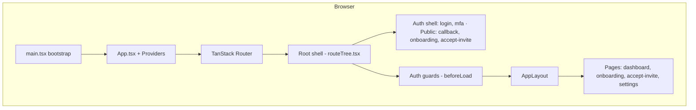
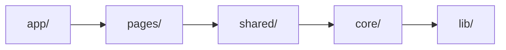

# Core Frontend

Enterprise-grade multi-tenant admin dashboard built with **React 19 + TypeScript + Vite**. Mirrors backend guarantees for security, multi-tenancy, RBAC, clean architecture, testability, observability, performance, and accessibility.

---

## Table of Contents

- [Quick Start](#quick-start)
- [Where to Run & Scripts](#where-to-run--scripts)
- [Code Structure](#code-structure)
- [Git branch & PR workflow](#git-branch--pr-workflow)
- [Contributing (humans)](#contributing-humans)
- [Architecture Diagrams](#architecture-diagrams)
- [Third-Party Libraries](#third-party-libraries)
- [Environment Variables](#environment-variables)
- [Cursor Skills & AI Assistance](#cursor-skills--ai-assistance)
- [How to Request Changes (Best Format for AI)](#how-to-request-changes-best-format-for-ai)
- [Architecture Deep-Dive](#architecture-deep-dive)
- [Adding a New Page](#adding-a-new-page)
- [Testing](#testing)
- [Deployment](#deployment)
- [Documentation](#documentation)

---

## Quick Start

**Path:** Run all commands from the **project root**:

```text
/Users/nikunjmavani/projects/core/core-fe
```

```bash
cd /Users/nikunjmavani/projects/core/core-fe   # or your clone path
pnpm install
pnpm dev
```

The app runs at **http://localhost:5173**.  
**Prerequisites:** Node.js **24.x** (Active LTS) or newer LTS, and **pnpm** ≥ 9 (`corepack enable && corepack prepare pnpm@latest --activate`). Use `.nvmrc` / `.node-version` for the pinned major.  
**Full local setup:** [docs/getting-started/setup.md](docs/getting-started/setup.md).

---

## Where to Run & Scripts

| When                                    | Command                         | What it does                                                                                                                                                                                        |
| --------------------------------------- | ------------------------------- | --------------------------------------------------------------------------------------------------------------------------------------------------------------------------------------------------- |
| **First time / after clone**            | `pnpm install`                  | Install dependencies (Husky hooks set up automatically)                                                                                                                                             |
| **Daily development**                   | `pnpm dev`                      | Start Vite dev server at http://localhost:5173                                                                                                                                                      |
| **Production build**                    | `pnpm build`                    | Type-check + production build → output in `dist/`                                                                                                                                                   |
| **Preview production build**            | `pnpm preview`                  | Serve `dist/` locally                                                                                                                                                                               |
| **Type-check only**                     | `pnpm type-check`               | TypeScript check (no emit)                                                                                                                                                                          |
| **Lint**                                | `pnpm lint`                     | Run ESLint                                                                                                                                                                                          |
| **Lint + fix**                          | `pnpm lint:fix`                 | ESLint with auto-fix                                                                                                                                                                                |
| **Format code**                         | `pnpm format`                   | Prettier format                                                                                                                                                                                     |
| **Check format**                        | `pnpm format:check`             | Prettier check only                                                                                                                                                                                 |
| **Unit tests (once)**                   | `pnpm test`                     | Vitest single run                                                                                                                                                                                   |
| **Unit tests (watch)**                  | `pnpm test:watch`               | Vitest watch mode                                                                                                                                                                                   |
| **Unit tests + coverage**               | `pnpm test:coverage`            | Vitest with coverage report                                                                                                                                                                         |
| **E2E tests**                           | `pnpm test:e2e`                 | Playwright E2E tests                                                                                                                                                                                |
| **Full validation**                     | `pnpm validate`                 | Lint + type-check + unit tests                                                                                                                                                                      |
| **Full health check**                   | `pnpm health`                   | Format, lint, types, tests, build, size, env, public, route-island structure. Use after major changes.                                                                                              |
| **Structure validation**                | `pnpm validate:structure`       | Route-island shape + <PAGE>.OVERVIEW.md references resolve (agent-accuracy guard).                                                                                                                  |
| **Health check + fix**                  | `pnpm health:fix`               | Auto-fix format + lint, then run full health check.                                                                                                                                                 |
| **Code review report**                  | `pnpm report:code-review`       | Generate full code review report to `reports/code-review/full-code-review-report.md` (lint, types, build, tests, coverage, architecture).                                                           |
| **Security: secrets**                   | `pnpm security:secrets`         | Gitleaks scan (requires `gitleaks` CLI)                                                                                                                                                             |
| **Security: SAST**                      | `pnpm security:sast`            | Semgrep scan (requires `semgrep` CLI)                                                                                                                                                               |
| **Bundle analysis**                     | `pnpm build:analyze`            | Build with `ANALYZE=true` and open stats                                                                                                                                                            |
| **Sync GitHub environments + secrets**  | `pnpm github:sync`              | Requires `gh auth login`. Scaffolds `.env.*`, syncs rulesets + environments, pushes deploy secrets from `.env.<environment>`. See [.github/environments/README.md](.github/environments/README.md). |
| **Validate .env.example (commit / CI)** | `pnpm run validate:env-example` | Ensures `.env.example` documents every key in `src/core/config/env-schema.ts` (`pnpm tool:sync-env-example`). Runs in pre-commit and CI.                                                            |
| **Deploy to Netlify (draft)**           | `pnpm run deploy:netlify`       | Build + deploy preview                                                                                                                                                                              |
| **Deploy to Netlify (production)**      | `pnpm run deploy:netlify:prod`  | Build + deploy to production                                                                                                                                                                        |

---

## Code Structure

The app uses a **page-first** architecture with a strict one-way dependency rule (importer → importee): **app → pages → shared → core → lib** (no backwards or cross-page imports).

### Top-level layout

```text
core-fe/
├── .env.example             # Env reference — the only committed env file (see Environment Variables)
├── public/                  # Static assets
├── src/
│   ├── app/                 # Application shell
│   ├── core/                # Framework-agnostic services
│   ├── pages/               # Page-first feature directories (routes)
│   ├── shared/              # Reusable components, layouts, forms, hooks, store/ (Zustand)
│   ├── lib/                 # Pure utilities
│   ├── App.tsx
│   ├── main.tsx
│   └── index.css
├── tests/                   # E2E, security, ci-policy, shared test utils (unit tests colocated in src/)
├── package.json
├── vite.config.ts
├── tsconfig.app.json
├── eslint.config.mjs
└── components.json         # shadcn/ui config
```

### Layer responsibilities

| Layer      | Path                | Purpose                                                                                                                                                                                                                                                                                              |
| ---------- | ------------------- | ---------------------------------------------------------------------------------------------------------------------------------------------------------------------------------------------------------------------------------------------------------------------------------------------------- |
| **App**    | `src/app/`          | Routes config, `beforeLoad` auth/RBAC guards, providers, error boundaries.                                                                                                                                                                                                                           |
| **Core**   | `src/core/`         | HTTP (hand-rolled fetch client + refresh), RBAC, config, data-provider, resources, security, types, version. No React components; used by pages and shared. (Auth runtime lives in `shared/auth/`, tenancy in `shared/tenancy/`, errors in `shared/errors/`, observability in `app/observability/`.) |
| **Pages**  | `src/pages/`        | One directory per route. Each has `<page>.route.tsx` (exports `Component`, optional `ErrorBoundary`; RBAC is enforced in `routeTree.tsx` `beforeLoad`, never a `loader`), `<Page>Page.tsx`, `<page>.manifest.ts`, `<page>.contracts.ts`, `<page>.api.ts`, `hooks/`, `components/`, `forms/`.         |
| **Shared** | `src/shared/`       | Cross-page UI (`components/ui/` = shadcn), layouts, forms, hooks. Promote from a page only when used by 2+ page groups.                                                                                                                                                                              |
| **Lib**    | `src/lib/`          | Pure helpers (e.g. `cn()`), animations. No side effects.                                                                                                                                                                                                                                             |
| **Stores** | `src/shared/store/` | Global client state (theme, UI). Server state lives in TanStack Query, not Zustand.                                                                                                                                                                                                                  |

### Page directory shape

Every URL-backed feature lives under `src/pages/<name>/` with this shape:

```text
pages/<name>/
├── <name>.route.tsx      # REQUIRED — exports Component only (no loader; RBAC lives in routeTree beforeLoad)
├── <name>.manifest.ts    # REQUIRED — path, title, testId, permission, kind, children
├── <Name>Page.tsx        # REQUIRED — top-level UI (<Name>Layout.tsx for layout routes)
├── <NAME>.OVERVIEW.md    # REQUIRED — entry doc: purpose, files, test ids
├── <name>.contracts.ts   # Zod schemas + inferred types (source of truth)
├── <name>.api.ts         # API functions using apiClient
├── hooks/                # TanStack Query hooks (folder-per-unit, e.g. use<Name>/)
├── components/           # Page-specific components
└── forms/                # Page-specific form components
```

**Route marker:** A directory is a frontend route only if it contains `<page>.route.tsx`. Nested routes get their own child directory with its own route file; dynamic segments are `$param` folders (e.g. `pages/organization/$organizationSlug/`), never bracket-style `[id]`. Every page also registers in `src/app/routes/routeTree.tsx` and adds a row in `docs/reference/routes-and-ui.md`. Route access is enforced by `gatewayFromManifest(manifest)` in the routeTree `beforeLoad` — `route.tsx` never exports a `loader`.

---

## Git branch & PR workflow

Trunk-based development on a single branch:

- **One long-lived branch:** `main` (default + trunk). Every push to `main` deploys the `development` alias; a release deploys `production`. Unfinished work ships behind a feature flag, not a branch.
- **Short-lived branches:** `feat/...`, `fix/...`, `refactor/...`, `docs/...`, `test/...`, `chore/...` (created from `main`). Hotfixes are fix-forward on `main`.
- **PR flow:** feat/fix → `main` (squash-merge, branch auto-deletes). CI runs on PRs to `main`. Ship by merging the standing release-please Release PR.

See **[docs/process/trunk-based-workflow.md](docs/process/trunk-based-workflow.md)** for the full workflow: branch naming, step-by-step PR flow, conventional commits, and hotfix process.

---

## Architecture Diagrams

### High-level flow (Mermaid)



### Dependency rule (who can import whom)



**Rules:** one-way, importer → importee — `app → pages → shared → core → lib` (a layer may also skip rungs downward, e.g. `app → shared`); never backwards. Pages never import from other pages. Zustand stores are part of the shared layer (`src/shared/store/`), not a separate one.

### Bootstrap sequence

```text
  Step 1 (sync)    Step 2 (sync)         Step 3 (async)        Step 4 (sync)
  ┌───────────┐    ┌──────────────────┐   ┌────────────────┐   ┌──────────────┐
  │ Init      │───>│ Seed org context │──>│ Silent refresh │──>│ Mount React  │
  │ Sentry +  │    │ (subdomain seed; │   │ (JWT refresh)  │   │ <App />      │
  │ WebVitals │    │  URL is truth)   │   │ → Auth store   │   │              │
  └───────────┘    └──────────────────┘   └────────────────┘   └──────────────┘
```

Sentry first → seed org context (the URL path is the source of truth once routing mounts) → auth refresh → then render.

### Data flow (HTTP & server state)

```text
  Component (useQuery / useMutation)
       │
       ▼
  TanStack Query (queryClient) — cache, dedup, retry (skip 401)
       │
       ▼
  apiClient (fetch client) — Bearer (org in token claim); 401 → single-flight refresh + replay
       │
       ▼
  in-client retry — 429 / 5xx exponential backoff + Retry-After
       │
       ▼
  Vite dev proxy (/api → backend) or production API
```

---

## Third-Party Libraries

| Category                     | Package                                                                            | Purpose                                                                                                                                                                                                                           |
| ---------------------------- | ---------------------------------------------------------------------------------- | --------------------------------------------------------------------------------------------------------------------------------------------------------------------------------------------------------------------------------- |
| **Runtime**                  | React 19, React DOM                                                                | UI framework                                                                                                                                                                                                                      |
| **Build**                    | Vite 8                                                                             | Dev server, HMR, production build                                                                                                                                                                                                 |
| **Language**                 | TypeScript                                                                         | Typing, strict mode                                                                                                                                                                                                               |
| **Routing**                  | @tanstack/react-router                                                             | Lazy routes, `beforeLoad` guards, search params                                                                                                                                                                                   |
| **Server state**             | @tanstack/react-query                                                              | Queries, mutations, cache                                                                                                                                                                                                         |
| **Client state**             | zustand                                                                            | Auth, theme, UI, tenant stores                                                                                                                                                                                                    |
| **HTTP**                     | hand-rolled fetch client (`core/http/fetch-client.ts`)                             | API client, 401 single-flight refresh/replay, retries                                                                                                                                                                             |
| **Forms**                    | react-hook-form, @hookform/resolvers, zod                                          | Form state + validation (Zod schemas)                                                                                                                                                                                             |
| **Styling**                  | tailwindcss 4, @tailwindcss/vite                                                   | Utility CSS, design tokens                                                                                                                                                                                                        |
| **UI primitives**            | radix-ui                                                                           | Accessible primitives (shadcn base)                                                                                                                                                                                               |
| **UI utilities**             | class-variance-authority, clsx, tailwind-merge                                     | Variants, `cn()`                                                                                                                                                                                                                  |
| **Icons**                    | lucide-react                                                                       | Icons                                                                                                                                                                                                                             |
| **Animations**               | animejs + CSS / Tailwind + tw-animate-css                                          | Anime.js drives JS motion (dashboard count-ups via `useAnimeCountUp`, onboarding step transitions); `tw-animate-css` drives shadcn overlay enter/exit; page fade-in-up + card hover via CSS. All honour `prefers-reduced-motion`. |
| **Charts**                   | recharts (via shadcn `chart`)                                                      | Charts on dashboard (lazy-loaded `charts` chunk)                                                                                                                                                                                  |
| **Command bar**              | cmdk                                                                               | Global command palette (Cmd+K)                                                                                                                                                                                                    |
| **Observability**            | @sentry/react, posthog-js, web-vitals                                              | Errors, replay, analytics, Core Web Vitals                                                                                                                                                                                        |
| **PWA**                      | vite-plugin-pwa, workbox-\*                                                        | Service worker, offline                                                                                                                                                                                                           |
| **New-deployment detection** | `plugins/version-json.ts`, `src/core/version/check.ts`                             | Polls `/version.json`; reloads when a new build is deployed so users don’t run stale cache                                                                                                                                        |
| **Testing**                  | vitest, @testing-library/react, @playwright/test, vitest-axe, @axe-core/playwright | Unit (colocated), security, E2E, a11y                                                                                                                                                                                             |
| **Quality**                  | eslint, prettier, husky, lint-staged                                               | Lint, format, pre-commit                                                                                                                                                                                                          |
| **Security**                 | gitleaks, semgrep                                                                  | Secret detection, SAST (CI/local)                                                                                                                                                                                                 |

UI components are **shadcn/ui** style: Radix primitives + Tailwind + `cva` in `src/shared/components/ui/`.

---

## Environment Variables

Env files live at **project root** for clear paths — one `.env.<NODE_ENV>` per environment
(mirrors core-be). `.env.example` is the **only committed** file; every other `.env*` is
gitignored. Deploys inject env from **GitHub Environments** (never from files). Your local dev
file is **`.env.local`** (behavior flags + machine secrets), scaffolded by `pnpm setup:local`
and loaded by `pnpm dev` in `local` mode.

| File               | Purpose                                                      |
| ------------------ | ------------------------------------------------------------ |
| `.env.example`     | Reference for all variables — the **only committed** file    |
| `.env.local`       | Local dev file (gitignored): behavior flags + secrets        |
| `.env.development` | Development deploy-env values (gitignored; local dev builds) |
| `.env.production`  | Production deploy-env values (gitignored; local prod builds) |

- **`VITE_`** prefix: exposed to the client (public). No secrets here.
- **No prefix**: build/CI only (e.g. Sentry auth token).

Common variables (see `.env.example` for full list). **Where to get credentials and optional env:** [docs/integrations/credentials-and-env.md](docs/integrations/credentials-and-env.md).

---

## Contributing (humans)

See **[CONTRIBUTING.md](CONTRIBUTING.md)** for: documentation index (README, CLAUDE, this file), what runs automatically (tests, route registration, RBAC, docs), how Cursor rules and skills are invoked without asking, and how to request changes for best results.

| Variable                                            | Description                                                                                                             |
| --------------------------------------------------- | ----------------------------------------------------------------------------------------------------------------------- |
| `VITE_API_BASE_URL`                                 | Production API base URL                                                                                                 |
| `VITE_DEV_API_URL`                                  | Dev proxy target (e.g. `http://localhost:3000`)                                                                         |
| `VITE_SENTRY_DSN`                                   | Sentry DSN (client)                                                                                                     |
| `SENTRY_ORG`, `SENTRY_PROJECT`, `SENTRY_AUTH_TOKEN` | Source map upload (build/CI only). See [docs/integrations/sentry-sourcemaps.md](docs/integrations/sentry-sourcemaps.md) |
| `VITE_POSTHOG_KEY`, `VITE_POSTHOG_HOST`             | PostHog analytics                                                                                                       |

---

## Cursor Skills & AI Assistance

This repo uses **Cursor rules** and **skills** so the AI follows project conventions and uses the right workflows.

### Always-on rules (no need to ask)

- **project-conventions** — Architecture, imports, state (TanStack vs Zustand), file shape.
- **file-structure** — Directory layout, `route.tsx` convention, dialog vs full page.
- **context7-libraries** — Use Context7 MCP for up-to-date docs (e.g. shadcn, Tailwind, React).
- **skill-router** — Routes your request to the right skill when relevant.

### Skills (invoked by task type)

| Skill                     | When to use                               | What it does                                                                                          |
| ------------------------- | ----------------------------------------- | ----------------------------------------------------------------------------------------------------- |
| **page-scaffolding**      | New page/route, “scaffold page”           | Creates `route.tsx`, page component, `contracts.ts`, `api.ts`, hooks, registers route, can add tests. |
| **component-promotion**   | “Move to shared”, “make reusable”         | Moves a page component to `shared/` when used by 2+ page groups; updates imports and tests.           |
| **react-best-practices**  | Performance, re-renders, bundle size      | Applies Vercel-style React/Next.js performance rules (waterfalls, memo, lazy, etc.).                  |
| **web-design-guidelines** | “Review UI”, “check a11y”, “audit design” | Reviews code against accessibility, focus, forms, typography, dark mode, WCAG.                        |
| **composition-patterns**  | “Compound component”, “too many props”    | Refactors component API (compound components, fewer booleans, state lifting).                         |
| **code-quality-security** | Lint rules, pre-commit, CI, security      | ESLint, Husky, Gitleaks, Semgrep, CI workflows, bundle size.                                          |
| **test-generation**       | “Add test”, “coverage”, “generate test”   | Generates/updates unit/integration tests (Vitest, RTL, vitest-axe, data-testid).                      |
| **skill-registry**        | “Which skill?”, “list skills”             | Points you to the right skill and file locations.                                                     |

**MCPs:** **Context7** for library docs; **shadcn** and **Tailwind** MCPs for components and styling. Mention “use context7” or the library name when you need exact API usage. **Onboarding:** set up MCP locally — [agent-os/docs/cursor-mcp-setup.md](agent-os/docs/cursor-mcp-setup.md).

---

## How to Request Changes (Best Format for AI)

To get the best results, either use the **standard requirement format** (for features) or be specific in a short request.

### Option A: Standard requirement format (recommended for features)

For new pages or multi-part features, use the **requirement format** so the AI has everything in one place and can implement without back-and-forth:

- **Full intake (types, skills, when to use):** [docs/getting-started/requirement-intake.md](docs/getting-started/requirement-intake.md).
- **Template and field guide:** [docs/getting-started/requirement-format.md](docs/getting-started/requirement-format.md) — copy the template, fill in What, Where, Acceptance criteria, Data/API, UI/Behavior, Constraints (and optional Out of scope).
- **Filled example:** [docs/getting-started/requirements/sample-requirement.md](docs/getting-started/requirements/sample-requirement.md) — sample "Notifications page" requirement.

Paste your filled requirement into the chat; the AI will parse it and implement fully (including tests, route registration, RBAC) without asking for confirmation. If your request is vague (e.g. "we need notifications"), the AI will ask you to use this format and point you to the template and sample.

### Option B: Short, specific requests

### 1. Be specific about the goal

- **Good:** “Add a reports page at `/organization/$organizationSlug/reports` with a summary table, following the route-island convention (the org shell provides `AppLayout`).” (Settings is not a route space — it is the global `#settings/<scope>/<section>` hash modal.)
- **Weaker:** “Add reports.”

### 2. Mention the layer or file when relevant

- **Good:** “In `pages/dashboard/api.ts`, add a function `fetchDashboardStats` that calls GET `/api/dashboard/stats` and returns data validated with the Zod schema from `contracts.ts`.”
- **Weaker:** “Add an API to fetch dashboard stats.”

### 3. Reference project conventions

- **Good:** “Add a new page under `pages/reports/` following the usual structure: `route.tsx`, `ReportsPage.tsx`, `contracts.ts`, `api.ts`, and a hook in `hooks/useReports.ts`. Use `apiClient` and register the route in `app/routes/routeTree.tsx`.”
- **Weaker:** “Create a reports page.”

### 4. Ask for the right skill when you know it

- **Good:** “Use the page-scaffolding skill to add a new page `notifications` with a list and mark-as-read action.”
- **Good:** “Review `shared/components/ui/dialog.tsx` for accessibility using the web-design-guidelines skill.”

### 5. Use Context7 for library-specific work

- **Good:** “Add a shadcn Dialog for confirmations. use context7 /shadcn-ui/ui”
- **Good:** “How do I use TanStack Query’s useInfiniteQuery? use context7 TanStack query”

### 6. Quick template (or use full requirement format)

For small requests you can use:

```text
**What:** [ one-line goal ]
**Where:** [ path or layer ]
**Details:** [ acceptance criteria, API, or UI behavior ]
**Constraints:** [ e.g. "must use apiClient", "follow route.tsx convention" ]
```

For **larger or feature-sized requests**, use the full requirement format: **[docs/getting-started/requirement-format.md](docs/getting-started/requirement-format.md)** (template + field guide) and **[docs/getting-started/requirements/sample-requirement.md](docs/getting-started/requirements/sample-requirement.md)** (example). The AI will implement from that without asking for confirmation.

---

## Architecture Deep-Dive

### Clean architecture layers

- **UI:** React components, layouts, forms — no business logic or direct API calls.
- **Pages/Domain:** Feature modules with contracts, hooks, components; own Zod schemas and domain logic.
- **Core:** Auth, HTTP, RBAC, tenancy, config, errors — framework-agnostic; consumed by pages and shared.

**Dependency rule:** UI → Domain/Pages → Core (never backwards).

### Authentication

- **Access token:** In-memory only (module closure in `shared/auth/token.ts`); never localStorage.
- **Refresh token:** HttpOnly cookie set by backend.
- **Flow:** Bootstrap runs silent refresh; the fetch client attaches Bearer (org context travels in the token's signed `org` claim, not the request URL), and on 401 runs a single-flight refresh and replays queued requests.

### Multi-tenancy

- **The URL path is the single source of truth** for organization context (`/organization/$organizationSlug`), synced into the store by the route guard chain.
- At bootstrap, `resolveOrganizationFromSubdomain()` seeds a fallback org into the store (and localStorage/subdomain feed the `/` resolver) before the URL guards take over.
- API requests carry **no** organization id path segment or header (`X-Organization-ID` does not exist): guards sync the URL's org via `/auth/switch-to-organization`, which re-mints the access token with a signed `org` claim, and the backend scopes every request from that token claim.

### RBAC

- **Route:** `gatewayFromManifest(manifest)` in `routeTree.tsx` `beforeLoad` (session → module → permission) — loaders are never used for RBAC.
- **Hook:** `usePermission('domain.action')` for conditional UI.
- **Component:** `<PermissionGuard permission="...">` for declarative guards.

### State

- **Server state:** TanStack Query only (in `pages/<name>/hooks/`).
- **Client state:** Zustand in `stores/` and `core/*/store.ts` (auth, tenant, theme, UI).
- **Form state:** react-hook-form + Zod in form components.

### Styling

- Tailwind CSS v4, CSS-first config in `src/index.css`, `@theme` for tokens (OKLCH).
- Dark mode via `.dark` class (useThemeStore).
- shadcn/ui in `src/shared/components/ui/`.

---

## Adding a New Page

1. Create `src/pages/<name>/` with the 4 mandatory island files — `<name>.route.tsx` (exports `Component` only — no `loader`), `<name>.manifest.ts`, `<Name>Page.tsx`, `<NAME>.OVERVIEW.md`. Dynamic segments are `$param` folders (never bracket-style `[id]`).
2. Add `<name>.contracts.ts` (Zod schemas + inferred types), `<name>.api.ts`, and `hooks/use<Name>/` when calling the backend (use `apiClient`), plus any page-specific `components/` and `forms/`.
3. Register the route in `src/app/routes/routeTree.tsx` (lazy import) — protected routes enforce RBAC there via `gatewayFromManifest(manifest)` in `beforeLoad`, never a `loader`.
4. Add a row in `docs/reference/routes-and-ui.md`.
5. Add permissions in `src/core/rbac/policies.ts` if needed.

For a full scaffold (including tests and route registration), ask for the **page-scaffolding** skill.

---

## Testing

**Entry points:** [tests/README.md](tests/README.md) · [docs/reference/testing.md](docs/reference/testing.md) (full matrix)

| Type             | Tool       | Location                            | Command              |
| ---------------- | ---------- | ----------------------------------- | -------------------- |
| Unit / component | Vitest     | Colocated `src/**/*.test.{ts,tsx}`  | `pnpm test:unit`     |
| Security         | Vitest     | `tests/security/*.security.test.ts` | `pnpm test:security` |
| E2E              | Playwright | `tests/e2e/*.e2e.test.ts`           | `pnpm test:e2e`      |
| Visual           | Playwright | `visual.e2e.test.ts`                | `pnpm test:visual`   |

E2E uses **hybrid selectors** (`data-testid` actions + role/label guards) — `agent-os/skills/playwright-e2e/SKILL.md`. Gates: `pnpm validate:testids`, `pnpm validate:structure`. Utilities in `tests/utils/` (`e2e-hybrid`, `axe-for-dialog`, `renderWithProviders`).

---

## Deployment

```bash
pnpm build
```

Output is in `dist/`. **Build runs on GitHub** (CI and Release workflows). Deploy to any static host (Netlify, Vercel, S3+CloudFront, Nginx, etc.).

- **Step-by-step runbook:** [docs/deployment/runbook-local-to-production.md](docs/deployment/runbook-local-to-production.md).
- **CLI setup (connect and go):** [docs/deployment/netlify-cli-setup.md](docs/deployment/netlify-cli-setup.md) — all steps via CLI. One-time connect repo in Netlify UI for push-to-deploy.
- **CI/CD & Deployment runbook:** [docs/deployment/cicd-and-netlify.md](docs/deployment/cicd-and-netlify.md) — production API (`https://core-api.albetrios.com`), Netlify env vars, deploy commands, and GitHub Actions summary.
- **Full path-to-production guide:** [docs/deployment/deployment-and-pre-launch.md](docs/deployment/deployment-and-pre-launch.md) — build, env vars, Netlify + GitHub, release workflow, Sentry source maps, and pre-launch checklist.
- Set `VITE_API_BASE_URL` (e.g. `https://core-api.albetrios.com`) in production; see [Environment variables](#environment-variables) and `.env.example`.
- Configure backend CORS and subdomain DNS for multi-tenancy. The app is built with `assetsInlineLimit: 0` for CSP-friendly delivery.

---

## Documentation

Structured guides for setup, deployment, and contributing.

| Purpose                                                                              | Doc                                                                                                                                                                                                                                                               |
| ------------------------------------------------------------------------------------ | ----------------------------------------------------------------------------------------------------------------------------------------------------------------------------------------------------------------------------------------------------------------- |
| **Documentation index**                                                              | [docs/README.md](docs/README.md) — index by use case                                                                                                                                                                                                              |
| Local setup (clone, env, run)                                                        | [docs/getting-started/setup.md](docs/getting-started/setup.md)                                                                                                                                                                                                    |
| **Cursor MCP (onboarding)** — set up Context7, shadcn, Tailwind, backend API locally | [agent-os/docs/cursor-mcp-setup.md](agent-os/docs/cursor-mcp-setup.md)                                                                                                                                                                                            |
| Cursor multi-repo / agent environments                                               | [agent-os/docs/cursor-agent-environments.md](agent-os/docs/cursor-agent-environments.md)                                                                                                                                                                          |
| Submitting a requirement (format + intake)                                           | [docs/getting-started/requirement-intake.md](docs/getting-started/requirement-intake.md) → template [requirement-format.md](docs/getting-started/requirement-format.md), example [sample-requirement.md](docs/getting-started/requirements/sample-requirement.md) |
| Trunk workflow + release                                                             | [docs/process/trunk-based-workflow.md](docs/process/trunk-based-workflow.md) (single-trunk PR flow, release-please ship, hotfix)                                                                                                                                  |
| CI/CD and Netlify deploy                                                             | [docs/deployment/cicd-and-netlify.md](docs/deployment/cicd-and-netlify.md)                                                                                                                                                                                        |
| Full deployment and pre-launch                                                       | [docs/deployment/deployment-and-pre-launch.md](docs/deployment/deployment-and-pre-launch.md)                                                                                                                                                                      |
| Path to production (gate)                                                            | [docs/deployment/path-to-production.md](docs/deployment/path-to-production.md)                                                                                                                                                                                    |
| Netlify CLI (one-time connect + deploy)                                              | [docs/deployment/netlify-cli-setup.md](docs/deployment/netlify-cli-setup.md)                                                                                                                                                                                      |
| Where to get credentials / env                                                       | [docs/integrations/credentials-and-env.md](docs/integrations/credentials-and-env.md)                                                                                                                                                                              |
| Sentry source maps                                                                   | [docs/integrations/sentry-sourcemaps.md](docs/integrations/sentry-sourcemaps.md)                                                                                                                                                                                  |
| Connect Cursor to backend MCP                                                        | [agent-os/docs/cursor-backend-mcp.md](agent-os/docs/cursor-backend-mcp.md)                                                                                                                                                                                        |
| Git branch and PR workflow                                                           | [docs/process/trunk-based-workflow.md](docs/process/trunk-based-workflow.md)                                                                                                                                                                                      |
| Tools & dependencies reference                                                       | [docs/reference/tools-and-usage.md](docs/reference/tools-and-usage.md)                                                                                                                                                                                            |
| Dependency audits, Dependabot, version pins                                          | [docs/reference/dependency-upgrades.md](docs/reference/dependency-upgrades.md)                                                                                                                                                                                    |
| Live routes & UI map                                                                 | [docs/reference/routes-and-ui.md](docs/reference/routes-and-ui.md)                                                                                                                                                                                                |
| Internationalization (i18n)                                                          | [docs/reference/internationalization.md](docs/reference/internationalization.md)                                                                                                                                                                                  |

---

## License

Private — all rights reserved.
