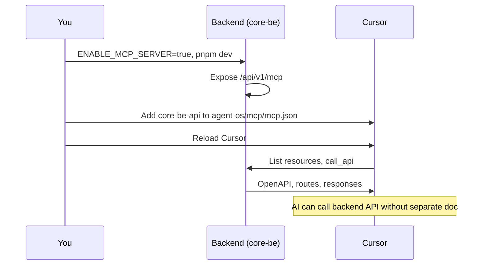

# Connecting Cursor to the Backend MCP

When the backend (core-be) runs with **`ENABLE_MCP_SERVER=true`**, it exposes a Model Context Protocol (MCP) endpoint. You can connect Cursor (in this frontend repo) to it so the AI can discover and call backend APIs without separate API documentation.



---

## Steps (in the frontend repo)

1. **Start the backend** with MCP enabled (in the core-be repo):

   ```env
   ENABLE_MCP_SERVER=true
   ```

   ```bash
   pnpm dev
   ```

   Ensure **CORS** allows your frontend origin: set `ALLOWED_ORIGINS` in backend `.env` (e.g. `http://localhost:5173` for Vite).

2. **In this repo (core-fe)**, create or edit **`agent-os/mcp/mcp.json`** at the project root and add:

   ```json
   {
     "mcpServers": {
       "core-be-api": {
         "url": "http://localhost:3000/api/v1/mcp"
       }
     }
   }
   ```

   If you already have other MCP servers, add the `"core-be-api"` entry inside `mcpServers`. Use a different port if your backend runs elsewhere (e.g. `http://localhost:4000/api/v1/mcp`).

3. **Reload Cursor** (or restart) so it picks up the new MCP server.

4. In this project, Cursor can now use the **core-be-api** server: list resources (`core-be://openapi`, `core-be://routes`) and the **call_api** tool to call the backend API. No separate API doc is required in the frontend.

---

## Auth API contract (frontend expectations)

The login flow and Google OAuth are wired to the backend. The frontend expects:

| Endpoint              | Method | Purpose                                                                                                                          |
| --------------------- | ------ | -------------------------------------------------------------------------------------------------------------------------------- |
| `/api/v1/auth/login`  | POST   | Body: `{ email, password }`. Response: `{ accessToken }`. Frontend then calls `/auth/me` with the token.                         |
| `/api/v1/auth/me`     | GET    | Header: `Authorization: Bearer <accessToken>`. Response: user object (`id`, `email`, `role`, `tenantId`, `name?`, `avatarUrl?`). |
| `/api/v1/auth/google` | GET    | Redirect to Google OAuth; after callback, backend sets refresh cookie and redirects user back to frontend (e.g. `/`).            |

If the backend does not implement `/auth/google` yet, "Sign in with Google" will navigate to that URL and the backend may return 404 until the route is added.

---

## Backend setup (reference)

- Set in backend `.env`: `ENABLE_MCP_SERVER=true`
- Backend MCP endpoint: **`POST {API_BASE}/api/v1/mcp`** (e.g. `http://localhost:3000/api/v1/mcp`)
- Backend docs: see core-be repo `agent-os/docs/cursor-backend-mcp.md` (this repo) and core-be MCP docs for full details.
