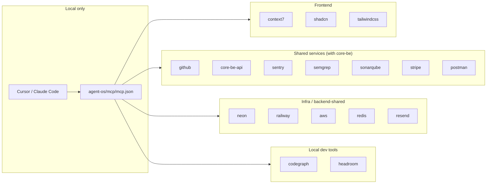

# Cursor MCP Setup (Local)

This project uses **Model Context Protocol (MCP)** servers in Cursor for AI-assisted development. You must set these up **locally**; they are not used in CI or production builds.

**Related:** [cursor-agent-environments.md](./cursor-agent-environments.md) — multi-root workspace and agent environments when working with `core-fe` and `core-be` together.



---

## MCPs used in this repo

The full server set is shared with **core-be** (`pnpm`-parity tooling) plus the
two FE-only servers. The committed template is `agent-os/mcp/mcp.example.json`;
the real, gitignored config is `agent-os/mcp/mcp.json` (the `.mcp.json` and
`.cursor/mcp.json` symlinks point into it).

### Frontend-specific

| MCP             | Purpose                                                                 |
| --------------- | ----------------------------------------------------------------------- |
| **context7**    | Up-to-date library docs (React, Vite, TanStack Query, Zod, …). API key. |
| **shadcn**      | Browse and add shadcn/ui components via CLI.                            |
| **tailwindcss** | Tailwind utilities, colors, docs, CSS-to-Tailwind conversion.           |

### Shared with core-be

| MCP             | Purpose                                                         | Auth / env                         |
| --------------- | --------------------------------------------------------------- | ---------------------------------- |
| **github**      | Repos, PRs, issues, Actions, code search.                       | OAuth (prompted on first use)      |
| **core-be-api** | Backend API discovery + `call_api` when core-be runs with MCP.  | backend on `:3000` w/ MCP enabled  |
| **sentry**      | Error monitoring, issue triage, releases.                       | OAuth                              |
| **semgrep**     | Static security scanning (mirrors the CI semgrep lane).         | none (`uvx`)                       |
| **sonarqube**   | Local code-quality gate (mirrors `pnpm sonar:scan`).            | `SONARQUBE_TOKEN`, `SONARQUBE_URL` |
| **stripe**      | Billing/payments API (org billing surfaces).                    | OAuth                              |
| **postman**     | API collections + request testing against the backend contract. | OAuth                              |

### Infra / backend-shared (rarely needed from the FE)

| MCP         | Purpose                              | Auth / env                |
| ----------- | ------------------------------------ | ------------------------- |
| **neon**    | Postgres (Neon) database inspection. | OAuth                     |
| **railway** | Deploy platform (backend).           | Railway login (`npx`)     |
| **aws**     | AWS APIs (`ap-south-1`).             | AWS creds / SSO (`uvx`)   |
| **redis**   | Redis inspection.                    | `REDIS_URL`               |
| **resend**  | Transactional email.                 | `RESEND_API_KEY` (Docker) |

### Local dev tools (auto-start pair)

| MCP           | Purpose                                | Requires           |
| ------------- | -------------------------------------- | ------------------ |
| **codegraph** | Code-graph navigation across the repo. | `codegraph` binary |
| **headroom**  | Context compression for long sessions. | `headroom` binary  |

> The `infra` servers come from core-be and stay in the config for cross-repo
> work on the same machine; remove any you don't use from
> `agent-os/mcp/mcp.json` to keep your session start clean. `aws`/`redis`/
> `resend`/`sonarqube` need the env vars above exported in your shell (the same
> ones core-be uses); `github`/`sentry`/`stripe`/`neon`/`postman` use OAuth.

---

## Setup instructions

### 1. Create `agent-os/mcp/mcp.json` (project root)

The file `agent-os/mcp/mcp.json` is **gitignored** so secrets (e.g. Context7 API key) are not committed. Create it from the example:

```bash
cp agent-os/mcp/mcp.example.json agent-os/mcp/mcp.json
```

If `agent-os/mcp/mcp.example.json` does not exist, create `agent-os/mcp/mcp.json` with the structure below.

### 2. Add your Context7 API key (required for context7 MCP)

1. Get an API key from [context7.com/dashboard](https://context7.com/dashboard).
2. Open `agent-os/mcp/mcp.json` and replace `YOUR_CONTEXT7_API_KEY` with your key in the `context7` server args.

Only the `context7` server needs an inline key — everything else uses OAuth or
shell env vars (see the tables above). The full 17-server set is in
`agent-os/mcp/mcp.example.json`; you typically edit just this one line (do not
commit the real key — `agent-os/mcp/mcp.json` is gitignored):

```json
"context7": {
  "command": "npx",
  "args": ["-y", "@upstash/context7-mcp", "--api-key", "YOUR_CONTEXT7_API_KEY"]
}
```

### 3. Backend MCP (core-be-api)

The **core-be-api** server only works when the backend is running with MCP enabled:

1. In the backend repo (core-be), set `ENABLE_MCP_SERVER=true` in `.env` and start it (e.g. `pnpm dev`).
2. Use the URL where your backend runs (e.g. `http://localhost:3000/api/v1/mcp`). Change the port in `agent-os/mcp/mcp.json` if needed.

Full details: [cursor-backend-mcp.md](cursor-backend-mcp.md).

### 4. Reload Cursor

After saving `agent-os/mcp/mcp.json`, reload Cursor (Command Palette → “Developer: Reload Window”) or restart Cursor so it picks up the MCP servers.

---

## Verifying MCPs

- In Cursor, MCP servers appear in the AI/chat context when configured.
- If a server fails (e.g. wrong API key or backend not running), check Cursor’s MCP/log output for errors.

---

## Summary

| Step | Action                                                                 |
| ---- | ---------------------------------------------------------------------- |
| 1    | `cp agent-os/mcp/mcp.example.json agent-os/mcp/mcp.json`               |
| 2    | Edit `agent-os/mcp/mcp.json` and set your Context7 API key             |
| 3    | (Optional) Start backend with `ENABLE_MCP_SERVER=true` for core-be-api |
| 4    | Reload Cursor                                                          |

These MCPs are for **local development only** and are not required for `pnpm dev` or `pnpm build` to run.
