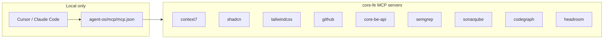

# Cursor MCP Setup (Local)

This project uses **Model Context Protocol (MCP)** servers in Cursor for AI-assisted development. You must set these up **locally**; they are not used in CI or production builds.

**Related:** [cursor-agent-environments.md](./cursor-agent-environments.md) — multi-root workspace and agent environments when working with `core-fe` and `core-be` together.



---

## MCPs used in this repo

core-fe maintains **its own** MCP set — chosen for frontend work, independent of
any other repo. The committed template is `agent-os/mcp/mcp.example.json`; the
real, gitignored config is `agent-os/mcp/mcp.json` (the `.mcp.json` and
`.cursor/mcp.json` symlinks point into it).

| MCP             | Why it's here (frontend)                                          | How it runs                      |
| --------------- | ----------------------------------------------------------------- | -------------------------------- |
| **context7**    | Up-to-date library docs (React, Vite, TanStack Query, Zod, …).    | devDep · `pnpm exec` · API key   |
| **shadcn**      | Browse + add shadcn/ui components via CLI.                        | devDep · `pnpm exec`             |
| **tailwindcss** | Tailwind utilities, colors, docs, CSS-to-Tailwind conversion.     | devDep · `pnpm exec`             |
| **github**      | Repos, PRs, issues, Actions, code search for this repo.           | hosted URL · OAuth               |
| **core-be-api** | Discover the backend API this UI consumes (`call_api`) — the only | hosted URL · backend on `:3000`  |
|                 | cross-service link, and only when you opt to run the backend.     |                                  |
| **semgrep**     | Static security scanning (mirrors the CI semgrep lane).           | `uvx` (ephemeral, needs `uv`)    |
| **sonarqube**   | Local code-quality gate (mirrors the pre-push SonarQube scan).    | `docker` · `SONARQUBE_TOKEN/URL` |
| **codegraph**   | Code-graph navigation across this repo.                           | devDep · `pnpm exec`             |
| **headroom**    | Context compression for long sessions.                            | `uvx` (ephemeral, needs `uv`)    |

> This list is intentionally frontend-shaped — no database / cache / email /
> deploy-platform servers (those belong to the backend). Add or remove servers in
> `agent-os/mcp/mcp.json` freely; it is yours.
>
> **Project-local, container-safe, zero global installs.** The four CLI servers
> (`context7`, `shadcn`, `tailwindcss`, `codegraph`) are **`devDependencies`**,
> invoked via `pnpm exec` — `pnpm install` provides them in any fresh container,
> pinned, with nothing on the global PATH. `semgrep`/`headroom` run via `uvx` and
> `sonarqube` via `docker` (ephemeral, not global — the container's base image
> needs `uv` / `docker` for those three). `github`/`core-be-api` are
> hosted URLs. `sonarqube` reads its env vars from your shell; `github`
> uses OAuth; `core-be-api` only resolves when you run the backend locally.

---

## Setup instructions

### 1. Create `agent-os/mcp/mcp.json` (project root)

The file `agent-os/mcp/mcp.json` is **gitignored** so secrets (e.g. Context7 API key) are not committed. Create it from the example, then install deps so the CLI servers exist locally:

```bash
cp agent-os/mcp/mcp.example.json agent-os/mcp/mcp.json
pnpm install   # provides context7/shadcn/tailwindcss/codegraph as devDeps — run by `pnpm exec`
```

The four CLI servers are project `devDependencies`, so a fresh checkout/container is ready after `pnpm install` — no global tools. `semgrep`/`headroom` additionally need `uv` (for `uvx`) and `sonarqube` needs `docker` on the machine.

> **codegraph** needs a one-time local index before its MCP can answer queries:
> run `pnpm exec codegraph init` in the project root (builds `.codegraph/`,
> which is gitignored / machine-local). It syncs incrementally afterward —
> rebuild with `pnpm exec codegraph index` if it ever drifts.

### 2. Add your Context7 API key (required for context7 MCP)

1. Get an API key from [context7.com/dashboard](https://context7.com/dashboard).
2. Open `agent-os/mcp/mcp.json` and replace `YOUR_CONTEXT7_API_KEY` with your key in the `context7` server args.

Only the `context7` server needs an inline key — everything else uses OAuth or
shell env vars (see the tables above). The full set is in
`agent-os/mcp/mcp.example.json`; you typically edit just this one line (do not
commit the real key — `agent-os/mcp/mcp.json` is gitignored):

```json
"context7": {
  "command": "pnpm",
  "args": ["exec", "context7-mcp", "--api-key", "YOUR_CONTEXT7_API_KEY"]
}
```

### 3. Backend MCP (core-be-api)

The **core-be-api** server only works when the backend is running with MCP enabled:

1. In the backend repo (core-be), set `ENABLE_MCP_SERVER=true` in `.env` and start it (e.g. `pnpm dev`).
2. Use the URL where your backend runs (e.g. `http://localhost:3000/api/v1/mcp`). Change the port in `agent-os/mcp/mcp.json` if needed.

Full details: [cursor-backend-mcp.md](cursor-backend-mcp.md).

### 4. Reload Cursor

After saving `agent-os/mcp/mcp.json`, reload Cursor (Command Palette → “Developer: Reload Window”) or restart Cursor so it picks up the MCP servers.

---

## Verifying MCPs

- In Cursor, MCP servers appear in the AI/chat context when configured.
- If a server fails (e.g. wrong API key or backend not running), check Cursor’s MCP/log output for errors.

---

## Summary

| Step | Action                                                                 |
| ---- | ---------------------------------------------------------------------- |
| 1    | `cp agent-os/mcp/mcp.example.json agent-os/mcp/mcp.json`               |
| 2    | Edit `agent-os/mcp/mcp.json` and set your Context7 API key             |
| 3    | (Optional) Start backend with `ENABLE_MCP_SERVER=true` for core-be-api |
| 4    | Reload Cursor                                                          |

These MCPs are for **local development only** and are not required for `pnpm dev` or `pnpm build` to run.
