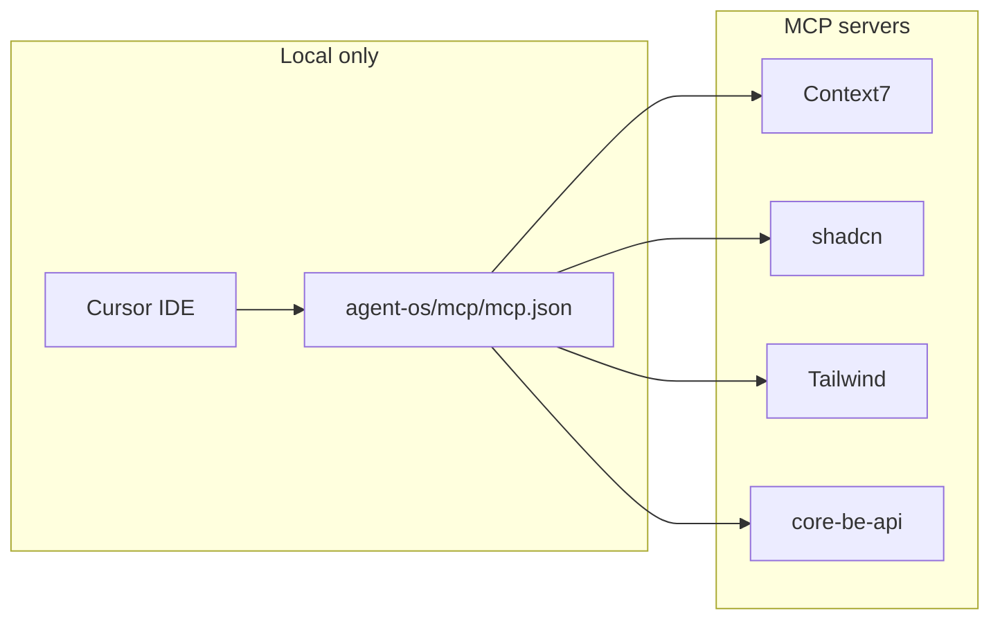

# Cursor MCP Setup (Local)

This project uses **Model Context Protocol (MCP)** servers in Cursor for AI-assisted development. You must set these up **locally**; they are not used in CI or production builds.

**Related:** [cursor-agent-environments.md](./cursor-agent-environments.md) — multi-root workspace and agent environments when working with `core-fe` and `core-be` together.



---

## MCPs used in this repo

| MCP             | Purpose                                                                                |
| --------------- | -------------------------------------------------------------------------------------- |
| **context7**    | Up-to-date library docs (React, Vite, TanStack Query, Zod, etc.). Requires an API key. |
| **shadcn**      | Browse and add shadcn/ui components via CLI.                                           |
| **tailwindcss** | Tailwind utilities, colors, docs, CSS-to-Tailwind conversion.                          |
| **core-be-api** | Backend API discovery and `call_api` when the backend runs with MCP enabled.           |

---

## Setup instructions

### 1. Create `agent-os/mcp/mcp.json` (project root)

The file `agent-os/mcp/mcp.json` is **gitignored** so secrets (e.g. Context7 API key) are not committed. Create it from the example:

```bash
cp agent-os/mcp/mcp.example.json agent-os/mcp/mcp.json
```

If `agent-os/mcp/mcp.example.json` does not exist, create `agent-os/mcp/mcp.json` with the structure below.

### 2. Add your Context7 API key (required for context7 MCP)

1. Get an API key from [context7.com/dashboard](https://context7.com/dashboard).
2. Open `agent-os/mcp/mcp.json` and replace `YOUR_CONTEXT7_API_KEY` with your key in the `context7` server args.

Example (do not commit the real key):

```json
{
  "mcpServers": {
    "context7": {
      "command": "npx",
      "args": ["-y", "@upstash/context7-mcp", "--api-key", "YOUR_CONTEXT7_API_KEY"]
    },
    "shadcn": {
      "command": "npx",
      "args": ["shadcn@latest", "mcp"]
    },
    "tailwindcss": {
      "command": "npx",
      "args": ["-y", "tailwindcss-mcp-server"]
    },
    "core-be-api": {
      "url": "http://localhost:3000/api/v1/mcp"
    }
  }
}
```

### 3. Backend MCP (core-be-api)

The **core-be-api** server only works when the backend is running with MCP enabled:

1. In the backend repo (core-be), set `ENABLE_MCP_SERVER=true` in `.env` and start it (e.g. `pnpm dev`).
2. Use the URL where your backend runs (e.g. `http://localhost:3000/api/v1/mcp`). Change the port in `agent-os/mcp/mcp.json` if needed.

Full details: [cursor-backend-mcp.md](cursor-backend-mcp.md).

### 4. Reload Cursor

After saving `agent-os/mcp/mcp.json`, reload Cursor (Command Palette → “Developer: Reload Window”) or restart Cursor so it picks up the MCP servers.

---

## Verifying MCPs

- In Cursor, MCP servers appear in the AI/chat context when configured.
- If a server fails (e.g. wrong API key or backend not running), check Cursor’s MCP/log output for errors.

---

## Summary

| Step | Action                                                                 |
| ---- | ---------------------------------------------------------------------- |
| 1    | `cp agent-os/mcp/mcp.example.json agent-os/mcp/mcp.json`               |
| 2    | Edit `agent-os/mcp/mcp.json` and set your Context7 API key             |
| 3    | (Optional) Start backend with `ENABLE_MCP_SERVER=true` for core-be-api |
| 4    | Reload Cursor                                                          |

These MCPs are for **local development only** and are not required for `pnpm dev` or `pnpm build` to run.
