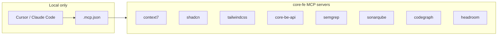

# Cursor MCP Setup (Local)

This project uses **Model Context Protocol (MCP)** servers in Cursor for AI-assisted development. You must set these up **locally**; they are not used in CI or production builds.

**Related:** [cursor-agent-environments.md](./cursor-agent-environments.md) — multi-root workspace and agent environments when working with `core-fe` and `core-be` together.



---

## MCPs used in this repo

core-fe maintains **its own** MCP set — chosen for frontend work, independent of
any other repo. The committed template is `.mcp.example.json`; the
real, gitignored config is `.mcp.json` (the `.mcp.json` and
`.cursor/mcp.json` symlinks point into it).

| MCP             | Why it's here (frontend)                                          | How it runs                      |
| --------------- | ----------------------------------------------------------------- | -------------------------------- |
| **context7**    | Up-to-date library docs (React, Vite, TanStack Query, Zod, …).    | devDep · `pnpm exec` · API key   |
| **shadcn**      | Browse + add shadcn/ui components via CLI.                        | devDep · `pnpm exec`             |
| **tailwindcss** | Tailwind utilities, colors, docs, CSS-to-Tailwind conversion.     | devDep · `pnpm exec`             |
| **core-be-api** | Discover the backend API this UI consumes (`call_api`) — the only | hosted URL · backend on `:3000`  |
|                 | cross-service link, and only when you opt to run the backend.     |                                  |
| **semgrep**     | Static security scanning (mirrors the CI semgrep lane).           | `uvx` (ephemeral, needs `uv`)    |
| **sonarqube**   | Local code-quality gate (mirrors the pre-push SonarQube scan).    | `docker` · `SONARQUBE_TOKEN/URL` |
| **codegraph**   | Code-graph navigation across this repo.                           | devDep · `pnpm exec`             |
| **headroom**    | Context compression for long sessions.                            | `uvx` (ephemeral, needs `uv`)    |

> This list is intentionally frontend-shaped — no database / cache / email /
> deploy-platform servers (those belong to the backend). Add or remove servers in
> `.mcp.json` freely; it is yours.
>
> **Project-local, container-safe, zero global installs.** The four CLI servers
> (`context7`, `shadcn`, `tailwindcss`, `codegraph`) are **`devDependencies`**,
> invoked via `pnpm exec` — `pnpm install` provides them in any fresh container,
> pinned, with nothing on the global PATH. `semgrep`/`headroom` run via `uvx` and
> `sonarqube` via `docker` (ephemeral, not global — the container's base image
> needs `uv` / `docker` for those three). `core-be-api` is a hosted URL and only
> resolves when you run the backend locally. `sonarqube` reads its env vars from
> your shell.

---

## Setup instructions

### Quick path — `pnpm setup:local`

One command scaffolds **deps + `.env.local` + full MCP set + CodeGraph index**:

```bash
pnpm setup:local --no-start   # bootstrap without starting Vite
```

Then set `CONTEXT7_API_KEY` in `.env.local` (from [context7.com/dashboard](https://context7.com/dashboard)) and reload Cursor.

| Command                  | What it scaffolds                                                        |
| ------------------------ | ------------------------------------------------------------------------ |
| `pnpm setup:local`       | deps + `.env.local` + CodeGraph index + **all** MCP servers + `pnpm dev` |
| `pnpm mcp:setup:default` | codegraph + headroom only (subset)                                       |
| `pnpm mcp:setup`         | full set from `.mcp.example.json` (non-destructive merge)                |
| `pnpm mcp:setup --list`  | template servers + declared status                                       |

Merges are **non-destructive** — existing `.mcp.json` entries (e.g. your Context7 key) are never overwritten.

### Manual path

#### 1. Create `.mcp.json`

The file is **gitignored**. Scaffold with CLI commands (preferred) or copy the example:

```bash
pnpm mcp:setup:default        # or: pnpm mcp:setup for the full set
pnpm install                  # devDeps for pnpm exec MCP servers
```

Or manually:

```bash
cp .mcp.example.json .mcp.json
pnpm install
```

> **codegraph** needs a one-time local index before its MCP can answer queries:
> run `pnpm exec codegraph init` in the project root (builds `.codegraph/`,
> which is gitignored / machine-local). It syncs incrementally afterward —
> rebuild with `pnpm exec codegraph index` if it ever drifts.

### 2. Add your Context7 API key (required for context7 MCP)

1. Get an API key from [context7.com/dashboard](https://context7.com/dashboard).
2. Set `CONTEXT7_API_KEY=` in **`.env.local`** (scaffolded by `pnpm setup:local`). The context7 MCP reads `${CONTEXT7_API_KEY}` from your environment — same pattern as core-be.

Do not commit the real key — `.env.local` is gitignored.

### 3. Backend MCP (core-be-api)

The **core-be-api** server only works when the backend is running with MCP enabled:

1. In the backend repo (core-be), set `ENABLE_MCP_SERVER=true` in `.env` and start it (e.g. `pnpm dev`).
2. Use the URL where your backend runs (e.g. `http://localhost:3000/api/v1/mcp`). Change the port in `.mcp.json` if needed.

Full details: [cursor-backend-mcp.md](cursor-backend-mcp.md).

### 4. Reload Cursor

After saving `.mcp.json`, reload Cursor (Command Palette → “Developer: Reload Window”) or restart Cursor so it picks up the MCP servers.

---

## Verifying MCPs

- In Cursor, MCP servers appear in the AI/chat context when configured.
- If a server fails (e.g. wrong API key or backend not running), check Cursor’s MCP/log output for errors.

---

## Summary

| Step | Action                                                                 |
| ---- | ---------------------------------------------------------------------- |
| 1    | `pnpm setup:local --no-start` (scaffolds `.env.local` + full MCP set)  |
| 2    | Set `CONTEXT7_API_KEY` in `.env.local`                                 |
| 3    | (Optional) Start backend with `ENABLE_MCP_SERVER=true` for core-be-api |
| 4    | Reload Cursor                                                          |

These MCPs are for **local development only** and are not required for `pnpm dev` or `pnpm build` to run.
