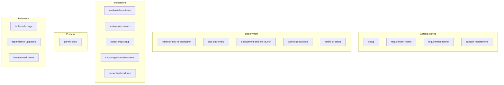

# Documentation Index

Guides are grouped by **use case**. Use this index to find the right doc quickly.

> **Note:** Mermaid diagrams in this repo render as diagrams on GitHub (repo view, PRs, and when browsing `.md` files).

---

## Getting started

| Doc                                                                                      | Purpose                                                                  |
| ---------------------------------------------------------------------------------------- | ------------------------------------------------------------------------ |
| [setup.md](getting-started/setup.md)                                                     | Local development: clone, env, run the app                               |
| [requirement-intake.md](getting-started/requirement-intake.md)                           | How to submit a requirement so the AI can implement it in one go         |
| [requirement-format.md](getting-started/requirement-format.md)                           | Template and field guide for writing requirements                        |
| [route-island-template.md](getting-started/route-island-template.md)                     | Copy-paste tree (`<page>.manifest.ts`, colocated tests, direct children) |
| [requirements/sample-requirement.md](getting-started/requirements/sample-requirement.md) | Filled example (Notifications page)                                      |

---

## Deployment

| Doc                                                                     | Purpose                                             |
| ----------------------------------------------------------------------- | --------------------------------------------------- |
| [runbook-dev-to-production.md](deployment/runbook-dev-to-production.md) | Step-by-step: local dev → validate → build → deploy |
| [cicd-and-netlify.md](deployment/cicd-and-netlify.md)                   | CI/CD, Netlify env, deploy commands, GitHub Actions |
| [deployment-and-pre-launch.md](deployment/deployment-and-pre-launch.md) | Full deployment guide and pre-launch checklist      |
| [path-to-production.md](deployment/path-to-production.md)               | Gate: run runbook + checklist before release        |
| [netlify-cli-setup.md](deployment/netlify-cli-setup.md)                 | Netlify CLI one-time connect and deploy             |
| [scripts/live/README.md](../scripts/live/README.md)                     | One-command deployment: `pnpm run setup`            |

---

## Integrations (credentials & tools)

| Doc                                                                       | Purpose                                                                                                   |
| ------------------------------------------------------------------------- | --------------------------------------------------------------------------------------------------------- |
| [credentials-and-env.md](integrations/credentials-and-env.md)             | Where to get credentials and env vars (API, Sentry, PostHog, Netlify, GitHub Secrets)                     |
| [sentry-sourcemaps.md](integrations/sentry-sourcemaps.md)                 | Sentry source map upload (Vite plugin)                                                                    |
| [cursor-mcp-setup.md](integrations/cursor-mcp-setup.md)                   | **Local setup:** Cursor MCP servers (Context7, shadcn, Tailwind, core-be-api) — required for Cursor users |
| [cursor-agent-environments.md](integrations/cursor-agent-environments.md) | Multi-root workspaces and Cursor agent environments (core-fe + core-be)                                   |
| [cursor-backend-mcp.md](integrations/cursor-backend-mcp.md)               | Connect Cursor to the backend MCP for API discovery                                                       |

---

## Process

| Doc                                        | Purpose                                              |
| ------------------------------------------ | ---------------------------------------------------- |
| [git-workflow.md](process/git-workflow.md) | Branch naming, PR flow, conventional commits, hotfix |

---

## Testing

| Doc / location                                                 | Purpose                                                                             |
| -------------------------------------------------------------- | ----------------------------------------------------------------------------------- |
| **[tests/README.md](../tests/README.md)** (project root)       | **Global test overview** — where unit, E2E, and load tests live and how to run them |
| [e2e-testids-inventory.md](reference/e2e-testids-inventory.md) | **`data-testid` catalog** for Playwright E2E (by route); keep in sync with UI       |
| [tools-and-usage.md](reference/tools-and-usage.md)             | Dependency usage (Vitest, Playwright, etc.)                                         |

---

## Reference

| Doc                                                                | Purpose                                                                                                   |
| ------------------------------------------------------------------ | --------------------------------------------------------------------------------------------------------- |
| [tools-and-usage.md](reference/tools-and-usage.md)                 | Dependency usage table (what each package is used for)                                                    |
| [quality/sonarqube-local.md](reference/quality/sonarqube-local.md) | **SonarQube local quality gate** — Docker server, `pnpm sonar:scan`, pre-push enforcement                 |
| [third-party-comparison.md](reference/third-party-comparison.md)   | Keep/swap verdicts for major dependencies (charts, analytics, routing)                                    |
| [ui-components-sourcing.md](reference/ui-components-sourcing.md)   | shadcn-first UI workflow (`npx shadcn add`, research sites)                                               |
| [dependency-upgrades.md](reference/dependency-upgrades.md)         | Audits, Dependabot, and intentional version pins                                                          |
| [route-island-structure.md](reference/route-island-structure.md)   | **Per-route folders** — same layout for every route/sub-route; import boundaries                          |
| [routes-and-ui.md](reference/routes-and-ui.md)                     | **Live frontend routes** (and backend APIs they use) and **UI** (shadcn component library and primitives) |
| [e2e-testids-inventory.md](reference/e2e-testids-inventory.md)     | Playwright `data-testid` inventory by route (skill: `agent-os/skills/e2e-testids/`)                       |
| [internationalization.md](reference/internationalization.md)       | i18n status and future client-side i18n                                                                   |
| **[public/README.md](../public/README.md)** (project root)         | **Static assets** in `public/`: manifest, robots.txt, icons, \_headers; required list and maintenance     |

---

## Reports & audits

| Doc                                                              | Purpose                                                                                                                                             |
| ---------------------------------------------------------------- | --------------------------------------------------------------------------------------------------------------------------------------------------- |
| [full-code-review-report.md](reports/full-code-review-report.md) | Full code review (security, performance, quality, readability, maintainability, scalability) and findings — **generate:** `pnpm report:code-review` |

---

## Root-level docs (project root)

- **README.md** — Quick start, scripts, architecture, how to request changes
- **CLAUDE.md** — Conventions (architecture, routes, state, styling, testing)
- **CONTRIBUTING.md** — For humans: where things live, what runs automatically
