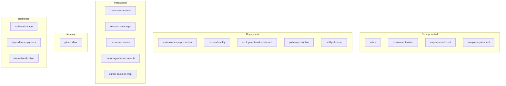

# Documentation Index

Guides are grouped by **use case**. Use this index to find the right doc quickly.

> **Note:** Mermaid diagrams in this repo render as diagrams on GitHub (repo view, PRs, and when browsing `.md` files).

---

## Getting started

| Doc                                                                                                          | Purpose                                                                       |
| ------------------------------------------------------------------------------------------------------------ | ----------------------------------------------------------------------------- |
| [setup.md](getting-started/setup.md)                                                                         | Local development: clone, env, run the app                                    |
| [requirement-intake.md](getting-started/requirement-intake.md)                                               | How to submit a requirement so the AI can implement it in one go              |
| [requirement-format.md](getting-started/requirement-format.md)                                               | Template and field guide for writing requirements                             |
| [route-island-template.md](getting-started/route-island-template.md)                                         | Copy-paste tree (`<page>.manifest.ts`, colocated tests, direct children)      |
| [requirements/sample-requirement.md](getting-started/requirements/sample-requirement.md)                     | Filled example (Notifications page)                                           |
| [requirements/unified-auth-otp-requirement.md](getting-started/requirements/unified-auth-otp-requirement.md) | **Cross-repo:** email/phone OTP rename, unified login+signup, BE+FE checklist |

---

## Deployment

| Doc                                                                                             | Purpose                                                               |
| ----------------------------------------------------------------------------------------------- | --------------------------------------------------------------------- |
| [runbook-dev-to-production.md](deployment/runbook-dev-to-production.md)                         | Step-by-step: local dev → validate → build → deploy                   |
| [cicd-and-netlify.md](deployment/cicd-and-netlify.md)                                           | CI/CD, Netlify env, deploy commands, GitHub Actions                   |
| [deployment-and-pre-launch.md](deployment/deployment-and-pre-launch.md)                         | Full deployment guide and pre-launch checklist                        |
| [path-to-production.md](deployment/path-to-production.md)                                       | Gate: run runbook + checklist before release                          |
| [production-readiness.md](deployment/production-readiness.md)                                   | **Go / no-go** — what blocks production, categorized                  |
| [netlify-cli-setup.md](deployment/netlify-cli-setup.md)                                         | Netlify CLI one-time connect and deploy                               |
| [runbooks/environment-variables.md](deployment/runbooks/environment-variables.md)               | **Env schema** — `.env.example`, auth switches, GitHub/Netlify deploy |
| [runbooks/csp-trusted-types-production.md](deployment/runbooks/csp-trusted-types-production.md) | CSP report URI, Trusted Types, `config.js` SRI contract               |
| [tooling/setup/live/README.md](../tooling/setup/live/README.md)                                 | One-command deployment: `pnpm run setup`                              |

---

## Integrations (credentials & tools)

| Doc                                                                                             | Purpose                                                                                                   |
| ----------------------------------------------------------------------------------------------- | --------------------------------------------------------------------------------------------------------- |
| [credentials-and-env.md](integrations/credentials-and-env.md)                                   | Where to get credentials and env vars (API, Sentry, PostHog, Netlify, GitHub Secrets)                     |
| [../deployment/runbooks/environment-variables.md](deployment/runbooks/environment-variables.md) | Canonical env runbook — schema, auth switches, module keys, `config.js`                                   |
| [sentry-sourcemaps.md](integrations/sentry-sourcemaps.md)                                       | Sentry source map upload (Vite plugin)                                                                    |
| [sentry-frontend.md](integrations/sentry-frontend.md)                                           | Sentry React SDK — errors, replay, performance, logs, feedback (full data catalog)                        |
| [posthog-frontend.md](integrations/posthog-frontend.md)                                         | PostHog product analytics — events, funnels, flags, Web Vitals (full event catalog)                       |
| [cursor-mcp-setup.md](integrations/cursor-mcp-setup.md)                                         | **Local setup:** Cursor MCP servers (Context7, shadcn, Tailwind, core-be-api) — required for Cursor users |
| [cursor-agent-environments.md](integrations/cursor-agent-environments.md)                       | Multi-root workspaces and Cursor agent environments (core-fe + core-be)                                   |
| [cursor-backend-mcp.md](integrations/cursor-backend-mcp.md)                                     | Connect Cursor to the backend MCP for API discovery                                                       |

---

## Process

| Doc                                                                          | Purpose                                                                                     |
| ---------------------------------------------------------------------------- | ------------------------------------------------------------------------------------------- |
| [git-workflow.md](process/git-workflow.md)                                   | Branch naming, PR flow, conventional commits, hotfix                                        |
| [organization-deployment-modes.md](process/organization-deployment-modes.md) | Personal / team / both deployment toggles — signup, onboarding, switcher, **env-only auth** |
| [pr-review.md](process/pr-review.md)                                         | PR review rubric                                                                            |
| [release-versioning.md](process/release-versioning.md)                       | Release and versioning process                                                              |
| [CONTRIBUTING.md](../CONTRIBUTING.md)                                        | For humans: repo layout, hooks/gates, how to work with the AI                               |
| [SECURITY.md](../SECURITY.md)                                                | Vulnerability reporting, dependency-advisory response targets                               |
| [CODE_OF_CONDUCT.md](../CODE_OF_CONDUCT.md)                                  | Community expectations                                                                      |

---

## Testing

| Doc / location                                                               | Purpose                                                                                      |
| ---------------------------------------------------------------------------- | -------------------------------------------------------------------------------------------- |
| **[tests/README.md](../tests/README.md)** (project root)                     | **Global test overview** — commands, folder layout, hybrid E2E                               |
| **[reference/testing.md](reference/testing.md)**                             | **Full test matrix** — every kind, spec inventory, skills, gates                             |
| **[reference/local-production-perf.md](reference/local-production-perf.md)** | **Production build perf** — `pnpm build` + `pnpm preview`, `pnpm size`, Lighthouse (not dev) |
| **[reference/cross-browser-support.md](reference/cross-browser-support.md)** | **Cross-browser matrix** — Chrome/Firefox/Safari status + `pnpm test:cross-browser`          |
| [e2e-testids-inventory.md](reference/e2e-testids-inventory.md)               | **`data-testid` catalog** for Playwright E2E (by route); keep in sync with UI                |
| [tools-and-usage.md](reference/tools-and-usage.md)                           | Dependency usage (Vitest, Playwright, etc.)                                                  |

---

## Reference

| Doc                                                                          | Purpose                                                                                                          |
| ---------------------------------------------------------------------------- | ---------------------------------------------------------------------------------------------------------------- |
| [tools-and-usage.md](reference/tools-and-usage.md)                           | Dependency usage table (what each package is used for)                                                           |
| [data-mutations.md](reference/data-mutations.md)                             | **Optimistic updates & write UX** — which mutations are optimistic vs in-progress, the policy, and the inventory |
| [quality/sonarqube-local.md](reference/quality/sonarqube-local.md)           | **SonarQube local quality gate** — Docker server, `pnpm sonar:scan`, pre-push enforcement                        |
| [quality/test-coverage.md](reference/quality/test-coverage.md)               | **Test coverage** — runners, global ratchet thresholds, patch coverage, strict colocation                        |
| [security-model.md](reference/security-model.md)                             | **Frontend security model** — threats covered, CSP delivery, accepted risks, backend's half                      |
| [backend-list-pagination-spec.md](reference/backend-list-pagination-spec.md) | **Backend pagination spec** — core-be cursor for invoices + server-side sort/filter; FE follow-ups               |
| [third-party-comparison.md](reference/third-party-comparison.md)             | Keep/swap verdicts for major dependencies (charts, analytics, routing)                                           |
| [ui-components-sourcing.md](reference/ui-components-sourcing.md)             | shadcn-first UI workflow (`npx shadcn add`, research sites)                                                      |
| [design.md](reference/design.md)                                             | **Design language** — aesthetic POV, typography, colour, motion, themeability principles                         |
| [preset-product-design-rules.md](reference/preset-product-design-rules.md)   | **Preset product rules** — per-axis floors (type, density, contrast, motion, touch) + WCAG/industry refs         |
| [theming.md](reference/theming.md)                                           | **Theming mechanics** — token map, shadcn-create adoption, Shuffle + swappable icon engine                       |
| [theme-axis-audit-playbook.md](reference/theme-axis-audit-playbook.md)       | **Theme axis audit playbook** — full preset catalog + per-axis fix procedure (all 18 axes ✅)                    |
| [dependency-upgrades.md](reference/dependency-upgrades.md)                   | Audits, Dependabot, and intentional version pins                                                                 |
| [route-island-structure.md](reference/route-island-structure.md)             | **Per-route folders** — same layout for every route/sub-route; import boundaries                                 |
| [routes-and-ui.md](reference/routes-and-ui.md)                               | **Live frontend routes** (and backend APIs they use) and **UI** (shadcn component library and primitives)        |
| [unified-auth-flows.md](reference/unified-auth-flows.md)                     | **Unified login + sign-up** — email/phone OTP, OAuth, route/API matrix, env toggles                              |
| [frontend-platform.md](reference/frontend-platform.md)                       | **Platform kernel** — boot order, gateway, session context, modules, errors, QueryBoundary policy                |
| [pwa-manifest-and-app-icon.md](reference/pwa-manifest-and-app-icon.md)       | **PWA manifest + icon** — `app-manifest.ts` source of truth, preset colors, PNG regen (skill: `pwa-manifest`)    |
| [local-production-perf.md](reference/local-production-perf.md)               | **Local prod perf audit** — build + preview/serve, size limits, Lighthouse workflow                              |
| [e2e-testids-inventory.md](reference/e2e-testids-inventory.md)               | Playwright `data-testid` inventory by route (skill: `agent-os/skills/e2e-testids/`)                              |
| [internationalization.md](reference/internationalization.md)                 | Client-side i18n (react-i18next) + backend message contract                                                      |
| [constants-and-i18n.md](reference/constants-and-i18n.md)                     | Constants file placement, locale namespaces, rollout waves                                                       |
| **[public/README.md](../public/README.md)** (project root)                   | **Static assets** in `public/`: manifest, robots.txt, icons, \_headers; required list and maintenance            |

---

## Reports & audits

| Doc                                                              | Purpose                                                                                                                                             |
| ---------------------------------------------------------------- | --------------------------------------------------------------------------------------------------------------------------------------------------- |
| [full-code-review-report.md](reports/full-code-review-report.md) | Full code review (security, performance, quality, readability, maintainability, scalability) and findings — **generate:** `pnpm report:code-review` |

---

## Root-level docs (project root)

- **README.md** — Quick start, scripts, architecture, how to request changes
- **CLAUDE.md** — Conventions (architecture, routes, state, styling, testing)
- **CONTRIBUTING.md** — For humans: where things live, what runs automatically
