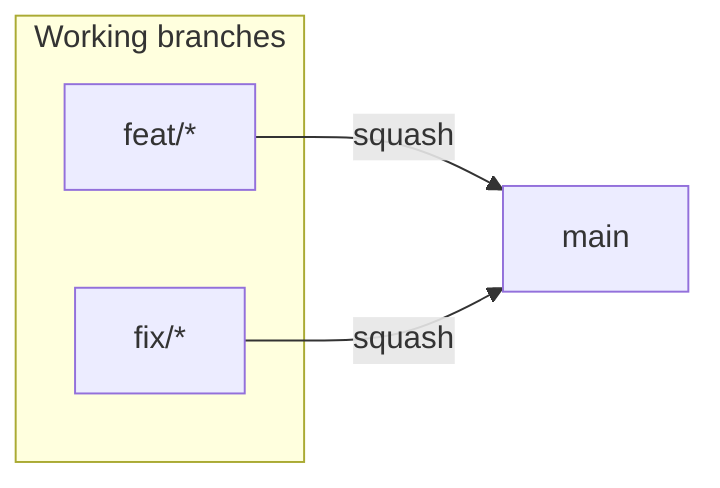

# Branch protection and required CI checks

Canonical reference for **which GitHub checks must gate merges** into **`main`** (the
single trunk), and how that maps to workflows and the committed ruleset JSON under
[`.github/rulesets/`](../../.github/rulesets/).

**Related docs:** [cicd-and-netlify.md](cicd-and-netlify.md) (CI/CD + Netlify deploy), [trunk-based-workflow.md](../process/trunk-based-workflow.md) (branch naming and release flow).

---

## Branch model

Trunk-based — one long-lived branch, **`main`**. Feature branches are created from it
and squash-merge back:



`main` drives both GitHub environments by **purpose**, not by branch:

| Trigger                        | GitHub Environment | Deploy target                                                    |
| ------------------------------ | ------------------ | ---------------------------------------------------------------- |
| every push to `main`           | `development`      | Netlify `--alias development` (development--core-fe.netlify.app) |
| a release (`vX.Y.Z`) on `main` | `production`       | Netlify `--prod` (core-fe.netlify.app)                           |

Hotfixes are fix-forward on `main` (a `fix:` PR → next patch release) — no release
branches. Canonical manifest: [`tooling/setup/setup.config.json`](../../tooling/setup/setup.config.json).

---

## Required status checks (pull requests)

These are the **exact check names** required in GitHub for every PR targeting **`main`**:

| Workflow file                                                                                                               | Job / check         | Required check string  |
| --------------------------------------------------------------------------------------------------------------------------- | ------------------- | ---------------------- |
| [pr-ci.yml](../../.github/workflows/pr-ci.yml)                                                                              | aggregate           | `Quality gate`         |
| [pr-ci.yml](../../.github/workflows/pr-ci.yml) via [reusable-unit-gate.yml](../../.github/workflows/reusable-unit-gate.yml) | unit gate           | `unit / Unit + global` |
| [pr-governance.yml](../../.github/workflows/pr-governance.yml)                                                              | PR title validation | `Checks`               |

Every other PR CI lane rolls up into **Quality gate** — adding a lane does not require
updating branch protection unless you want it individually required.

Post-merge SBOM, release-please, and the Netlify deploys run from
[post-merge-ci.yml](../../.github/workflows/post-merge-ci.yml) when a PR merges (not
required PR checks — post-merge does **not** re-run the test suite).

### Skipped PR CI jobs on docs-only pull requests

When path filters detect **docs-only markdown** (`docs-only-md`), most PR CI jobs are
**skipped**. Skipped required checks do **not** block merge.

---

## `Protect main` ruleset (personal governance mode)

Committed ruleset: [main.json](../../.github/rulesets/main.json). Sync to GitHub with
`pnpm github:sync`. The human-review row below is set by the **governance mode** switch
(see the next section) — do not hand-edit it.

| Rule                            | `main`                                                                                         |
| ------------------------------- | ---------------------------------------------------------------------------------------------- |
| Required approving reviews      | **0** (personal mode; `github:tool:governance-mode team` sets it to 1 once a 2nd owner exists) |
| Require CODEOWNER review        | No                                                                                             |
| Require conversation resolution | Yes                                                                                            |
| Strict up-to-date checks        | **On** — a branch must be up to date with `main` before it merges (merged tree == tested tree) |
| Allowed merge methods           | **`squash` only** (branch auto-deletes on merge)                                               |
| Require signed commits          | Yes                                                                                            |
| Block force-push / deletion     | Yes                                                                                            |
| Bypass actors                   | Admin (`RepositoryRole` id 5), PR mode                                                         |
| Required status checks          | Quality gate, unit / Unit + global, Checks                                                     |

Repo settings pair with the ruleset: `delete_branch_on_merge = true`, squash commit
title = PR title, message = PR body.

---

## Governance mode (personal ↔ team)

The human-review posture is a **single switch**, not a set of hand-edited fields. It
spans two files — the ruleset's `pull_request` rule and the `production` environment's
`requiredReviewers` — and the coupled fields deadlock the maintainer in the wrong
combination (GitHub forbids self-approval, so `preventSelfReview` with one reviewer locks
the shipper out). The tool flips every field across both files atomically and refuses any
deadlocking or unsatisfiable combination.

| Field                             | `personal`  | `team`          |
| --------------------------------- | ----------- | --------------- |
| `required_approving_review_count` | 0           | 1               |
| `require_code_owner_review`       | false       | true            |
| `require_last_push_approval`      | false       | true            |
| `dismiss_stale_reviews_on_push`   | false       | true            |
| prod `requiredReviewers.users`    | first owner | all owners (≤6) |
| prod `preventSelfReview`          | false       | true            |

```bash
pnpm github:tool:governance-mode          # status: current mode + roster + next step
pnpm github:tool:governance-mode team     # apply four-eyes (needs ≥2 CODEOWNERS users)
pnpm github:sync                          # apply ruleset + environment to GitHub
pnpm github:tool:governance-mode:check    # CI drift guard (also enforced in the ci-policy lane)
```

`team` requires a second individual `@user` in [.github/CODEOWNERS](../../.github/CODEOWNERS)
first — the repo is `personal` today. Full reference:
[branch-governance.md](../reference/branch-governance.md).

---

## GitHub Environments

Committed environment config: [development.json](../../.github/environments/development.json), [production.json](../../.github/environments/production.json). See [.github/environments/README.md](../../.github/environments/README.md).

Only the **`production`** environment carries a required reviewer — it gates the prod
deploy (the one human approval in the model). `development` is ungated.

**Required deploy secrets** (post-merge Netlify deploy fails if missing):

- `VITE_API_BASE_URL`
- `NETLIFY_AUTH_TOKEN`
- `NETLIFY_SITE_ID`

Optional (warn only): `VITE_POSTHOG_KEY`, `VITE_POSTHOG_HOST`, `VITE_PRIVACY_POLICY_URL`.

| Command                                  | Purpose                                                        |
| ---------------------------------------- | -------------------------------------------------------------- |
| `pnpm github:sync`                       | Unified IaC: rulesets + env shells + secrets from `.env.*`     |
| `pnpm github:sync --check`               | Read-only drift (rulesets + protection + secret names)         |
| `pnpm github:sync --prune`               | Flag branch rulesets not in config (`--prune --yes` to delete) |
| `pnpm validate:deploy-env`               | Fail loud if required secrets missing                          |
| `pnpm github:tool:governance-mode`       | Governance mode status / switch (`personal`/`team`)            |
| `pnpm github:tool:governance-mode:check` | Fail on inconsistent/deadlocking governance mode               |
