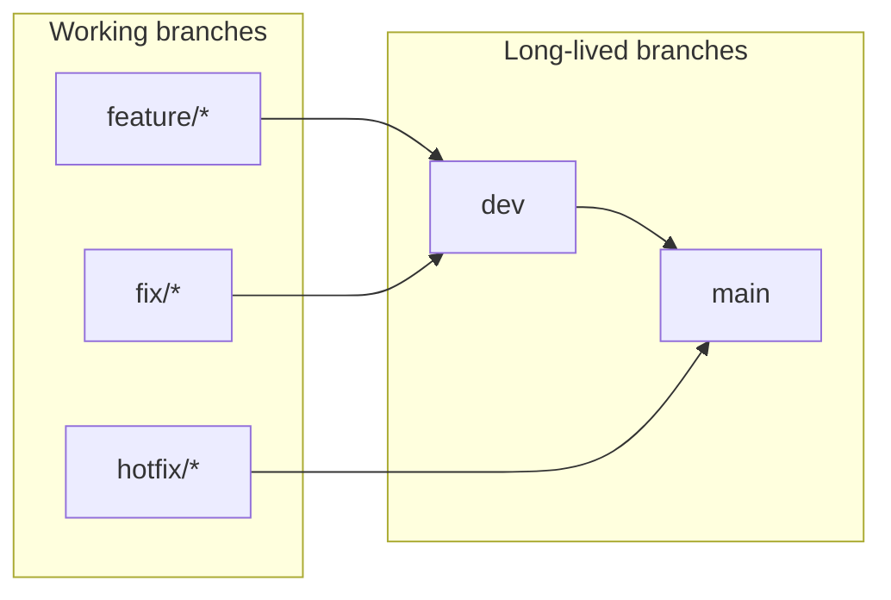

# Branch protection and required CI checks

Canonical reference for **which GitHub checks must gate merges** into **`main`** and **`dev`**, and how that maps to workflows and committed ruleset JSON under [`.github/rulesets/`](../../.github/rulesets/).

**Related docs:** [cicd-and-netlify.md](cicd-and-netlify.md) (CI/CD + Netlify deploy), [git-workflow.md](../process/git-workflow.md) (branch naming and promotion).

---

## Branch model

Long-lived branches **`main`** and **`dev`** align with GitHub environments (`production`, `development`). Typical promotion path:

Hotfixes merge **`hotfix/* → main`** first; post-merge CI opens a back-merge PR to sync **`main → dev`** (see [post-release-backmerge.yml](../../.github/workflows/post-release-backmerge.yml)).

| Branch | GitHub Environment | Deploy target                                   |
| ------ | ------------------ | ----------------------------------------------- |
| `dev`  | `development`      | Netlify (dev site secrets in `development` env) |
| `main` | `production`       | Netlify (prod site secrets in `production` env) |

Canonical manifest: [`scripts/setup/setup.config.json`](../../scripts/setup/setup.config.json).

---

## Required status checks (pull requests)

These are the **exact check names** to require in GitHub for every PR targeting **`main`** or **`dev`**.

| Workflow file                                                                                                               | Job / check         | Required check string  |
| --------------------------------------------------------------------------------------------------------------------------- | ------------------- | ---------------------- |
| [pr-ci.yml](../../.github/workflows/pr-ci.yml)                                                                              | aggregate           | `Quality gate`         |
| [pr-ci.yml](../../.github/workflows/pr-ci.yml) via [reusable-unit-gate.yml](../../.github/workflows/reusable-unit-gate.yml) | unit gate           | `unit / Unit + global` |
| [pr-governance.yml](../../.github/workflows/pr-governance.yml)                                                              | PR title validation | `Checks`               |

Every other PR CI lane rolls up into **Quality gate** — adding a lane does not require updating branch protection unless you want it individually required.

### Same checks on both branches

Require all three rows above for **`main`** and **`dev`** PRs. [pr-ci.yml](../../.github/workflows/pr-ci.yml) runs on `pull_request` into each branch.

Post-merge SBOM, release-please, Netlify deploy, and back-merge automation run from [post-merge-ci.yml](../../.github/workflows/post-merge-ci.yml) when a PR merges (not required PR checks).

### Skipped PR CI jobs on docs-only pull requests

When path filters detect **docs-only markdown** (`docs-only-md`), most PR CI jobs are **skipped**. Skipped required checks do **not** block merge.

---

## Ruleset policy differences

Committed rulesets: [main.json](../../.github/rulesets/main.json), [dev.json](../../.github/rulesets/dev.json). Sync to GitHub with `pnpm gh:rulesets:sync`.

| Rule                            | `main`                                     | `dev`                 |
| ------------------------------- | ------------------------------------------ | --------------------- |
| Required approving reviews      | **1**                                      | **0**                 |
| Require CODEOWNER review        | **Yes**                                    | No                    |
| Dismiss stale approvals on push | **Yes**                                    | No                    |
| Require approval on last push   | **Yes**                                    | No                    |
| Require conversation resolution | Yes                                        | Yes                   |
| Allowed merge methods           | **`merge` only**                           | **`squash`, `merge`** |
| Require signed commits          | **Yes**                                    | No                    |
| Block force-push                | Yes                                        | Yes                   |
| Block deletion                  | Yes                                        | Yes                   |
| Bypass actors                   | Admin (`RepositoryRole` id 5), PR mode     | none                  |
| Required status checks          | Quality gate, unit / Unit + global, Checks | Same                  |

Both use `strict_required_status_checks_policy: true` (branch must be up to date).

---

## GitHub Environments

Committed environment config: [development.json](../../.github/environments/development.json), [production.json](../../.github/environments/production.json).

Deploy secrets (`VITE_API_BASE_URL`, `VITE_POSTHOG_KEY`, `VITE_POSTHOG_HOST`,
`VITE_PRIVACY_POLICY_URL`, `NETLIFY_AUTH_TOKEN`, `NETLIFY_SITE_ID`) are stored
**per environment** with the same keys — values differ between development and
production Netlify sites. Sync via `pnpm setup:infra:github-secrets` from
`config.setup.env` (see `scripts/setup/setup.config.json`).
