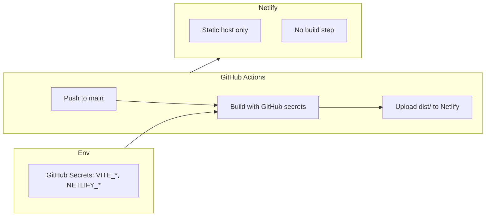
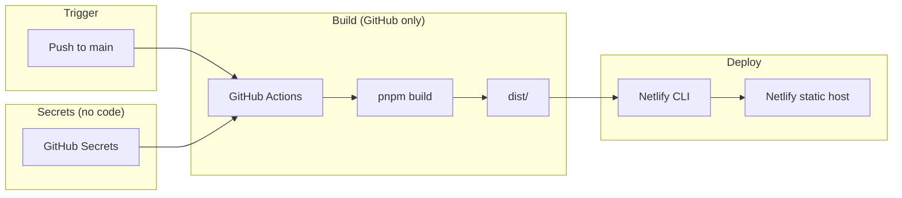
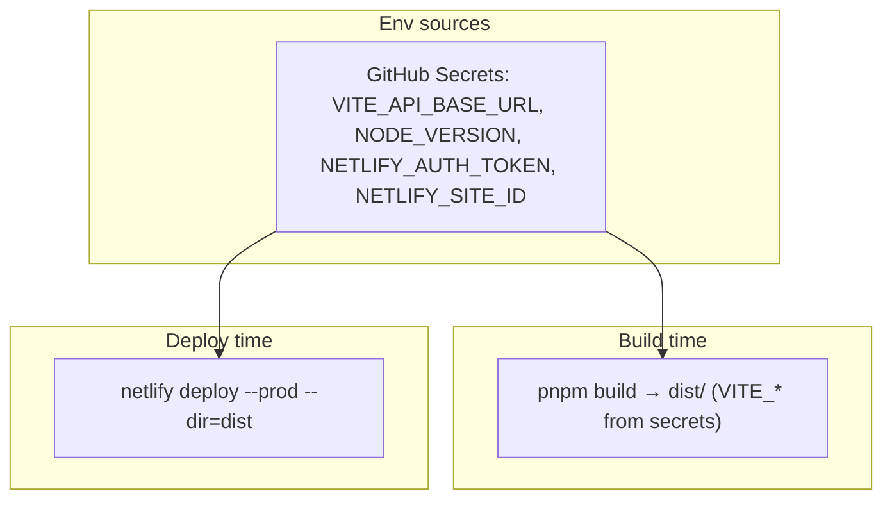
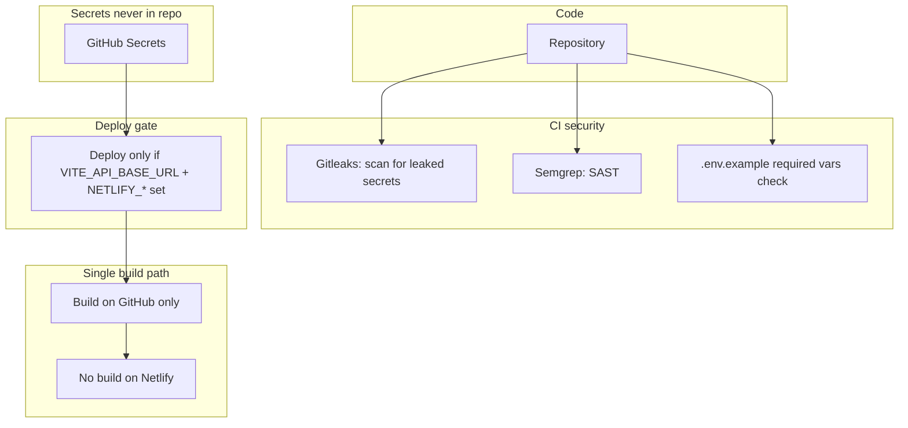
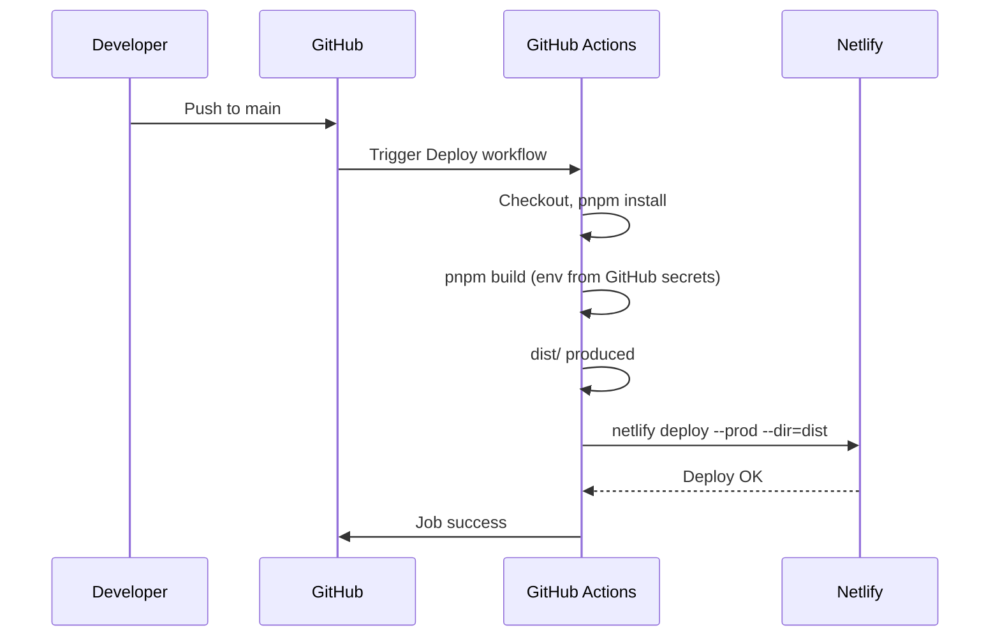

# CI/CD and Netlify Deployment

Single reference for how Core Frontend is built, tested, and deployed. **Build runs only on GitHub Actions**; Netlify receives the pre-built `dist/` (no build on Netlify). See [deployment-and-pre-launch.md](deployment-and-pre-launch.md) for other static hosts.

---

## Deployment flow diagrams

### Full flow: Push → Env → Build → Deploy

### Where env comes from

### Secured pipeline (security layers)

### End-to-end sequence

---

## Setup checklist: what's done vs what you need

### Already done (no action)

- Netlify site linked to this repo (CLI).
- Netlify production env: `VITE_API_BASE_URL=https://your-api-domain.com`.
- Netlify CLI login (browser auth; no token to store).
- `netlify.toml` and deploy scripts in place.

### Required (you do once)

| What                   | Where                                               | Notes                                                                                                                                                                                                                           |
| ---------------------- | --------------------------------------------------- | ------------------------------------------------------------------------------------------------------------------------------------------------------------------------------------------------------------------------------- |
| **Env vars for build** | **GitHub Secrets**                                  | Put `VITE_API_BASE_URL`, `NODE_VERSION` in GitHub → Settings → Secrets and variables → Actions. Build runs on GitHub; these are injected at build time. No build on Netlify.                                                    |
| **GitHub secrets**     | GitHub → Settings → Secrets and variables → Actions | **Required for deploy:** `VITE_API_BASE_URL`, `NODE_VERSION`, `NETLIFY_AUTH_TOKEN` (Netlify → User settings → Applications → Personal access tokens), `NETLIFY_SITE_ID` (Netlify → Site settings → General → Site information). |
| **Netlify: no build**  | Netlify UI                                          | If the site is connected to Git, **disable the build** (e.g. set build command to a no-op or disconnect "Build" so only GitHub deploys). Deploy workflow uploads pre-built `dist/` via CLI.                                     |
| **Backend CORS**       | Your API server                                     | Allow your Netlify site origin (or custom domain) so the browser can call the production API.                                                                                                                                   |

### Optional (tokens / secrets)

| What                       | Where to put it                                                          | When                                                                                                                                        |
| -------------------------- | ------------------------------------------------------------------------ | ------------------------------------------------------------------------------------------------------------------------------------------- |
| **Sentry (source maps)**   | **GitHub Secrets:** `SENTRY_AUTH_TOKEN`, `SENTRY_ORG`, `SENTRY_PROJECT`. | Build runs on GitHub; add these so the build step can upload source maps. See [sentry-sourcemaps.md](../integrations/sentry-sourcemaps.md). |
| **Sentry (client errors)** | **GitHub Secrets:** `VITE_SENTRY_DSN`.                                   | Baked into the client at build time.                                                                                                        |
| **PostHog**                | **GitHub Secrets:** `VITE_POSTHOG_KEY`, `VITE_POSTHOG_HOST`.             | Baked into the client at build time.                                                                                                        |

### Local development

- **`.env` / `.env.local`** at project root: `VITE_DEV_API_URL` (e.g. `http://localhost:3000`) if your backend runs locally. No token needed for basic dev.
- **Sentry (local build):** If you run `pnpm build` locally and want source maps uploaded, put `SENTRY_AUTH_TOKEN`, `SENTRY_ORG`, `SENTRY_PROJECT` in `.env.sentry-build-plugin` (gitignored) or `.env.local`. Optional.

**Summary:** Build runs only on GitHub Actions (Deploy workflow on push to `main`). Set **GitHub secrets** (`VITE_API_BASE_URL`, `NODE_VERSION`, `NETLIFY_AUTH_TOKEN`, `NETLIFY_SITE_ID`). Disable Netlify's Git build so only the workflow deploys. **Backend CORS** must allow your frontend origin.

**CLI-only deploy:** You can still run `pnpm run deploy:netlify:prod` locally (build runs on your machine, then Netlify CLI uploads `dist/`). See [netlify-cli-setup.md](netlify-cli-setup.md).

---

## Production API

| Purpose          | Value                                                                           |
| ---------------- | ------------------------------------------------------------------------------- |
| **API base URL** | `https://your-api-domain.com`                                                   |
| **API path**     | `/api/v1` (set in app; requests go to `https://your-api-domain.com/api/v1/...`) |

Backend must allow CORS from the frontend origin (Netlify site URL / custom domain).

---

## Hosting: Netlify

- **Site:** Netlify hosts the pre-built `dist/` only. No build runs on Netlify.
- **Config:** `netlify.toml` (publish dir, SPA redirect, headers). Build command there is unused when deploying from GitHub (workflow runs build and uploads `dist/`).
- **Deploys:** (1) **GitHub Actions** — Deploy workflow on push to `main` (build with GitHub secrets, then `netlify deploy --prod --dir=dist`), or Release workflow when a release is created. (2) **CLI** — `pnpm run deploy:netlify:prod` for manual deploy.

### Build-time env (GitHub Secrets)

Build runs on GitHub; env comes from **GitHub Secrets**. Set in GitHub → Settings → Secrets and variables → Actions:

| Variable            | Value                         | Notes                                                                                                                                     |
| ------------------- | ----------------------------- | ----------------------------------------------------------------------------------------------------------------------------------------- |
| `VITE_API_BASE_URL` | `https://your-api-domain.com` | Production API base; app appends `/api/v1`.                                                                                               |
| `NODE_VERSION`      | `24`                          | Required in **`config.setup.env`** and GitHub Actions; must match `package.json` `engines.node` and `netlify.toml` `[build.environment]`. |

Optional (Sentry, PostHog): add to GitHub secrets; they are baked into the client at build time.

### Setting GitHub secrets

**Option A — From config (CLI)**

Run `pnpm run setup:infra:github-secrets` after `gh auth login`. This reads `config.setup.env` and sets `VITE_API_BASE_URL` and `NODE_VERSION` in GitHub secrets via `gh secret set`. Add `NETLIFY_AUTH_TOKEN` and `NETLIFY_SITE_ID` manually (or use `pnpm run setup:infra:netlify`).

**Option B — Manual in GitHub UI**

1. Go to GitHub → repo → Settings → Secrets and variables → Actions.
2. Add `VITE_API_BASE_URL`, `NODE_VERSION`, `NETLIFY_AUTH_TOKEN`, `NETLIFY_SITE_ID`.

**Variable names (required):** `VITE_API_BASE_URL`, `NODE_VERSION`. **Optional:** `VITE_SENTRY_DSN`, `SENTRY_AUTH_TOKEN`, `SENTRY_ORG`, `SENTRY_PROJECT`, `VITE_POSTHOG_KEY`, `VITE_POSTHOG_HOST`.

**Local dev:** Use `.env` / `.env.local` for `VITE_*` vars.

**Env validation: commit**

| When                    | What runs                                                                                                                   |
| ----------------------- | --------------------------------------------------------------------------------------------------------------------------- |
| **Commit (pre-commit)** | **`.env.example` check** — schema ↔ template parity via `pnpm tool:sync-env-example`. Run: `pnpm run validate:env-example`. |

When you add a new env var, follow **`agent-os/skills/env-schema-add/SKILL.md`**:

1. Add the field to **`src/core/config/env-schema.ts`**.
2. Add it to **`.env.example`** under the correct Secrets/Variables half.
3. Run **`pnpm tool:sync-env-example`**.
4. Set its value in **GitHub Secrets** (Settings → Secrets and variables → Actions).

### One-time setup (CLI or script)

1. **Login:** `pnpm exec netlify login` (browser), or set `NETLIFY_AUTH_TOKEN` (see [netlify-cli-setup.md](netlify-cli-setup.md)).
2. **Link site:** `pnpm exec netlify link --id e158779a-5efb-4f3b-9b0f-8399d3335066` (or run `pnpm run setup:infra:netlify` which links + sets env + deploys).
3. **Env vars:** Set GitHub secrets (see above) or run `pnpm run setup:infra:github-secrets` from config.

### Deploy commands

| Command                        | What it does                            |
| ------------------------------ | --------------------------------------- |
| `pnpm run deploy:netlify`      | Build + deploy **draft** (preview URL). |
| `pnpm run deploy:netlify:prod` | Build + deploy to **production**.       |

Both run `pnpm build` then `netlify deploy` (with or without `--prod`).

### GitHub → Netlify (deploy only; no build on Netlify)

1. **Do not** rely on Netlify's "Build" from Git. Build runs only in GitHub Actions.
2. In **GitHub**: Settings → Secrets and variables → Actions. Add `VITE_API_BASE_URL`, `NETLIFY_AUTH_TOKEN`, `NETLIFY_SITE_ID`.
3. Every push to `main` runs the **Deploy** workflow: build (with GitHub secrets) → upload `dist/` to Netlify. Netlify serves the uploaded files; it does not run a build.
4. **Optional:** In Netlify, if the site is linked to the repo, disable the build step (e.g. set build command to `echo 'Build on GitHub'` and publish dir to `dist`) so Netlify doesn't run a second build. Or create the site without Git connection and deploy only via the workflow.

---

## CI (GitHub Actions)

| Workflow                                                                   | Trigger                                | What it does                                                                                                                                                                                                                                                                                                                                                                       |
| -------------------------------------------------------------------------- | -------------------------------------- | ---------------------------------------------------------------------------------------------------------------------------------------------------------------------------------------------------------------------------------------------------------------------------------------------------------------------------------------------------------------------------------- |
| **PR CI** (`.github/workflows/pr-ci.yml`)                                  | PR to `main` or `dev`                  | Path-filtered parallel lanes: lint, biome, knip, format, type-check, structure/token validators, agent-os evals, unit + security Vitest, build + bundle size, gitleaks, Semgrep, Trivy IaC, dependency review, actionlint; aggregate **Quality gate**.                                                                                                                             |
| **Post-merge CI** (`.github/workflows/post-merge-ci.yml`)                  | Push to `main` or `dev`                | SBOM attestation, post-merge unit/security Vitest, release-please (stable on `main`, prerelease on `dev`) with CHANGELOG lint-fix + PAT-attributed auto-merge of release PRs (a GITHUB_TOKEN merge would not re-trigger this workflow, so the tag/Release would never be created), release SBOM attach, Netlify deploy + smoke (`development` / `production` GitHub environments). |
| **Preview** (`.github/workflows/preview.yml`)                              | PR to `main` or `dev`                  | Build and upload `dist/` artifact (retention 7 days).                                                                                                                                                                                                                                                                                                                              |
| **Release-flow guards** (`.github/workflows/scheduled-release-guards.yml`) | Daily / weekly (Mon) schedule + manual | Release-cycle drift canaries: daily `main` ⊆ `dev` ancestry check (a missed post-release back-merge becomes a next-day notification instead of a release-day ancestry-repair PR); weekly GitHub environment protection drift check (committed `.github/environments/*.json` vs GitHub UI — the Netlify deploy pre-flight refuses to deploy on drift).                              |
| **Dependabot auto-merge** (`.github/workflows/dependabot-auto-merge.yml`)  | PR review submitted                    | Approval-triggered squash auto-merge for the low-risk `npm-non-major` Dependabot group only — the maintainer approval is the manual gate; the PR merges when PR CI goes green. Majors / security / github-actions stay manual. Requires the repo "Allow auto-merge" setting.                                                                                                       |

**Build runs only on GitHub.** Netlify never runs a build; it only serves the `dist/` uploaded by post-merge CI (`dev` → development, `main` → production). Netlify is the current deploy target of record.

**CI never boots core-be.** Playwright E2E is local-only (`pnpm test:e2e` against a live core-be on `:3000`); CI and CD need only the deployed backend URL (`VITE_API_BASE_URL` secret per environment) — never a full backend.

### Branches and environments

| Branch | GitHub Environment | Release channel                           | Netlify deploy                                      |
| ------ | ------------------ | ----------------------------------------- | --------------------------------------------------- |
| `dev`  | `development`      | `-dev.N` prereleases (`CHANGELOG-dev.md`) | Alias deploy: `dev--core-fe.netlify.app`            |
| `main` | `production`       | Stable releases (`CHANGELOG.md`)          | Production deploy (`--prod`): `core-fe.netlify.app` |

**One Netlify project (`core-fe`) serves both environments** — `main` publishes the production deploy, `dev` publishes an alias deploy on the same site (Netlify deploy contexts), so there is no separate dev site. Both GitHub Environments carry the same `NETLIFY_SITE_ID`; only `VITE_API_BASE_URL` differs.

- Feature PRs target **`dev`**. Promote with **`dev → main`** when ready for production.
- PR CI (`pr-ci.yml`) and Preview (`preview.yml`) run on pull requests to both branches.
- Branch protection and required checks: [branch-protection.md](branch-protection.md).
- Full workflow: [git-workflow.md](../process/git-workflow.md) and [deployment-and-pre-launch.md](deployment-and-pre-launch.md#branch--environment-flow).

---

## Summary

| Item                | Where / How                                                                                                              |
| ------------------- | ------------------------------------------------------------------------------------------------------------------------ |
| **Production API**  | `https://your-api-domain.com` (path `/api/v1` in app).                                                                   |
| **Frontend host**   | Netlify (static host only; no build on Netlify).                                                                         |
| **Build**           | GitHub Actions only (Deploy workflow on push to `main`; Release workflow when release created). Env from GitHub secrets. |
| **Env vars**        | GitHub secrets: `VITE_API_BASE_URL`, `NODE_VERSION`, `NETLIFY_AUTH_TOKEN`, `NETLIFY_SITE_ID`.                            |
| **Deploy (GitHub)** | Deploy workflow: push to `main` → build → upload `dist/` to Netlify.                                                     |
| **Deploy (CLI)**    | `pnpm run deploy:netlify` (draft), `pnpm run deploy:netlify:prod` (production); build runs locally.                      |
| **CI**              | GitHub Actions: lint, type-check, unit + security tests, build (smoke) on push/PR. E2E is local-only.                    |
