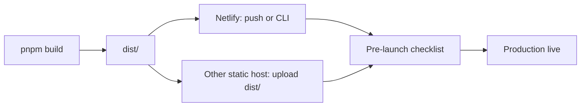

# Full Deployment and Pre-Launch Checklist

This guide covers building, configuring, and deploying Core Frontend to production. If you need details (e.g. API URL, hosting choice), see [What we need from you](#what-we-need-from-you) at the end.



---

## Table of contents

- [CI/CD & Deployment setup](#cicd--deployment-setup)
- [Branch & environment flow](#branch--environment-flow)
- [Production build](#production-build)
- [Environment variables](#environment-variables)
- [Deploy options](#deploy-options)
- [Netlify + GitHub integration](#netlify--github-integration)
- [Release workflow (CI)](#release-workflow-ci)
- [Sentry source maps](#sentry-source-maps)
- [Pre-launch checklist](#pre-launch-checklist)
- [What we need from you](#what-we-need-from-you)

---

## CI/CD & Deployment setup

**Single runbook:** [cicd-and-netlify.md](cicd-and-netlify.md) — production API, Netlify env vars, deploy commands, and GitHub Actions summary.

**Current production API:** `https://your-api-domain.com` (app uses path `/api/v1`). Set `VITE_API_BASE_URL=https://your-api-domain.com` for production builds (Netlify or other static host).

**Netlify (current host):** Build and deploy via GitHub integration (push to production branch) or CLI (`pnpm run deploy:netlify` / `pnpm run deploy:netlify:prod`). Required env: `VITE_API_BASE_URL`. See [Netlify + GitHub integration](#netlify--github-integration) and [cicd-and-netlify.md](cicd-and-netlify.md).

**Build:** Production build runs **on GitHub** (CI and Release workflows). Netlify also builds when you push (or you can deploy the GitHub-built artifact). See [Release workflow (CI)](#release-workflow-ci).

---

## Branch & environment flow

This section explains how `dev`, `qa`, and `main` work together with CI, previews, and releases.

### Normal dev → qa → main flow

- **Feature branches**
  - Branch from `dev` (or `qa`/`main` if you prefer a different policy).
  - Open a PR back into `dev`.
  - The **CI workflow** (`.github/workflows/ci.yml`) runs on PRs to `dev` (lint, type-check, tests, smoke build, security, E2E).
  - The **Preview workflow** (`.github/workflows/preview.yml`) runs on PRs to `dev` and uploads a `dist/` artifact for manual testing.

- **Promoting to `qa` (optional)**
  - When `dev` is stable enough for QA, open a PR from `dev` → `qa`.
  - CI + Preview run again on the `qa` PR.
  - Use this branch to point at a staging backend and/or staging Netlify site if you have one.

- **Promoting to `main`**
  - When `dev`/`qa` is ready for production, open a PR from `dev` (or `qa`) → `main`.
  - CI + Preview run on the `main` PR.
  - After merging into `main`:
    - **CI** runs on `main`.
    - **Deploy workflow** (`.github/workflows/deploy.yml`) runs on push to `main` and:
      - Builds with GitHub secrets (VITE_API_BASE_URL, etc.).
      - Deploys `dist/` to Netlify via CLI when `VITE_API_BASE_URL`, `NETLIFY_AUTH_TOKEN`, and `NETLIFY_SITE_ID` are set.
    - **Release workflow** (`.github/workflows/release.yml`) runs on push to `main`:
      - `release-please` updates or opens a release PR with version bump and `CHANGELOG.md` changes.

### Hotfix flow (production fixes)

Use this when production is broken and you need a fast patch:

1. **Create a hotfix branch**
   - Branch from `main`, e.g. `hotfix/fix-login-redirect`.
   - Implement the fix using **conventional commits** (e.g. `fix: handle null user on login`) so `release-please` can infer a patch bump.
2. **Open a PR into `main`**
   - CI (`ci.yml`) and Preview (`preview.yml`) run on the PR to `main`.
3. **Merge into `main`**
   - Triggers:
   - **Deploy workflow** → build with GitHub secrets → deploy `dist/` to Netlify.
   - **Release workflow** → `release-please` updates or creates a release PR for this hotfix.
4. **Cut the hotfix release**
   - Merge the `release-please` **release PR**.
   - This creates a **tagged GitHub Release**, bumps the version, updates `CHANGELOG.md`, and runs the **Deploy Release** job (see below) to build and deploy with the new version.
5. **Sync branches**
   - Bring the hotfix back into `dev`/`qa` (merge `main` into those branches or cherry-pick) so future releases include the fix.

## Production build

From the project root:

```bash
pnpm install --frozen-lockfile
pnpm build
```

Output is in **`dist/`**: static assets (JS, CSS, `index.html`), `config.js` (from `public/`; app reads `window.__CONFIG__` or build-time env), `version.json`, **robots.txt**, and PWA assets.

- **Type-check:** `pnpm build` runs `tsc -b` then `vite build` (production mode).
- **Preview locally:** `pnpm preview` serves `dist/` so you can test the production build.
- **Public assets:** All files in **`public/`** are copied to `dist/`. See **[public/README.md](../../public/README.md)** for the full list (manifest, robots.txt, \_headers, offline.html, theme-init.js, config.js, icons). Add **pwa-192x192.png** and **pwa-512x512.png** for PWA install and to avoid icon 404s.

---

## Environment variables

| Context   | Where                             | Purpose                                           |
| --------- | --------------------------------- | ------------------------------------------------- |
| **Build** | GitHub Actions, Netlify, or local | `VITE_*` are baked into the client at build time. |

Full reference: **`.env.example`** at project root. Summary:

| Variable         | Notes                                                                                                                  |
| ---------------- | ---------------------------------------------------------------------------------------------------------------------- |
| **API base URL** | `VITE_API_BASE_URL` — backend base (e.g. `https://your-api-domain.com`). App uses path `/api/v1`. Empty = same-origin. |
| **Sentry DSN**   | `VITE_SENTRY_DSN` — optional; client error tracking.                                                                   |
| **PostHog**      | `VITE_POSTHOG_KEY`, `VITE_POSTHOG_HOST` — optional analytics.                                                          |

Sentry **source map upload** (build-time only, not client): see [Sentry source maps](#sentry-source-maps). Uses `SENTRY_AUTH_TOKEN`, `VITE_SENTRY_ORG` / `VITE_SENTRY_PROJECT` (or `SENTRY_ORG` / `SENTRY_PROJECT` per [sentry-sourcemaps.md](../integrations/sentry-sourcemaps.md)).

---

## Deploy options

### Option A — Netlify (GitHub integration)

Use the included **Netlify + GitHub** setup for automatic deploys. See [Netlify + GitHub integration](#netlify--github-integration) below.

### Option B — Other static hosts (Vercel, S3+CloudFront, etc.)

1. Build with the right env (e.g. set `VITE_API_BASE_URL` in the host's build environment).
2. Deploy the **`dist/`** directory as the site root.
3. **SPA routing:** Configure the host so all routes serve `index.html` (most platforms do this by default for SPAs).
4. **CORS:** Ensure your backend allows the frontend origin.
5. **Multi-tenancy:** If you use subdomains (e.g. `acme.app.example.com`), set up DNS and (if needed) wildcard SSL.

No `config.js` override unless your host supports injecting a small script; in that case the app will use `window.__CONFIG__` (see `src/core/config/env.ts`).

---

## Netlify + GitHub integration

The repo includes **`netlify.toml`** so Netlify can build and deploy from GitHub with minimal setup.

### 1. Connect the repo in Netlify

1. Log in to [Netlify](https://app.netlify.com).
2. **Add new site** → **Import an existing project** → **Deploy with GitHub**.
3. Authorize Netlify and pick this repository.
4. Netlify will read **`netlify.toml`** and prefill:
   - **Build command:** `pnpm build`
   - **Publish directory:** `dist`
   - **Node version:** 24 (from `[build.environment]`).
5. Click **Deploy site**. The first deploy will run; fix any env or build errors in step 2.

### 2. Set environment variables

In Netlify: **Site settings** → **Environment variables** → **Add a variable** (or **Import from .env**).

Set at least:

| Variable            | Scope | Description                                                                          |
| ------------------- | ----- | ------------------------------------------------------------------------------------ |
| `VITE_API_BASE_URL` | All   | Production API base URL (e.g. `https://your-api-domain.com`). App appends `/api/v1`. |

Optional:

| Variable            | Scope               | Description                      |
| ------------------- | ------------------- | -------------------------------- |
| `VITE_SENTRY_DSN`   | Production / Branch | Sentry DSN.                      |
| `VITE_POSTHOG_KEY`  | Production / Branch | PostHog project API key.         |
| `VITE_POSTHOG_HOST` | Production / Branch | e.g. `https://us.i.posthog.com`. |

For **Sentry source map upload** (build-time only), add **sensitive** vars in Netlify and do not expose to the client:

- `SENTRY_AUTH_TOKEN`
- `VITE_SENTRY_ORG` (or `SENTRY_ORG`)
- `VITE_SENTRY_PROJECT` (or `SENTRY_PROJECT`)

See [Sentry source maps](#sentry-source-maps).

### 3. Branch and production behavior

- **Production branch:** In **Site settings** → **Build & deploy** → **Continuous deployment**, set **Production branch** (e.g. `main`). Pushes to this branch deploy to the main site URL.
- **Branch deploys:** Other branches get a preview URL per push/PR (e.g. `deploy-preview-42--yoursite.netlify.app`). Use **Branch deploy contexts** in Environment variables to set different `VITE_API_BASE_URL` for previews (e.g. staging API).

### 4. What `netlify.toml` does

- **Build:** `pnpm build` (Node **24** LTS). Netlify detects `pnpm-lock.yaml` and uses pnpm; `packageManager` in `package.json` pins the version.
- **Publish:** `dist/` is the site root.
- **Redirects:** `/*` → `/index.html` with status 200 so client-side routing works (SPA).
- **Headers:** Optional `X-Frame-Options`, `X-Content-Type-Options`, `Referrer-Policy` (you can add more in Netlify UI).

### 5. Custom domain and HTTPS

In **Domain management** add your domain; Netlify will provision HTTPS. Point DNS to Netlify (A/CNAME or Netlify DNS).

### 6. Netlify CLI (create site, env, deploy from terminal)

You can do everything from the CLI. The project includes **`netlify-cli`** as a dev dependency, so use `pnpm exec netlify` (or the scripts below) — no global install needed.

**Log in (once)**

```bash
pnpm exec netlify login
```

**Create a new site and link this repo (first time)**

```bash
pnpm exec netlify init
```

Choose **Create & configure a new site**, pick your team, and give the site a name. Netlify will create the site and link the current directory. Build settings are read from `netlify.toml`.

**Set environment variables**

```bash
# One by one
pnpm exec netlify env:set VITE_API_BASE_URL "https://your-api-domain.com"

# Or import from a file (e.g. .env.production — do not commit secrets)
pnpm exec netlify env:import .env.production
```

List vars: `pnpm exec netlify env:list`. Remove: `pnpm exec netlify env:unset VAR_NAME`.

**Deploy**

```bash
# Draft (preview URL)
pnpm run deploy:netlify

# Production
pnpm run deploy:netlify:prod
```

Both scripts run `pnpm build` then deploy. You can also run `pnpm build` and `pnpm exec netlify deploy` (or `--prod`) separately.

**Link an existing site (if you already created it in the UI)**

```bash
pnpm exec netlify link
```

Select your team and the site. After that, `deploy:netlify` / `deploy:netlify:prod` and `netlify env:set` apply to that site.

**Note:** GitHub integration (push → auto deploy) is still configured in the Netlify UI (or via `netlify api`). The CLI is for one-off deploys, env management, and creating/linking the site without using the browser.

---

## Release workflow (CI)

On **push to `main`**, the **Release** workflow (`.github/workflows/release.yml`):

1. Runs **release-please** (`release-please` job):
   - Reads `release-please-config.json` / `.release-please-manifest.json`.
   - Calculates the next version from conventional commits on `main`.
   - Updates `CHANGELOG.md`, bumps the version, and creates or updates a **release PR**.
   - When that release PR is merged, it creates a **Git tag** and **GitHub Release**.
2. If a release was created, runs **Deploy Release** job:
   - Checks out the code at the release tag.
   - Installs dependencies with `pnpm install --frozen-lockfile`.
   - Runs `pnpm build` with `VITE_APP_VERSION` set from the release (env from GitHub secrets):
     - Produces a production `dist/` build.
   - Uploads `dist/` as an artifact named `release-${TAG}` (retention 90 days).
   - **Deploys to Netlify** using the Netlify CLI when deploy secrets are present:
     - Requires `VITE_API_BASE_URL`, `NETLIFY_AUTH_TOKEN`, and `NETLIFY_SITE_ID` in GitHub Actions secrets.
     - Runs `pnpm exec netlify deploy --prod --dir=dist`.

In other words:

- **Push to `main`** → CI + Deploy workflow handle continuous deploys.
- **Merge the release-please PR** → Release workflow cuts a tagged release and runs a release-driven build + Netlify deploy tied to that version.

---

## Sentry source maps

To get readable stack traces in Sentry, upload source maps at build time. The app already has **@sentry/vite-plugin** configured; it runs only when **`mode === 'production'`** and **`SENTRY_AUTH_TOKEN`** is set.

- **Full steps:** [sentry-sourcemaps.md](../integrations/sentry-sourcemaps.md)
- **CI:** Add `SENTRY_AUTH_TOKEN`, `VITE_SENTRY_ORG` (or `SENTRY_ORG`), and `VITE_SENTRY_PROJECT` (or `SENTRY_PROJECT`) as repository or environment secrets, and ensure your production build runs with those set.

---

## Pre-launch checklist

- [ ] **API:** `VITE_API_BASE_URL` set to the production backend. CORS allows your frontend origin.
- [ ] **Auth:** Backend is deployed; refresh token is HttpOnly cookie; login and refresh flows work.
- [ ] **Multi-tenancy:** If using subdomains, DNS and SSL are set; backend resolves tenant from `Host` / `X-Tenant-ID`.
- [ ] **CSP:** `index.html` CSP allows your API and analytics origins; no need to relax for production if already correct.
- [ ] **Sentry / PostHog:** Optional; if used, DSN and keys set (build or runtime as above).
- [ ] **HTTPS:** Frontend and API served over HTTPS in production.

---

## What we need from you

To finish production setup, we may need:

1. **Backend API base URL** for production (and staging if different).
2. **Hosting choice:** Static host (Netlify / Vercel / S3+CloudFront / other). Confirm how you set build-time env vars.
3. **Sentry:** Whether you use it; if yes, we can wire source map upload in CI (you add `SENTRY_AUTH_TOKEN` and org/project).
4. **PostHog (or other analytics):** Whether you use it; if yes, keys for production.
5. **Custom domain / subdomains:** If you use tenant subdomains (e.g. `acme.app.example.com`), the domain and any wildcard cert.
6. **Deploy step:** If you want the Release workflow to deploy automatically, the target (e.g. Netlify, Vercel, S3 bucket) and any deploy tokens (stored as GitHub secrets).

Share these and we can plug in the exact values and steps (e.g. `.env.production` example, release workflow deploy step, or one-off deploy commands).
