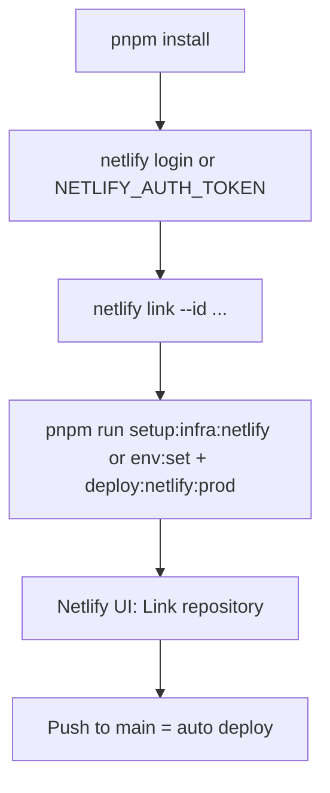

# Netlify CLI: One-Time Setup and Deploy

Everything can be done from the terminal. **One optional token** lets you skip the browser; after that, connect the repo once in Netlify (or use the script) and the system handles the rest.

**Run locally first (recommended):** You can run `pnpm run setup:infra:netlify` locally once to deploy from your machine _before_ pushing to GitHub. That validates build, env, and Netlify in one go. Once the repo is linked in Netlify (step 4), future deploys happen automatically on push to `main` — no need to run the script again unless you want a manual deploy.



---

## 1. Prerequisites

- Node.js **24.x** (Active LTS) or newer LTS, pnpm ≥ 9
- This repo cloned
- (Optional) Netlify personal access token for non-interactive use: [Netlify → User settings → Applications → Personal access tokens](https://app.netlify.com/user/applications#personal-access-tokens). Create a token and set `export NETLIFY_AUTH_TOKEN=...`

---

## 2. One-time: authenticate and link site

Run from the **project root**.

**Option A — With browser (no token)**

```bash
cd /path/to/core-fe
pnpm install
pnpm exec netlify login
pnpm exec netlify link --id e158779a-5efb-4f3b-9b0f-8399d3335066
```

**Option B — No browser (use token)**

```bash
cd /path/to/core-fe
pnpm install
export NETLIFY_AUTH_TOKEN="your-token-from-netlify-applications"
pnpm exec netlify link --id e158779a-5efb-4f3b-9b0f-8399d3335066 --auth "$NETLIFY_AUTH_TOKEN"
```

After this, the repo is linked to the Netlify site. You can run the setup script or the commands in step 3 yourself.

---

## 3. Set production env and deploy (CLI)

**Option A — Use the script (recommended)**

```bash
pnpm run setup:infra:netlify
```

Or from repo root: `./tooling/setup/netlify.sh`

The script will:

- Link the site if not already linked (needs `NETLIFY_SITE_ID` or existing `.netlify` from step 2).
- Set production env vars: `VITE_API_BASE_URL`.
- Run `pnpm run deploy:netlify:prod`.

Use `NETLIFY_AUTH_TOKEN` if you don't want browser login. Use `NETLIFY_SITE_ID=e158779a-5efb-4f3b-9b0f-8399d3335066` if you run the script on a fresh clone without running step 2 first.

**Option B — Run commands yourself**

```bash
pnpm exec netlify env:set VITE_API_BASE_URL "https://your-api-domain.com" --context production
pnpm run deploy:netlify:prod
```

---

## 4. GitHub → Netlify (push = deploy) — one-time in UI

So that **every push to `main`** builds and deploys on Netlify **without running any CLI**:

1. Open [Netlify](https://app.netlify.com) → your site (e.g. cheerful-kelpie-70a569).
2. **Site configuration** (or **Site settings**) → **Build & deploy** → **Continuous deployment**.
3. Click **Link repository** (or **Manage repository** → **Link repository**).
4. Choose **GitHub** and authorize if asked, then select this repo (`core-fe` or your org/repo name).
5. Set **Production branch** to `main` (or your default branch).
6. **Save**. Env vars are already set via CLI; if you added the site from scratch in Netlify, set them under **Environment variables** (same values as in step 3).

After this, **you don't need to run anything**: push to `main` → Netlify builds and deploys. No token in the repo; Netlify uses GitHub OAuth.

---

## 5. Summary: "connect and the system does the rest"

| Step | What                                  | Where                                                                                                               |
| ---- | ------------------------------------- | ------------------------------------------------------------------------------------------------------------------- |
| 0    | **Optional: deploy from local first** | Run `pnpm run setup:infra:netlify` locally once to validate before pushing to GitHub.                               |
| 1    | Install deps                          | `pnpm install` (CLI)                                                                                                |
| 2    | Auth + link site                      | `netlify login` then `netlify link --id <site-id>` (CLI), or token + link (CLI)                                     |
| 3    | Env + deploy                          | `pnpm run setup:infra:netlify` or the three commands in §3 (CLI)                                                    |
| 4    | Push = deploy                         | Link repo once in Netlify UI (Build & deploy → Link repository). After that, pushes to `main` deploy automatically. |

**GitHub secrets:** For CI/CD deploy, add `VITE_API_BASE_URL`, `NODE_VERSION`, `NETLIFY_AUTH_TOKEN`, `NETLIFY_SITE_ID` in GitHub → Settings → Secrets and variables → Actions. Run **`pnpm run setup:infra:github-secrets`** to push `VITE_API_BASE_URL` and `NODE_VERSION` from `config.setup.env` via `gh secret set`. See [cicd-and-netlify.md](cicd-and-netlify.md).

**New env var:** Follow **`agent-os/skills/env-schema-add/SKILL.md`**. Add the key to `src/core/config/env-schema.ts` and **`.env.example`**, then run `pnpm tool:sync-env-example`. Set values in GitHub Secrets/Variables via `pnpm github:sync`.

**Tokens (optional):**

- **`NETLIFY_AUTH_TOKEN`** — only if you want to run CLI/script without opening the browser. Create in Netlify → User settings → Applications → Personal access tokens.
- No other tokens are required for build and deploy. Sentry/PostHog are optional (see [cicd-and-netlify.md](cicd-and-netlify.md)).

**Backend:** Ensure CORS on `your-api-domain.com` allows your Netlify site origin (e.g. `https://cheerful-kelpie-70a569.netlify.app` or your custom domain).

---

## 6. New machine / CI

On a new machine or in CI:

1. Clone repo, `pnpm install`.
2. Set env: `NETLIFY_AUTH_TOKEN`, and optionally `NETLIFY_SITE_ID=e158779a-5efb-4f3b-9b0f-8399d3335066`.
3. Run `./tooling/setup/netlify.sh` or `pnpm run setup:infra:netlify` (it will link using `NETLIFY_SITE_ID` if `.netlify` is missing, then set env and deploy).

To only deploy (env already set): `pnpm run deploy:netlify:prod`.
