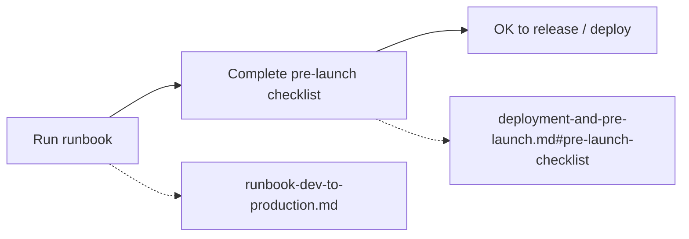

# Path to Production (gate)

Before running any **path-to-production** action (release, deployment, or production sign-off):

1. **Run the runbook** — Follow [runbook-dev-to-production.md](runbook-dev-to-production.md): local dev → validate → build → deploy.
2. **Complete the pre-launch checklist** — See [deployment-and-pre-launch.md](deployment-and-pre-launch.md#pre-launch-checklist): API URL, auth, CORS, optional Sentry/PostHog, HTTPS.

Do not proceed with deployment or release until these are done and reviewed as needed.
