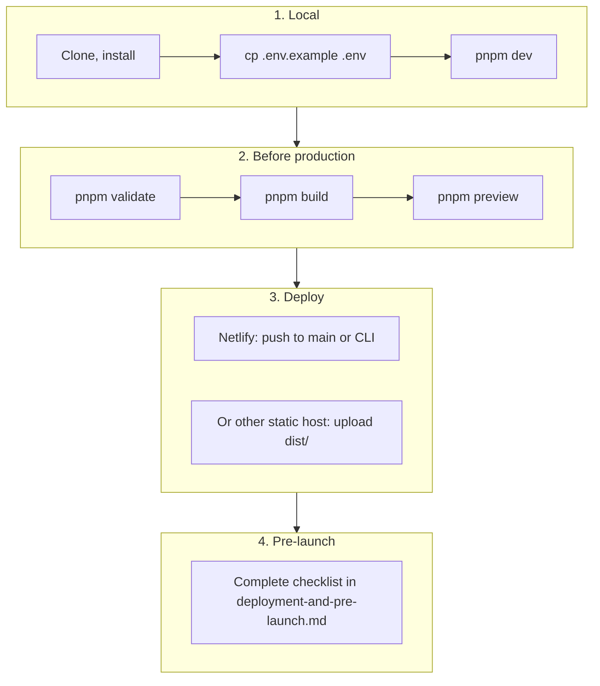

# Runbook: Local Development to Production

> **Single-trunk model.** "Development" here means your **local dev machine**, not a
> `dev` branch. core-fe is trunk-based: feature branches squash-merge to `main`; a
> release ships by merging the standing release-please Release PR (then approving the
> one production gate). See [../process/git-workflow.md](../process/git-workflow.md).
> This runbook covers the local → validate → build → deploy path.

Step-by-step path from local development to production deployment.



---

## 1. Local development

**Prerequisites:** Node.js 24+ (LTS), pnpm. See [setup.md](../getting-started/setup.md) for full local setup.

1. Clone, install, and configure env:

   ```bash
   git clone <repo-url>
   cd core-fe
   pnpm install
   cp .env.example .env
   ```

   Set at least `VITE_API_BASE_URL` (see [credentials-and-env.md](../integrations/credentials-and-env.md)).

2. Run the app:

   ```bash
   pnpm dev
   ```

   App runs at http://localhost:5173.

---

## 2. Before promoting to production

Run these in order:

| Step                               | Command         | Purpose                         |
| ---------------------------------- | --------------- | ------------------------------- |
| Lint + format + type-check + tests | `pnpm validate` | Code quality and tests pass     |
| Production build                   | `pnpm build`    | Output in `dist/`               |
| Optional: preview build            | `pnpm preview`  | Serve `dist/` locally to verify |

---

## 3. Deploy

- **Netlify (recommended):** Push to the production branch (e.g. `main`) if GitHub is linked, or use CLI: `pnpm run deploy:netlify:prod`. See [cicd-and-netlify.md](cicd-and-netlify.md) and [netlify-cli-setup.md](netlify-cli-setup.md).
- **Other static hosts:** Build with correct env, then deploy the `dist/` directory. See [deployment-and-pre-launch.md](deployment-and-pre-launch.md).

---

## 4. Pre-launch checklist

Before considering the release done, complete the [Pre-launch checklist](deployment-and-pre-launch.md#pre-launch-checklist) in [deployment-and-pre-launch.md](deployment-and-pre-launch.md): API URL, auth, CORS, optional Sentry/PostHog, HTTPS.

---

## Summary

1. **Local:** [setup.md](../getting-started/setup.md) → `pnpm dev`
2. **Validate:** `pnpm validate`
3. **Build:** `pnpm build`
4. **Deploy:** [cicd-and-netlify.md](cicd-and-netlify.md) / [deployment-and-pre-launch.md](deployment-and-pre-launch.md)
5. **Gate:** [deployment-and-pre-launch.md](deployment-and-pre-launch.md#pre-launch-checklist)

Optional: [path-to-production.md](path-to-production.md) for a short gate doc that points here and to the checklist.
