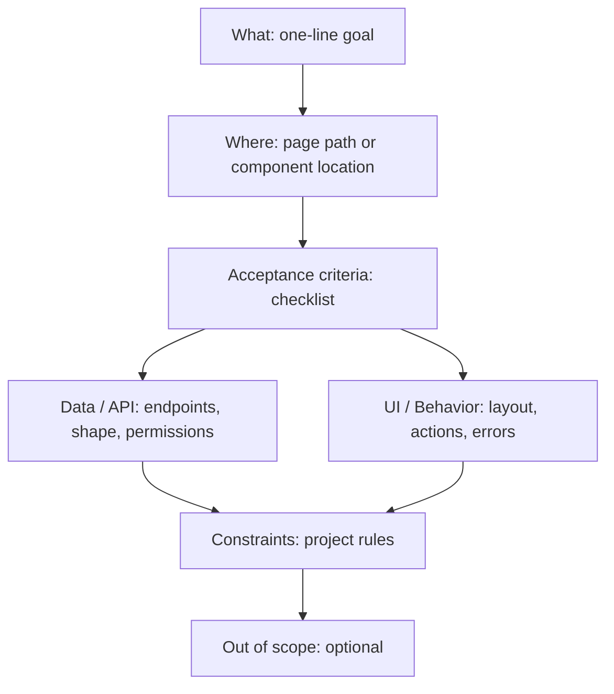

# Requirement Format for Core Frontend

Use this format when you want to request a new feature, page, or change. Filling it out helps the AI implement exactly what you need without back-and-forth.

**When to use:** New page, new feature, new component with multiple acceptance criteria, or when your idea has several parts (API + UI + permissions).

**Quick option:** For small, single-step requests (e.g. "add a button that does X"), a short sentence is enough. For anything bigger, use the template below.



---

## Copy-paste template

Copy the block below, fill in the sections, and paste into your request (e.g. in Cursor chat or a ticket). You can leave optional sections blank.

```markdown
## Requirement

### What

[One-line goal, e.g. "Notifications page where users see a list and can mark all as read."]

### Where

[Where it lives: e.g. "New page at /notifications" or "New component in shared" or "New API + hook in pages/billing"]

### Acceptance criteria

- [ ] [Criterion 1, e.g. "List shows title, body, read/unread, created date"]
- [ ] [Criterion 2, e.g. "Mark all as read button at top"]
- [ ] [Criterion 3, e.g. "Empty state when no notifications"]
- [ ] [Add more as needed]

### Data / API (if applicable)

- **Endpoint(s):** [e.g. GET /api/notifications, PATCH /api/notifications/read-all]
- **Response shape:** [e.g. "Array of { id, title, body, read, createdAt }"]
- **Permissions:** [e.g. "notifications.read", "notifications.write" or "Same as dashboard"]

### UI / Behavior (if applicable)

- **Layout:** [e.g. "AppShell, same as dashboard"]
- **Forms/inputs:** [e.g. "None" or "Filter by read/unread dropdown"]
- **Actions:** [e.g. "Mark all read (button), row click marks single as read"]
- **Validation / errors:** [e.g. "Show toast on error; retry button"]

### Constraints

- [e.g. "Use apiClient only", "Follow route.tsx convention", "Must be accessible (a11y)"]
- [Add any must-follow project rules]

### Out of scope (optional)

- [What we are NOT doing in this request, e.g. "No push notifications"]
```

---

## Field guide

| Section                 | Required?           | What to put                                                                           |
| ----------------------- | ------------------- | ------------------------------------------------------------------------------------- |
| **What**                | Yes                 | One clear sentence: the goal of the request.                                          |
| **Where**               | Yes                 | Place in the app: new page + path, or existing page/component, or "shared component". |
| **Acceptance criteria** | Yes                 | Bullet list of testable conditions. Use checkboxes `- [ ]` so they can be verified.   |
| **Data / API**          | If feature uses API | Endpoints, expected response shape, and RBAC permission names.                        |
| **UI / Behavior**       | If feature has UI   | Layout, forms, buttons, validation, error handling.                                   |
| **Constraints**         | Recommended         | Project rules (apiClient, route.tsx, a11y) or technical limits.                       |
| **Out of scope**        | Optional            | Explicit "not in this request" to avoid scope creep.                                  |

---

## Example (short)

See a full filled example: **[sample-requirement.md](requirements/sample-requirement.md)**.

---

## What the AI will do

When you submit a requirement in this format, the AI will:

1. **Parse** each section and map it to the codebase (pages, shared, core, routes, RBAC).
2. **Invoke** the right skills (e.g. code-structure, page-scaffolding) and follow project conventions.
3. **Implement** the full set: route, page, contracts, api, hooks, components/forms, **tests**, route registration, RBAC — **without asking** "Do you want tests?" or "Should I add RBAC?".
4. **Verify** acceptance criteria against what was built (e.g. list, mark all read, empty state).

If something is missing or ambiguous, the AI may ask only for that part (e.g. "What permission name should this route use?") and then continue.
