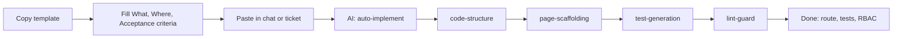

# Requirement Intake (core-fe)

Use this when submitting a new requirement so the AI can implement it fully without back-and-forth. This doc describes the intake flow; the actual template and example are in [requirement-format.md](requirement-format.md) and [requirements/sample-requirement.md](requirements/sample-requirement.md).

---

## When to use

- New page, new feature, new component with multiple acceptance criteria
- Any request that has several parts (API + UI + permissions)
- When you want the AI to implement everything in one go (tests, route registration, RBAC included)

For small, single-step requests (e.g. "add a button that does X"), a short sentence is enough.

---

## What to provide

1. **Template:** Copy the template from [requirement-format.md](requirement-format.md) (What, Where, Acceptance criteria, Data/API, UI/Behavior, Constraints, Out of scope).
2. **Example:** See [requirements/sample-requirement.md](requirements/sample-requirement.md) for a filled "Notifications page" example.
3. Paste your filled requirement into the chat (or ticket). The AI will parse it and run the full pipeline without asking for confirmation.

---

## Requirement types (what to specify)

| Type                               | Details to provide                                                                                                                            |
| ---------------------------------- | --------------------------------------------------------------------------------------------------------------------------------------------- |
| **New page**                       | What, Where (path, e.g. `/notifications`), Acceptance criteria, Data/API (endpoints, permissions), UI/Behavior (layout, actions), Constraints |
| **New component (shared or page)** | What, Where (e.g. "shared" or "pages/X"), Acceptance criteria, UI/Behavior, Constraints                                                       |
| **New API consumer**               | What, Where, Endpoints, Response shape, Permissions (RBAC), Error handling                                                                    |

Always include **Acceptance criteria** as a checklist so the implementation can be verified.

---

## Skills that will run (AI / automation)

When you submit a requirement in this format, the AI will:

1. **auto-implement** — Master pipeline: parse → implement → route → RBAC → test → lint → docs → verify.
2. **code-structure** — Place code in the right layers (pages, shared, core) and follow dependency rules.
3. **page-scaffolding** (if new page) — Create route.tsx, page component, contracts.ts, api.ts, hooks/, register route, data-testid.
4. **test-generation** — Add or update colocated tests (Vitest, RTL, vitest-axe).
5. **lint-guard** — Fix ESLint and TypeScript errors before finishing.

No need to ask "add tests?" or "register route?" — the skills do that by default.

---

## Rules that apply

- **file-structure** — Route marker (`route.tsx`), page directory shape, dialog vs full page.
- **project-conventions** — Architecture, imports, state (TanStack vs Zustand), file conventions.
- **testing-requirements** — Colocated tests, data-testid, coverage; see `agent-os/rules/testing-requirements.mdc`.
- **skill-router** — Which skill runs for which task; see `agent-os/rules/skill-router.mdc`.

---

## Quick links

- **Template and field guide:** [requirement-format.md](requirement-format.md)
- **Filled example:** [requirements/sample-requirement.md](requirements/sample-requirement.md)
- **Unified auth (login + signup, email/phone OTP):** [requirements/unified-auth-otp-requirement.md](requirements/unified-auth-otp-requirement.md) · [reference/unified-auth-flows.md](../reference/unified-auth-flows.md)
