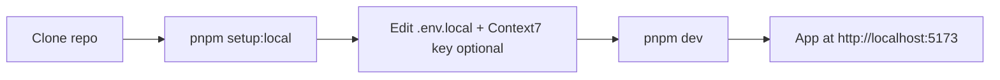

# Local Development Setup (core-fe)

Single reference for local development setup. For deploy and CI/CD, see [netlify-cli-setup.md](../deployment/netlify-cli-setup.md) and [cicd-and-netlify.md](../deployment/cicd-and-netlify.md).



Or step-by-step: `pnpm install` → `pnpm setup:local --only-env` → `pnpm dev`.

---

## Quick start (one command)

```bash
git clone <repo-url>
cd core-fe
pnpm setup:local
```

`pnpm setup:local` is idempotent: checks Node/pnpm, on macOS installs/upgrades the external CLI tools via Homebrew (`setup:mac-tools` — gitleaks, gh, jq, uv, a headless Docker runtime, …), installs deps when `node_modules/` is missing, scaffolds `.env.local` from `.env.example` (your gitignored local dev file), scaffolds the full MCP set from `.mcp.example.json`, indexes CodeGraph, then starts `pnpm dev`.

Useful flags:

| Flag                | Effect                                          |
| ------------------- | ----------------------------------------------- |
| `--no-start`        | Bootstrap only — skip starting the dev server   |
| `--check`           | Preflight / dry-run — no file writes            |
| `--skip-deps`       | Skip `pnpm install`                             |
| `--skip-mac-tools`  | Skip the macOS external-tool install/upgrade    |
| `--skip-mcp`        | Skip CodeGraph + MCP scaffold                   |
| `--only-env`        | Scaffold `.env.example` → `.env.local` and exit |
| `--force-env-local` | Rewrite `.env.local` from `.env.example`        |

`pnpm setup:local` also scaffolds the **full MCP template set** into `.mcp.json` (context7, shadcn, tailwindcss, core-be-api, semgrep, sonarqube, codegraph, headroom). Set `CONTEXT7_API_KEY` in `.env.local` and reload Cursor.

---

## Prerequisites

- **Node.js 24+** (Active LTS line; see `.nvmrc`) and **pnpm** (e.g. `corepack enable && corepack prepare pnpm@latest --activate`)
- **External CLI tools** — on **macOS**, `pnpm setup:mac-tools` installs/upgrades everything the repo needs beyond Node/pnpm, non-interactively via Homebrew: gitleaks, gh, jq, uv, ripgrep, shellcheck, librsvg (`rsvg-convert`), and a headless Docker runtime (colima) when none is present. `pnpm setup:local` runs it automatically on macOS (opt out with `--skip-mac-tools`). The list is data-driven from [`tooling/dev/setup-prerequisites-mac-tools.manifest`](../../tooling/dev/setup-prerequisites-mac-tools.manifest) — add/remove a line to change it. Non-macOS: install the equivalents with your package manager.
- **[core-be](https://github.com/nikunjmavani/core-be)** on `:3000` for auth, org, and E2E — the FE proxies `/api` there in dev. Pure UI shell work (no login/API) can run without it; anything past `/login` needs core-be up (`GET /readyz`).

---

## 1. Clone and install

```bash
git clone <repo-url>
cd core-fe
pnpm install
```

---

## 2. Environment variables

Env files live at **project root**, one `.env.<NODE_ENV>` per environment (mirrors core-be). `.env.example` is the only committed env file; every other `.env*` is gitignored. `pnpm setup:local` scaffolds the example into **`.env.local`** — your gitignored local dev file (behavior flags + machine secrets), loaded by `pnpm dev` (the `local` environment is set by `VITE_APP_ENV`, not the Vite mode):

```bash
pnpm setup:local --only-env
# or: cp .env.example .env.local
```

Set at least:

| Variable            | Purpose                                                                        |
| ------------------- | ------------------------------------------------------------------------------ |
| `VITE_API_BASE_URL` | Production API base (e.g. `https://your-api-domain.com`). Empty = same-origin. |

For local dev with a backend on another port, you can use `VITE_DEV_API_URL` (e.g. `http://localhost:3000`) if your Vite config proxies API requests. See `.env.example` for the full list.

**Where to get credentials:** [credentials-and-env.md](../integrations/credentials-and-env.md). **Full env runbook:** [environment-variables.md](../deployment/runbooks/environment-variables.md).

---

## 3. Run the app

```bash
pnpm dev
```

The app runs at **http://localhost:5173**. API calls go to **core-be** on `:3000` via the Vite proxy — start core-be before exercising auth, onboarding, or org flows.

---

## 4. Cursor MCP (local setup)

MCP servers are **local only** (not CI). Two tiers — same model as core-be:

| Tier                          | Template            | Command                                    |
| ----------------------------- | ------------------- | ------------------------------------------ |
| **Default pair** (auto-start) | `.mcp.default.json` | `pnpm mcp:setup:default` only              |
| **Full set**                  | `.mcp.example.json` | **`pnpm setup:local`** or `pnpm mcp:setup` |

The gitignored live config is `.mcp.json` (symlink → `agent-os/mcp/mcp.json`). Merges are non-destructive.

1. Run `pnpm setup:local --no-start` — scaffolds `.env.local` + full MCP set + CodeGraph index.
2. Set `CONTEXT7_API_KEY` in `.env.local`.
3. (Optional) Start the backend with `ENABLE_MCP_SERVER=true` for **core-be-api**.
4. Reload Cursor.

Full steps and MCP list: [cursor-mcp-setup.md](../../agent-os/docs/cursor-mcp-setup.md).

---

## 5. Optional: Sentry, PostHog, E2E

- **Sentry (source maps):** See [sentry-sourcemaps.md](../integrations/sentry-sourcemaps.md). Optional for local dev.
- **PostHog:** Set `VITE_POSTHOG_KEY` and `VITE_POSTHOG_HOST` if you use analytics.
- **E2E tests:** Playwright; run `pnpm test:e2e` (backend and app should be running for full E2E).

---

## Next steps

- **First-time Netlify connect + deploy:** [netlify-cli-setup.md](../deployment/netlify-cli-setup.md)
- **CI/CD and production env:** [cicd-and-netlify.md](../deployment/cicd-and-netlify.md)
- **Step-by-step path to production:** [runbook-local-to-production.md](../deployment/runbook-local-to-production.md)
