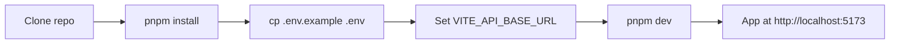

# Local Development Setup (core-fe)

Single reference for local development setup. For deploy and CI/CD, see [netlify-cli-setup.md](../deployment/netlify-cli-setup.md) and [cicd-and-netlify.md](../deployment/cicd-and-netlify.md).



---

## Prerequisites

- **Node.js 24+** (Active LTS line; see `.nvmrc`) and **pnpm** (e.g. `corepack enable && corepack prepare pnpm@latest --activate`)
- A running backend (optional for UI-only work; required for API calls). See backend repo for its setup.

---

## 1. Clone and install

```bash
git clone <repo-url>
cd core-fe
pnpm install
```

---

## 2. Environment variables

Env files live at **project root**. Copy the example and edit locally:

```bash
cp .env.example .env
```

Set at least:

| Variable            | Purpose                                                                        |
| ------------------- | ------------------------------------------------------------------------------ |
| `VITE_API_BASE_URL` | Production API base (e.g. `https://your-api-domain.com`). Empty = same-origin. |

For local dev with a backend on another port, you can use `VITE_DEV_API_URL` (e.g. `http://localhost:3000`) if your Vite config proxies API requests. See `.env.example` for the full list.

**Where to get credentials:** [credentials-and-env.md](../integrations/credentials-and-env.md).

---

## 3. Run the app

```bash
pnpm dev
```

The app runs at **http://localhost:5173**.

---

## 4. Cursor MCP (local setup required)

If you use **Cursor** for this project, set up the MCP servers **locally** so the AI can use up-to-date docs, shadcn, Tailwind, and the backend API:

1. Copy the example config: `cp agent-os/mcp/mcp.example.json agent-os/mcp/mcp.json`
2. Edit `agent-os/mcp/mcp.json` and add your [Context7 API key](https://context7.com/dashboard) (replace `YOUR_CONTEXT7_API_KEY`).
3. (Optional) Start the backend with `ENABLE_MCP_SERVER=true` for the **core-be-api** MCP.
4. Reload Cursor.

Full steps and MCP list: [cursor-mcp-setup.md](../integrations/cursor-mcp-setup.md).

---

## 5. Optional: Sentry, PostHog, E2E

- **Sentry (source maps):** See [sentry-sourcemaps.md](../integrations/sentry-sourcemaps.md). Optional for local dev.
- **PostHog:** Set `VITE_POSTHOG_KEY` and `VITE_POSTHOG_HOST` if you use analytics.
- **E2E tests:** Playwright; run `pnpm test:e2e` (backend and app should be running for full E2E).

---

## Next steps

- **First-time Netlify connect + deploy:** [netlify-cli-setup.md](../deployment/netlify-cli-setup.md)
- **CI/CD and production env:** [cicd-and-netlify.md](../deployment/cicd-and-netlify.md)
- **Step-by-step path to production:** [runbook-dev-to-production.md](../deployment/runbook-dev-to-production.md)
