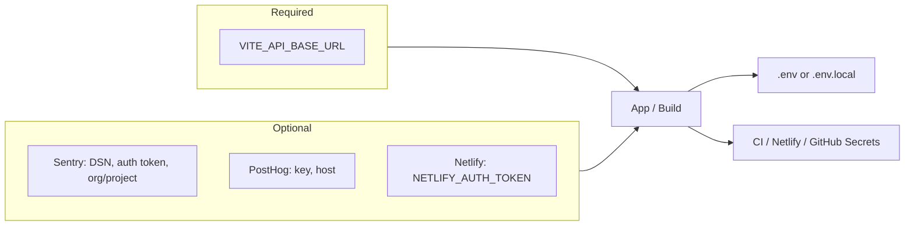

# Credentials and Environment Variables (core-fe)

Where to get credentials and environment variables for this frontend repo. Never commit secrets; use `.env.local` or CI/host secrets.

---

## Required (build / runtime)

| Variable            | Where to get it           | Notes                                                                             |
| ------------------- | ------------------------- | --------------------------------------------------------------------------------- |
| `VITE_API_BASE_URL` | Your backend API base URL | e.g. `https://your-api-domain.com`. App uses path `/api/v1`. Empty = same-origin. |

---

## Optional: Sentry (errors + source maps)

| Variable                       | Where to get it                                                           |
| ------------------------------ | ------------------------------------------------------------------------- |
| `VITE_SENTRY_DSN`              | Sentry project → Settings → Client Keys (DSN) — for client error tracking |
| `SENTRY_AUTH_TOKEN`            | Sentry → Settings → Auth Tokens — for source map upload at build time     |
| `SENTRY_ORG`, `SENTRY_PROJECT` | Sentry URLs: org slug and project slug                                    |

**Full steps:** [sentry-sourcemaps.md](sentry-sourcemaps.md).

---

## Optional: PostHog (analytics)

| Variable            | Where to get it                                                       |
| ------------------- | --------------------------------------------------------------------- |
| `VITE_POSTHOG_KEY`  | PostHog project → Project API key                                     |
| `VITE_POSTHOG_HOST` | PostHog host (e.g. `https://app.posthog.com` or your self-hosted URL) |

---

## Optional: Netlify (deploy from CLI / GitHub Actions)

| What                              | Where to get it                                                                                                                            |
| --------------------------------- | ------------------------------------------------------------------------------------------------------------------------------------------ |
| **Netlify personal access token** | Netlify → User settings → Applications → Personal access tokens. Use for `NETLIFY_AUTH_TOKEN` if deploying from CLI or GitHub Actions.     |
| **Site link**                     | One-time: `pnpm exec netlify link` (or use Netlify UI to import from Git). See [netlify-cli-setup.md](../deployment/netlify-cli-setup.md). |

---

## Optional: GitHub Secrets (CI/CD)

For deploy via GitHub Actions, set `VITE_API_BASE_URL`, `NODE_VERSION`, `NETLIFY_AUTH_TOKEN`, `NETLIFY_SITE_ID` in GitHub → Settings → Secrets and variables → Actions. Run `pnpm run setup:infra:github-secrets` to push vars from `config.setup.env`. See [cicd-and-netlify.md](../deployment/cicd-and-netlify.md).

---

## Local development

- Use **`.env`** or **`.env.local`** at project root. `.env.example` lists all variables; copy it to `.env` and fill values. `.env.local` is gitignored for secrets.
- For local backend: `VITE_DEV_API_URL` (e.g. `http://localhost:3000`) if your Vite config proxies API requests.
