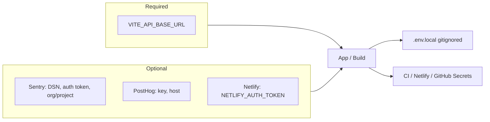

# Credentials and Environment Variables (core-fe)

Where to get credentials and environment variables for this frontend repo. Never commit secrets; use the gitignored `.env.local` locally or GitHub Environments for deploys.

---

## Required (build / runtime)

| Variable            | Where to get it           | Notes                                                                             |
| ------------------- | ------------------------- | --------------------------------------------------------------------------------- |
| `VITE_API_BASE_URL` | Your backend API base URL | e.g. `https://your-api-domain.com`. App uses path `/api/v1`. Empty = same-origin. |

---

## Optional: Sentry (errors + source maps)

| Variable                       | Where to get it                                                           |
| ------------------------------ | ------------------------------------------------------------------------- |
| `VITE_SENTRY_DSN`              | Sentry project → Settings → Client Keys (DSN) — for client error tracking |
| `SENTRY_AUTH_TOKEN`            | Sentry → Settings → Auth Tokens — for source map upload at build time     |
| `SENTRY_ORG`, `SENTRY_PROJECT` | Sentry URLs: org slug and project slug                                    |

**Full steps:** [sentry-sourcemaps.md](sentry-sourcemaps.md).

---

## Optional: PostHog (analytics)

| Variable            | Where to get it                                                       |
| ------------------- | --------------------------------------------------------------------- |
| `VITE_POSTHOG_KEY`  | PostHog project → Project API key                                     |
| `VITE_POSTHOG_HOST` | PostHog host (e.g. `https://app.posthog.com` or your self-hosted URL) |

---

## Optional: Netlify (deploy from CLI / GitHub Actions)

| What                              | Where to get it                                                                                                                            |
| --------------------------------- | ------------------------------------------------------------------------------------------------------------------------------------------ |
| **Netlify personal access token** | Netlify → User settings → Applications → Personal access tokens. Use for `NETLIFY_AUTH_TOKEN` if deploying from CLI or GitHub Actions.     |
| **Site link**                     | One-time: `pnpm exec netlify link` (or use Netlify UI to import from Git). See [netlify-cli-setup.md](../deployment/netlify-cli-setup.md). |

---

## Platform auth & modules (env-only)

Login UI auth surface is **env-only** — no backend config API. Set per-method booleans on core-fe and matching credentials on core-be.

| Variable                                        | Purpose                                                   |
| ----------------------------------------------- | --------------------------------------------------------- |
| `VITE_AUTH_EMAIL`                               | Email OTP panel                                           |
| `VITE_AUTH_OAUTH_GOOGLE` / `_GITHUB` / `_APPLE` | OAuth provider buttons                                    |
| `VITE_AUTH_PASSKEY`                             | Passkey button                                            |
| `VITE_DISABLED_MODULES`                         | Comma-separated product module keys to disable (not auth) |

Full reference: [environment-variables runbook](../deployment/runbooks/environment-variables.md).

---

## Optional: GitHub Secrets (CI/CD)

For deploy via GitHub Actions, set `VITE_API_BASE_URL`, `NODE_VERSION`, `NETLIFY_AUTH_TOKEN`, `NETLIFY_SITE_ID` in GitHub → Settings → Secrets and variables → Actions. Run `pnpm run setup:infra:github-secrets` to push vars from `config.setup.env`. See [cicd-and-netlify.md](../deployment/cicd-and-netlify.md).

---

## Local development

- Use **`.env.local`** at project root (gitignored — your local dev file, one `.env.<NODE_ENV>` per environment mirroring core-be). **`pnpm setup:local`** scaffolds it from `.env.example` and injects localhost defaults (including `VITE_APP_ENV=local`); `pnpm dev` loads it. The `local` environment is set by `VITE_APP_ENV`, not the Vite mode (Vite 8 forbids a mode named `local`).
- It holds **both** behavior flags and machine secrets (SONAR_*, tokens). Deploys never read it — they inject env from GitHub Environments.
- For local backend: `VITE_DEV_API_URL` (default `http://localhost:3000`) — Vite proxies `/api` in development (keep `VITE_API_BASE_URL` empty so the proxy is used).
- **MCP:** set `CONTEXT7_API_KEY` in `.env.local` for the Context7 MCP (`${CONTEXT7_API_KEY}` in `.mcp.json`).

### Auth method toggles (build-time, env-only)

Auth surface is **never** fetched from core-be at boot — set `VITE_AUTH_*` on core-fe and matching OAuth credentials on core-be. See [environment-variables runbook](../deployment/runbooks/environment-variables.md).

| Variable                      | Values                         | Purpose                                                                                                                     |
| ----------------------------- | ------------------------------ | --------------------------------------------------------------------------------------------------------------------------- |
| `VITE_AUTH_EMAIL`             | `true` / `false`               | Hide email OTP sign-in when `false`.                                                                                        |
| `VITE_AUTH_OAUTH_GOOGLE`      | `true` / `false` (default on)  | Show/hide Google OAuth button. Requires `oauth.google` + core-be `OAUTH_GOOGLE_*` for click to succeed.                     |
| `VITE_AUTH_OAUTH_GITHUB`      | `true` / `false` (default on)  | Show/hide GitHub OAuth button.                                                                                              |
| `VITE_AUTH_OAUTH_APPLE`       | `true` / `false` (default off) | Show/hide Apple OAuth button (FE may ship before core-be `OAUTH_APPLE_*`).                                                  |
| `VITE_AUTH_OAUTH_AUTO_GOOGLE` | `true` / `false` (default off) | When `true` (and Google OAuth on), `/login` auto-starts Google sign-in after ~800ms; user can choose **Use email instead**. |
| `VITE_AUTH_PASSKEY`           | `true` / `false`               | Hide passkey sign-in when `false`.                                                                                          |

### Deployment mode overrides (optional)

| Variable                      | Purpose                                                                   |
| ----------------------------- | ------------------------------------------------------------------------- |
| `VITE_PERSONAL_ORGANIZATIONS` | Tri-state override for personal workspace mode (`true` / `false` / unset) |
| `VITE_TEAM_ORGANIZATIONS`     | Tri-state override for team org mode (`true` / `false` / unset)           |

When unset, org deployment flags come from **`GET /auth/me/context`**. When set, env wins for shell gating (Storybook / white-label builds). See [organization-deployment-modes.md](../process/organization-deployment-modes.md).
