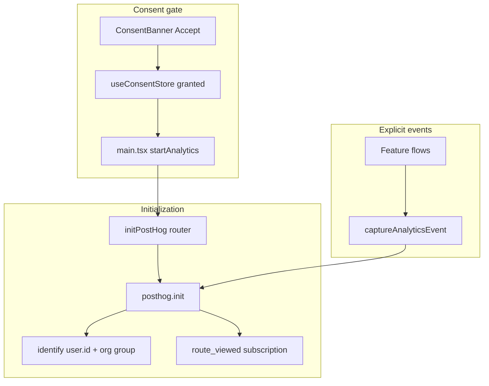

# PostHog — React frontend product analytics

Core-fe uses **PostHog** for consent-gated product analytics and
Core Web Vitals (feature flags are planned — see [Feature flags](#feature-flags)).
**Sentry** owns error/reliability observability — see
[sentry-frontend.md](./sentry-frontend.md).

**Related:** [Credentials](./credentials-and-env.md) · [Frontend platform](../reference/frontend-platform.md)

---

## Is PostHog enabled?

PostHog runs only when **all** of the following are true:

1. User **accepted** the cookie banner (`useConsentStore.analyticsConsent === 'granted'`)
2. **`VITE_POSTHOG_KEY`** is set at build time (or `window.__CONFIG__.POSTHOG_KEY`)
3. Boot completes — `initPostHog(router)` runs from `main.tsx` after splash + idle

Without consent or key, all `captureAnalyticsEvent()` calls are no-ops.

---

## Architecture

| Layer         | Path                                      | Role                                              |
| ------------- | ----------------------------------------- | ------------------------------------------------- |
| Event catalog | `shared/analytics/analytics.constants.ts` | Event names + super-property keys                 |
| Capture API   | `shared/analytics/capture.ts`             | Consent gate, context enrichment, URL scrub       |
| Bootstrap     | `app/analytics/posthog.ts`                | `posthog.init`, identity, router, reset on logout |
| Web Vitals    | `app/observability/performance.ts`        | `web_vital` events                                |

**Privacy:** `autocapture: false`, `disable_session_recording: true`, no emails in
`identify()`. URLs scrubbed via `lib/telemetry-scrub.ts` (`?token=` → `[Filtered]`).

---

## Environment variables

| Variable            | Required           | Purpose                                          |
| ------------------- | ------------------ | ------------------------------------------------ |
| `VITE_POSTHOG_KEY`  | Yes (for any data) | Project API key                                  |
| `VITE_POSTHOG_HOST` | No                 | Ingest host (default `https://us.i.posthog.com`) |

---

## Event catalog (full)

Every custom event includes **shared context** from `getAnalyticsContext()`:

| Property              | Source                 |
| --------------------- | ---------------------- |
| `app_version`         | `VITE_APP_VERSION`     |
| `app_build_id`        | `VITE_APP_BUILD_ID`    |
| `environment`         | Vite mode              |
| `is_authenticated`    | `useAuthStore`         |
| `organization_id`     | `useOrganizationStore` |
| `organization_slug`   | active org             |
| `organization_type`   | `PERSONAL` / `TEAM`    |
| `organization_status` | `active` / `suspended` |

### Consent

| Event                        | When                | Extra properties                     |
| ---------------------------- | ------------------- | ------------------------------------ |
| `analytics_consent_decision` | User accepts banner | `decision`, `source: consent_banner` |

### Auth funnel

| Event                      | When                              | Extra properties                                    |
| -------------------------- | --------------------------------- | --------------------------------------------------- |
| `auth_email_code_sent`     | Email OTP sent                    | `step: verify`                                      |
| `auth_email_code_verified` | Code accepted                     | —                                                   |
| `auth_oauth_started`       | OAuth redirect begins             | `provider`                                          |
| `auth_oauth_completed`     | OAuth callback refresh OK         | —                                                   |
| `session_started`          | Successful sign-in                | `method`: `email_code` \| `oauth`                   |
| `session_ended`            | Logout / force logout / cross-tab | `reason`: `logout` \| `force_logout` \| `cross_tab` |

### Tenancy

| Event                   | When                   | Extra properties                                         |
| ----------------------- | ---------------------- | -------------------------------------------------------- |
| `organization_switched` | Switch org or personal | `target_organization_id`, `target_type`, `switch_target` |
| `invite_accepted`       | Accept-invite success  | `invitation_id`, `organization_id`                       |

### Product surfaces

| Event                      | When                  | Extra properties                                                    |
| -------------------------- | --------------------- | ------------------------------------------------------------------- |
| `onboarding_completed`     | Finish wizard         | `team_size`, `primary_use_case`, `referral_source`, `invited_count` |
| `settings_section_viewed`  | Settings hash changes | `scope`, `section`                                                  |
| `command_palette_opened`   | Cmd+K / palette open  | —                                                                   |
| `appearance_dialog_opened` | Appearance panel      | —                                                                   |
| `language_dialog_opened`   | Language panel        | —                                                                   |

### Deploy / version

| Event                               | When                | Extra properties |
| ----------------------------------- | ------------------- | ---------------- |
| `deployment_update_available`       | New build detected  | `build_id`       |
| `deployment_update_refresh_clicked` | User clicks Refresh | `build_id`       |
| `deployment_update_dismissed`       | Toast dismissed     | `build_id`       |

### Performance

| Event       | When                     | Extra properties                                     |
| ----------- | ------------------------ | ---------------------------------------------------- |
| `web_vital` | CLS, INP, LCP, FCP, TTFB | `name`, `value`, `rating`, `delta`, `navigationType` |

### Navigation

| Event          | When                         | Extra properties              |
| -------------- | ---------------------------- | ----------------------------- |
| `$pageview`    | PostHog automatic            | Scrubbed `$current_url`       |
| `route_viewed` | TanStack Router `onResolved` | `path` (no query), `route_id` |

Settings hash routes (`#settings/...`) do **not** emit `route_viewed` duplicates —
they emit `settings_section_viewed` instead.

---

## PostHog dashboards to build

Suggested insights for analyzing the data above:

1. **Auth funnel** — `auth_email_code_sent` → `auth_email_code_verified` → `session_started`
2. **OAuth split** — `auth_oauth_started` by `provider` vs `auth_oauth_completed`
3. **Activation** — `onboarding_completed` breakdown by `primary_use_case`, `team_size`
4. **Engagement** — DAU/WAU from `session_started`, stickiness from `$pageview`
5. **Settings usage** — `settings_section_viewed` by `scope` + `section`
6. **Org switching** — `organization_switched` by `target_type`
7. **Performance** — `web_vital` trends by `name` + `rating` (p75 LCP/INP)
8. **Deploy adoption** — `deployment_update_available` vs `deployment_update_refresh_clicked`
9. **Group analytics** — filter by `organization` group properties (`type`, `slug`)

---

## Feature flags

> **Not wired yet.** PostHog feature-flag support (a `useFeatureFlag` provider) is
> planned but not currently implemented — the previous `FeatureFlagProvider` was
> removed while unused to keep `posthog-js` off the first-paint path. It will be
> re-added (as an `import type` + runtime `import()` boundary, like
> `shared/analytics/capture.ts`) when the first flag consumer lands.

---

## Adding a new event

1. Add the name to `ANALYTICS_EVENTS` in `shared/analytics/analytics.constants.ts`
2. Call `captureAnalyticsEvent(ANALYTICS_EVENTS.myEvent, { ... })` at the product boundary
3. Document the event + properties in this file
4. Add a colocated test if the capture is non-trivial

Never import `posthog-js` directly in feature code — use `captureAnalyticsEvent`.

---

## Key source files

| File                                           | Role                                  |
| ---------------------------------------------- | ------------------------------------- |
| `shared/analytics/analytics.constants.ts`      | Event name catalog                    |
| `shared/analytics/capture.ts`                  | Capture API + identity/router helpers |
| `app/analytics/posthog.ts`                     | SDK init + logout reset               |
| `shared/analytics/capture-consent-decision.ts` | Consent audit event                   |
| `main.tsx`                                     | Idle bootstrap with router            |
| `shared/components/ConsentBanner/`             | Consent gate                          |

---

## References

- [PostHog JS SDK](https://posthog.com/docs/libraries/js)
- [Group analytics](https://posthog.com/docs/product-analytics/group-analytics)
- [Feature flags](https://posthog.com/docs/feature-flags)
