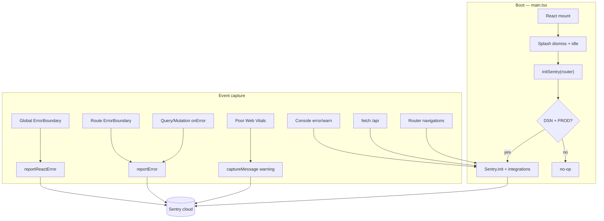

# Sentry — React frontend observability

Core-fe ships a **production-only** Sentry integration for errors, performance,
session replay, profiling, logs, and user feedback. PostHog owns product analytics;
Sentry owns reliability observability.

**Related:** [Source map upload](./sentry-sourcemaps.md) · [Credentials](./credentials-and-env.md) · [Security model](../reference/security-model.md)

---

## Is Sentry “added” to the frontend?

**Yes.** The SDK is installed (`@sentry/react`), bootstrapped from `main.tsx`, and
wired through error handlers, TanStack Query, and the router.

**Activation:** whenever **`VITE_SENTRY_DSN`** is set — including **`pnpm dev`**
with `.env.local`. No production build required.

Without a DSN, init is a no-op. Sentry is **not** gated by the analytics cookie
banner (legitimate-interest error monitoring); PostHog is consent-gated separately.

To verify in dev:

```bash
pnpm dev
# after app load, browser console:
throw new Error('Sentry dev test');
```

Events appear under environment **`development`** in Sentry → Issues.

---

## Architecture



**Lazy load:** `@sentry/react` is dynamically imported after first paint so it does
not land on the critical preload path. `reportError` / `reportReactError` use the
same lazy import pattern.

**Consent:** Sentry runs under **legitimate interest** (error monitoring, masked
replay). It is **not** gated by the analytics cookie banner — see
`ConsentBanner` copy and `main.tsx` comments.

---

## Environment variables

| Variable            | Where                             | Purpose                                             |
| ------------------- | --------------------------------- | --------------------------------------------------- |
| `VITE_SENTRY_DSN`   | GitHub Environment / `.env.local` | Client DSN — **required for any events**            |
| `SENTRY_AUTH_TOKEN` | CI / local build only             | Upload source maps at build time                    |
| `SENTRY_ORG`        | CI / local build only             | Org slug for source map plugin                      |
| `SENTRY_PROJECT`    | CI / local build only             | Project slug for source map plugin                  |
| `VITE_APP_VERSION`  | Build                             | Release name in Sentry (matches source map release) |

Runtime override: `window.__CONFIG__.SENTRY_DSN` in `public/config.js` (no `VITE_`
prefix) — same resolution order as other platform keys.

---

## What data Sentry receives (full catalog)

Use this table when configuring Sentry dashboards, alerts, and sampling.

### Issues (errors)

| Source                       | Code path                                          | Notes                                                      |
| ---------------------------- | -------------------------------------------------- | ---------------------------------------------------------- |
| Uncaught JS errors           | Default SDK handlers + `globalHandlersIntegration` | Automatic                                                  |
| Unhandled promise rejections | Default SDK                                        | Automatic                                                  |
| React root / boundary        | `App.tsx` → `reportReactError`                     | Component stack linked via `captureReactException`         |
| Route errors                 | `ErrorBoundary.tsx` → `reportError`                | Skips HTTP 404                                             |
| TanStack Query failures      | `queryClient.ts` `QueryCache.onError`              | Includes `queryKey` extra                                  |
| TanStack Mutation failures   | `MutationCache.onError`                            | Includes `mutationKey` extra                               |
| Manual                       | `reportError(err, context?)`                       | HTTP metadata (url, method, status) — **no response body** |
| Poor Core Web Vitals         | `performance.ts`                                   | Warning-level message when rating = `poor`                 |
| Console                      | `captureConsoleIntegration`                        | `error` and `warn` levels only                             |
| Reporting API                | `reportingObserverIntegration`                     | Deprecation / crash reports from browser                   |

**User context:** `user.id` only (no email/name). Set on init + auth store subscribe.

**Organization context:** tags `organization_id`, `organization_slug` from
`useOrganizationStore` (init + subscribe).

**Build context:** tag `app.build_id` from `VITE_APP_BUILD_ID`.

**Release:** `VITE_APP_VERSION` — ties issues to deployed version + source maps.

### Performance (transactions & spans)

| Integration                               | What you see in Sentry                                   |
| ----------------------------------------- | -------------------------------------------------------- |
| `tanstackRouterBrowserTracingIntegration` | Route navigations, pageload, `beforeLoad` timing         |
| `httpClientIntegration`                   | `fetch` / XHR spans to `/api/*` and configured API hosts |
| `browserProfilingIntegration` (prod)      | CPU profiles attached to sampled transactions            |

**Sampling (production defaults in `sentry.ts`):**

| Setting                   | Value                                 | Sentry UI                                              |
| ------------------------- | ------------------------------------- | ------------------------------------------------------ |
| `tracesSampleRate`        | `0.1` (10%)                           | Performance → Transactions                             |
| `profilesSampleRate`      | `1.0` of traced                       | Performance → Profiles                                 |
| `tracePropagationTargets` | `localhost`, `https://api.*`, `/api/` | Distributed traces to core-be when BE also uses Sentry |

### Session Replay (production)

| Setting                    | Value                                      | Sentry UI                           |
| -------------------------- | ------------------------------------------ | ----------------------------------- |
| `replaysSessionSampleRate` | `0.1`                                      | Replays → normal sessions           |
| `replaysOnErrorSampleRate` | `1.0`                                      | Replays → 100% when an error occurs |
| Privacy                    | `maskAllText: true`, `blockAllMedia: true` | All text masked, media blocked      |

Use replays to reproduce UI bugs with masked DOM — no readable user input.

### Logs (production)

`enableLogs: true` + `consoleLoggingIntegration({ levels: ['warn', 'error'] })` sends
structured logs to **Sentry → Logs** (SDK v10+). Useful for correlating warnings with
errors in the same trace.

### User Feedback (production)

`feedbackIntegration` injects Sentry’s feedback widget (bottom-right). Users can
attach context to an issue. CSP already allows `*.sentry.io` and `*.ingest.sentry.io`
(`index.html` + `lib/csp-api-origin.ts`).

### Releases & source maps

Build-time `@sentry/vite-plugin` uploads maps when `SENTRY_AUTH_TOKEN` is set.
Issues then show **original TypeScript** stack frames. See
[sentry-sourcemaps.md](./sentry-sourcemaps.md).

---

## Privacy & scrubbing

All outgoing events pass through scrubbers in `lib/telemetry-scrub.ts`:

- **`?token=`** and other single-use query params → `[Filtered]` in URLs
- **UI input breadcrumbs** → message replaced with `[Filtered]`
- **No PII in user object** — id only
- **No API response bodies** in error extras
- **`sendDefaultPii: false`**

---

## Sentry project setup checklist

When creating or tuning the Sentry project for this app:

1. **Platform:** JavaScript → React
2. **Alerts:** Issue regressions, spike in `poor` web vitals, P95 LCP/INP
3. **Performance:** Enable if not on plan — we already send transactions
4. **Session Replay:** Enable + confirm masking meets your policy
5. **Profiling:** Enable for browser profiling samples
6. **Logs:** Enable Logs product for `consoleLoggingIntegration` output
7. **Releases:** Match release name to `VITE_APP_VERSION`
8. **Source maps:** Follow [sentry-sourcemaps.md](./sentry-sourcemaps.md)
9. **Inbound filters:** Optional — ignore browser extension noise in Sentry UI
10. **Teams / ownership:** Route `organization_slug` tag filters to on-call

---

## Key source files

| File                                   | Role                                                 |
| -------------------------------------- | ---------------------------------------------------- |
| `src/app/observability/sentry.ts`      | Init, integrations, context sync, `reportReactError` |
| `src/main.tsx`                         | Idle bootstrap after splash                          |
| `src/App.tsx`                          | Global `react-error-boundary` → `reportReactError`   |
| `src/app/routes/ErrorBoundary.tsx`     | Route errors → `reportError`                         |
| `src/shared/errors/errorHandler.ts`    | `reportError` with user/org/HTTP context             |
| `src/core/http/queryClient.ts`         | Query/mutation error → `reportError`                 |
| `src/app/observability/performance.ts` | Web Vitals → PostHog + Sentry warnings               |
| `src/lib/telemetry-scrub.ts`           | URL + breadcrumb scrubbing                           |
| `vite.config.ts`                       | Source map upload plugin                             |
| `index.html`                           | DNS prefetch + CSP allowlist for Sentry ingest       |

---

## Troubleshooting

| Symptom            | Likely cause                                                     |
| ------------------ | ---------------------------------------------------------------- |
| No events in dev   | Expected — use `pnpm preview` with DSN                           |
| No events in prod  | Missing `VITE_SENTRY_DSN` on Netlify / GitHub env                |
| Minified stacks    | Source maps not uploaded — check `SENTRY_AUTH_TOKEN` in CI build |
| No replays         | Replay not enabled on Sentry plan or sample rate = 0 in non-prod |
| CSP console errors | Check `connect-src` includes `https://*.ingest.sentry.io`        |

---

## References

- [Sentry React SDK](https://docs.sentry.io/platforms/javascript/guides/react/)
- [TanStack Router integration](https://docs.sentry.io/platforms/javascript/guides/react/features/tanstack-router/)
- [Session Replay](https://docs.sentry.io/platforms/javascript/session-replay/)
- [Browser profiling](https://docs.sentry.io/platforms/javascript/profiling/)
- [User Feedback widget](https://docs.sentry.io/platforms/javascript/user-feedback/)
