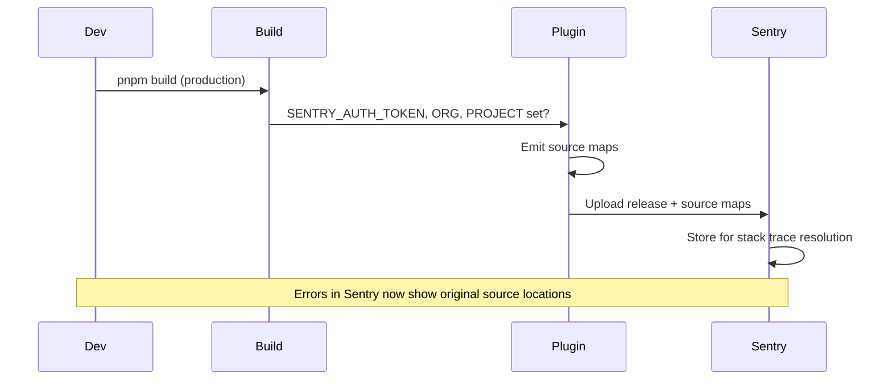

# Sentry Source Map Upload (Vite Plugin)

The app uses **@sentry/vite-plugin** to upload source maps on **production builds** so Sentry can show original source locations in stack traces. The plugin is already configured in `vite.config.ts`; you only need to provide credentials.



---

## 1. Get your Sentry org and project slugs

- **Org slug:** In Sentry, open your organization. The URL is like `https://sentry.io/organizations/<org-slug>/`. Use that `<org-slug>` (e.g. `my-company`).
- **Project slug:** Open your project. The URL is like `https://sentry.io/organizations/<org-slug>/projects/<project-slug>/`. Use that `<project-slug>` (e.g. `core-fe`).

You can also find them under **Settings → Organization → General** (org) and **Project Settings → General** (project).

---

## 2. Create an auth token (Organization token recommended)

1. In Sentry, go to **Settings** (gear icon) → **Developer Settings** → **Organization Auth Tokens**  
   Direct link: `https://sentry.io/settings/<org-slug>/auth-tokens/`
2. Click **Create New Token**.
3. Give it a name (e.g. `core-fe source map upload`).
4. Copy the token **immediately** — Sentry shows it only once.  
   Use it as `SENTRY_AUTH_TOKEN`.

**Alternative (Personal token):** Account dropdown → **User Settings** → **Auth Tokens**. Create a token with **Project: Read & Write** and **Release: Admin**. Use that as `SENTRY_AUTH_TOKEN`.

---

## 3. Provide credentials to the build

The plugin runs only when **`mode === 'production'`** and **`SENTRY_AUTH_TOKEN`** is set. It reads:

| Variable            | Required | Description                       |
| ------------------- | -------- | --------------------------------- |
| `SENTRY_AUTH_TOKEN` | Yes      | Token from step 2 (never commit). |
| `SENTRY_ORG`        | Yes      | Org slug from step 1.             |
| `SENTRY_PROJECT`    | Yes      | Project slug from step 1.         |
| `VITE_APP_VERSION`  | Optional | Release name (defaults from CI).  |

**Option A — CI / production build (recommended)**  
Set in your CI or deployment environment:

```bash
export SENTRY_AUTH_TOKEN=sntrys_xxx...
export SENTRY_ORG=your-org-slug
export SENTRY_PROJECT=your-project-slug
pnpm build
```

**Option B — Local production build**  
Create a file at project root (gitignored):

**`.env.sentry-build-plugin`** (already in `.gitignore`):

```bash
SENTRY_AUTH_TOKEN=sntrys_xxx...
SENTRY_ORG=your-org-slug
SENTRY_PROJECT=your-project-slug
```

Then run `pnpm build`. The plugin loads this file when present.

**Option C — Environment variables only**  
Set `SENTRY_AUTH_TOKEN`, `SENTRY_ORG`, and `SENTRY_PROJECT` in your shell or in `.env.local` (gitignored) before running `pnpm build`.

---

## 4. Verify

1. Run a production build: `pnpm build`
2. In the build output you should see Sentry plugin activity (release created, source maps uploaded).
3. In Sentry: **Project → Settings → Source Maps** — you should see a release and uploaded artifacts.

---

## References

- [Sentry: Uploading Source Maps (Vite)](https://docs.sentry.io/platforms/javascript/sourcemaps/uploading/vite/)
- [Sentry: Auth Tokens](https://docs.sentry.io/product/accounts/auth-tokens/)
- Plugin config: `vite.config.ts` (sentryVitePlugin, production only)
