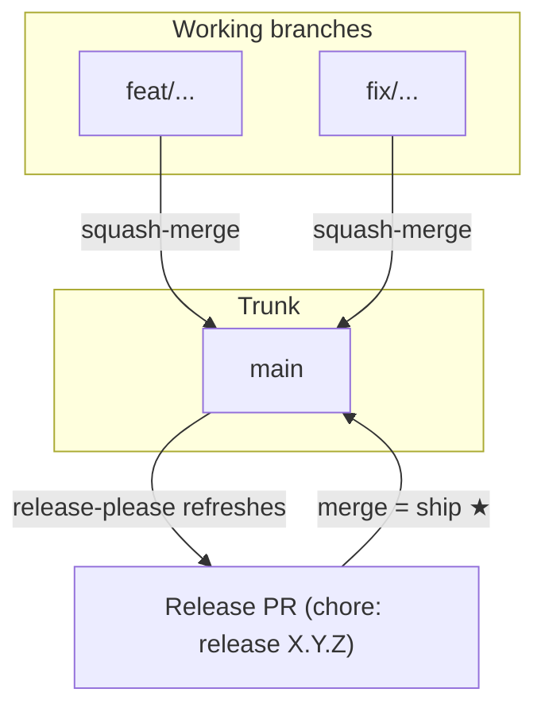

# Git Branch Naming and PR Workflow

Trunk-based workflow for core-fe. For setup see [setup.md](../getting-started/setup.md)
and [netlify-cli-setup.md](../deployment/netlify-cli-setup.md). For CI/CD and deployment,
see [cicd-and-netlify.md](../deployment/cicd-and-netlify.md). The full migration rationale is
[delivery-model-migration-plan.md](delivery-model-migration-plan.md).

---

## One long-lived branch: `main`

core-fe is **trunk-based** — there is a single long-lived branch, `main`, and short-lived
working branches off it. Unfinished or risky work ships **behind a feature flag, never behind
a long-lived branch** (see [feature-flags.md](../reference/feature-flags.md)).

| Branch   | GitHub Environment      | Purpose                                                |
| -------- | ----------------------- | ------------------------------------------------------ |
| **main** | `production` (releases) | The trunk. Every PR merges here; releases cut from it. |

`main` also drives the `development` environment — **every push to `main` deploys the
development alias** (`development--core-fe.netlify.app`), so the alias always serves trunk HEAD. Production
(`core-fe.netlify.app`) serves the latest **release tag** only.

> The former `dev` integration branch is retired. The dev→main dual-channel model, the
> back-merge loop, and the promote ceremony are gone.

---

## Short-lived working branches (created from `main`)

Use the format **type/short-description**.

### Branch type prefixes

| Type     | Use for          | Example                   |
| -------- | ---------------- | ------------------------- |
| feat     | New feature      | feat/ai-stream-response   |
| fix      | Bug fix          | fix/login-error           |
| refactor | Code improvement | refactor/auth-module      |
| docs     | Documentation    | docs/readme-update        |
| test     | Adding tests     | test/user-service         |
| chore    | Maintenance      | chore/update-dependencies |
| perf     | Performance      | perf/list-virtualization  |

### Accepted type prefixes

`feature` · `feat` · `fix` · `refactor` · `docs` · `test` · `chore` · `ci` · `perf` ·
`build` · `style` · `revert`

Hotfixes to an already-shipped version use a short-lived `release/<major>.<minor>` line — see
below.

---

## Full workflow



**Integrate often** (merge to `main`), **release on cadence** (merge the Release PR).
A feature merge is not a release — it refreshes the preview + the development alias only.

---

## Step-by-step PR workflow

### 1. Create a branch from `main`

```bash
git switch main && git pull
git switch -c feat/ai-stream-response
```

### 2. Work and commit

Use [Conventional Commits](https://www.conventionalcommits.org/) (enforced in PR checks) —
the PR title becomes the squash commit, so it must be conventional too:

```bash
git add .
git commit -m "feat: add AI streaming response"
```

Unfinished? Put it behind a `VITE_FF_*` flag and merge anyway — do **not** hold it on a
long-lived branch ([feature-flags.md](../reference/feature-flags.md)).

### 3. Push and open a PR to `main`

```bash
git push -u origin feat/ai-stream-response
```

- **Target branch:** `main`.
- **PR title = conventional commit** (it becomes the squash commit message subject).
- CI runs the single `quality-gate` (lint, format, types, unit + security tests, build,
  security scans). All must pass.
- **Merge = squash**, and the branch **auto-deletes** on merge.

### 4. Release (on your cadence)

release-please keeps **one standing Release PR** open (`chore: release X.Y.Z`), recomputing
the next version + changelog from all unreleased commits. **Merging it is the ship button:**

- version bump + `CHANGELOG.md` + tag `vX.Y.Z` + GitHub Release + SBOM attach, then
- the **one human gate** — approve the `production` deploy → prod serves `vX.Y.Z`.

Bump rules (highest wins): `fix:` → patch, `feat:` → minor, `feat!:`/`BREAKING CHANGE:` →
major; `chore/docs/refactor/ci/test/build/style/perf` → changelog only.

### Rollback (fast) / redeploy an old tag

Two paths, both behind the `production` reviewer approval:

- **Instant rollback** (no rebuild): Actions → **Rollback deploy** → Run workflow.
  Restores the previous published Netlify deploy (or an explicit `deploy_id`).
- **Redeploy a tag** (clean rebuild): Actions → **Release deploy** → Run workflow →
  `tag=v1.0.0`. Rebuilds that tag's tree and deploys `--prod`.

### Hotfix an already-shipped version

```bash
git switch -c release/1.0 v1.0.0     # short-lived; NEVER merged back
# fix, commit, push → post-merge CI on release/** cuts v1.0.1 (GitHub Release)
# → release-deploy.yml deploys v1.0.1 to prod ⛔ approval (or dispatch Release deploy tag=v1.0.1)
# cherry-pick to main if the bug exists there too (one-way)
```

---

## Golden rules

**DO:** integrate often; squash-merge to `main`; use lowercase hyphenated `type/short`
branch names; hide unfinished work behind flags.

**DO NOT:** create long-lived branches; use spaces or long sentences in branch names; hold
work on a branch instead of a flag.

---

## Summary

- **One trunk:** `main`. Feature branches squash-merge to it and auto-delete.
- **Deploys:** every `main` push → development alias; releases only → production (one approval).
- **Ship:** merge the standing `chore: release X.Y.Z` Release PR.
- **Rollback:** **Rollback deploy** (instant restore, no rebuild) or **Release deploy** `{tag}` (rebuild).
