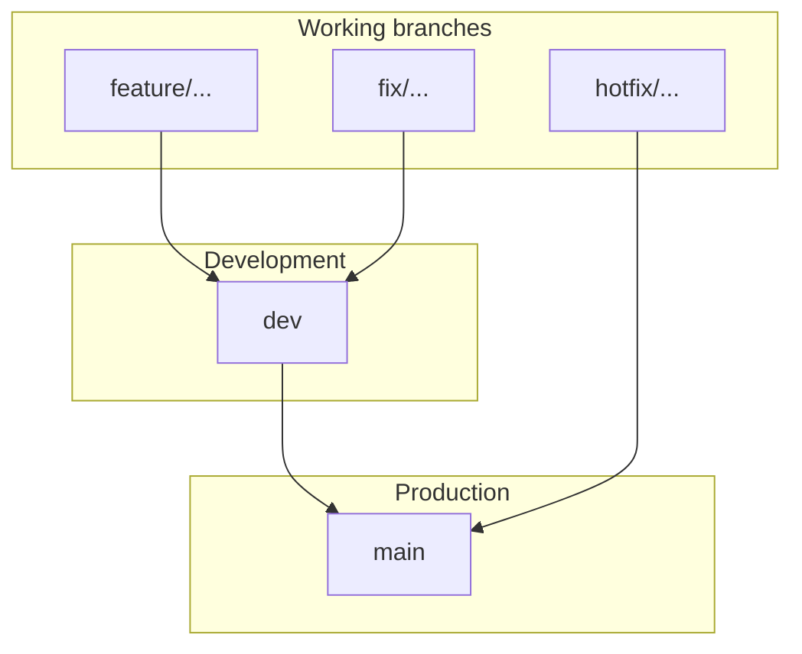

# Git Branch Naming and PR Workflow

Professional branch strategy and pull-request flow for core-fe. For setup see [setup.md](../getting-started/setup.md) and [netlify-cli-setup.md](../deployment/netlify-cli-setup.md). For CI/CD and deployment (including tokens), see [cicd-and-netlify.md](../deployment/cicd-and-netlify.md).

---

## Primary long-lived branches

These branches represent environments and use simple, standard names.

| Branch   | GitHub Environment | Purpose                           | Contains                   |
| -------- | ------------------ | --------------------------------- | -------------------------- |
| **main** | `production`       | Production-ready code             | Stable, fully tested code  |
| **dev**  | `development`      | Integration branch for developers | Latest development changes |

Canonical mapping lives in [`tooling/setup/setup.config.json`](../../tooling/setup/setup.config.json).

---

## Short-lived working branches (created from dev)

Use the format: **type/short-description**

### Branch type prefixes

| Type     | Use for               | Example                    |
| -------- | --------------------- | -------------------------- |
| feature  | New feature           | feature/ai-stream-response |
| fix      | Bug fix               | fix/login-error            |
| refactor | Code improvement      | refactor/auth-module       |
| docs     | Documentation         | docs/readme-update         |
| test     | Adding tests          | test/user-service          |
| chore    | Maintenance           | chore/update-dependencies  |
| hotfix   | Urgent production fix | hotfix/payment-crash       |

### Examples

- feature/user-authentication
- feature/ai-stream-response
- fix/token-expiry
- refactor/user-service
- docs/api-documentation

### Enterprise format (with ticket ID)

**type/ticket-description**

- feature/AI-101-stream-response
- fix/API-205-login-error
- refactor/SYS-88-clean-architecture

### Accepted type prefixes

`feature` · `feat` · `fix` · `hotfix` · `refactor` · `docs` · `test` · `chore` · `ci` · `perf` · `build` · `style` · `revert`

---

## Full workflow: merge flow



**Merge order:** feature/... → dev → main

---

## Step-by-step PR workflow

### 1. Create feature branch from dev

```bash
git checkout dev
git pull origin dev
git checkout -b feature/ai-stream-response
```

### 2. Work and commit

Use [Conventional Commits](https://www.conventionalcommits.org/) for commit messages (enforced in PR checks):

```bash
git add .
git commit -m "feat: add AI streaming response"
```

### 3. Push branch

```bash
git push origin feature/ai-stream-response
```

### 4. Open pull request

- **Target branch:** `dev` (for feature/fix/refactor branches).
- PR title must follow conventional commits (e.g. `feat: add AI streaming response`).
- CI runs automatically (lint, format, type-check, tests, build, security, E2E). All must pass.
- **Protected branches:** Required checks and merge rules for `main` and `dev` are documented in [branch-protection.md](../deployment/branch-protection.md).

### 5. Promote to production

- Open a PR **dev → main** when changes are ready for production.
- After merge, post-merge CI deploys to Netlify (`development` on push to `dev`, `production` on push to `main`).

### Hotfix (production fix)

- Branch from **main**: `git checkout main && git pull && git checkout -b hotfix/payment-crash`.
- Fix, commit, push. Open PR **hotfix/... → main**.
- After merge, deploy to production. Post-merge CI dispatches a back-merge PR to sync **main → dev**.

---

## Golden rules

**DO:**

- Use lowercase
- Use hyphens in branch names
- Keep names short and clear
- Use prefixes (feature/, fix/, refactor/, docs/, test/, chore/, hotfix/)

**DO NOT:**

- Use spaces in branch names
- Use very long sentences
- Use random or personal branch names

---

## Summary

**Long-lived branches:** main, dev

**GitHub environments:** `production` (main), `development` (dev)

**Short-lived branches:** feature/short-description, fix/short-description, refactor/short-description, docs/..., test/..., chore/..., hotfix/...

**PR flow:** feature → dev → main. CI runs on every PR to `main` or `dev`; Netlify deploys run from post-merge CI on push to `dev` (development) and `main` (production).
