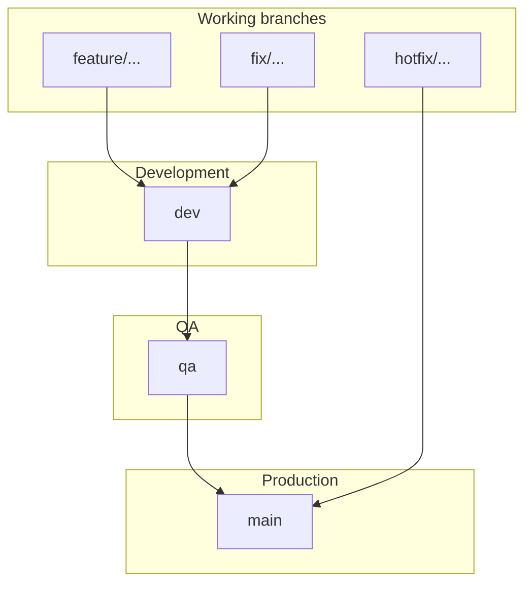

# Git Branch Naming and PR Workflow

Professional branch strategy and pull-request flow for core-fe. For setup see [setup.md](../getting-started/setup.md) and [netlify-cli-setup.md](../deployment/netlify-cli-setup.md). For CI/CD and deployment (including tokens), see [cicd-and-netlify.md](../deployment/cicd-and-netlify.md).

---

## Primary long-lived branches

| Branch   | Purpose                           | Contains                     |
| -------- | --------------------------------- | ---------------------------- |
| **main** | Production-ready code             | Stable, fully tested code    |
| **dev**  | Integration branch for developers | Latest development changes   |
| **qa**   | Testing branch for QA team        | Code ready for QA validation |

---

## Short-lived working branches (created from dev)

Use the format: **type/short-description**

### Branch type prefixes

| Type     | Use for               | Example                    |
| -------- | --------------------- | -------------------------- |
| feature  | New feature           | feature/ai-stream-response |
| fix      | Bug fix               | fix/login-error            |
| refactor | Code improvement      | refactor/auth-module       |
| docs     | Documentation         | docs/readme-update         |
| test     | Adding tests          | test/user-service          |
| chore    | Maintenance           | chore/update-dependencies  |
| hotfix   | Urgent production fix | hotfix/payment-crash       |

### Examples

- feature/user-authentication
- feature/ai-stream-response
- fix/token-expiry
- refactor/user-service
- docs/api-documentation

### Enterprise format (with ticket ID)

**type/ticket-description**

- feature/AI-101-stream-response
- fix/API-205-login-error
- refactor/SYS-88-clean-architecture

---

## Full workflow: merge flow



**Merge order:** feature/... → dev → qa → main

---

## Step-by-step PR workflow

### 1. Create feature branch from dev

```bash
git checkout dev
git pull origin dev
git checkout -b feature/ai-stream-response
```

### 2. Work and commit

Use [Conventional Commits](https://www.conventionalcommits.org/) for commit messages (enforced in PR checks):

```bash
git add .
git commit -m "feat: add AI streaming response"
```

### 3. Push branch

```bash
git push origin feature/ai-stream-response
```

### 4. Open pull request

- **Target branch:** `dev` (for feature/fix/refactor branches).
- PR title must follow conventional commits (e.g. `feat: add AI streaming response`).
- CI runs automatically (lint, format, type-check, tests, .env.example check, build, security, E2E). All must pass.
- After review and approval, merge into `dev`.

### 5. Promote to QA

- Open a PR **dev → qa** when a set of changes is ready for QA.
- After merge, QA environment deploys (Netlify). Run smoke and QA tests.

### 6. Promote to production

- Open a PR **qa → main** when QA has signed off.
- After merge, production deploys (Netlify). Ensure runbook steps are done if needed.

### Hotfix (production fix)

- Branch from **main**: `git checkout main && git pull && git checkout -b hotfix/payment-crash`.
- Fix, commit, push. Open PR **hotfix/... → main**.
- After merge, deploy to production. Then merge **main → dev** (and optionally **main → qa**) to keep long-lived branches in sync.

---

## Golden rules

**DO:**

- Use lowercase
- Use hyphens in branch names
- Keep names short and clear
- Use prefixes (feature/, fix/, refactor/, docs/, test/, chore/, hotfix/)

**DO NOT:**

- Use spaces in branch names
- Use very long sentences
- Use random or personal branch names

---

## Summary

**Long-lived branches:** main, dev, qa

**Short-lived branches:** feature/short-description, fix/short-description, refactor/short-description, docs/..., test/..., chore/..., hotfix/...

**PR flow:** feature → dev → qa → main. CI runs on every PR to main, dev, or qa; deployments to Netlify trigger per your Netlify branch configuration (e.g. dev, qa, main).
