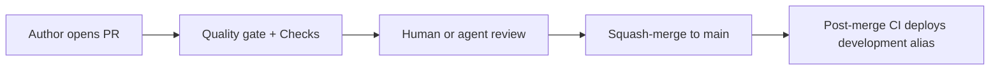

# Pull request review (core-fe)

**Authors:** use [`.github/PULL_REQUEST_TEMPLATE.md`](../../.github/PULL_REQUEST_TEMPLATE.md) and run `pnpm health` (or wait for CI).
**Reviewers (human and agent):** use this doc as the shared rubric. Severity labels match [engineering-principles](../../agent-os/rules/engineering-principles.mdc) PR review mode. Structure mirrors core-be's `docs/process/pr-review.md`.

---

## At a glance

| Item                    | Reference                                                                                    |
| ----------------------- | -------------------------------------------------------------------------------------------- |
| **Required CI checks**  | `Quality gate` + `unit / Unit + global` (pr-ci.yml) + `Checks` (pr-governance.yml)           |
| **Author gate (local)** | `pnpm health` or the `/ci-local` command                                                     |
| **PR template**         | [`.github/PULL_REQUEST_TEMPLATE.md`](../../.github/PULL_REQUEST_TEMPLATE.md)                 |
| **New work intake**     | [requirement-intake.md](../getting-started/requirement-intake.md)                            |
| **Severity**            | **Blocker** = must fix before merge · **Major** = should fix or justify · **Nit** = optional |



---

## Severity legend

| Label       | Meaning                | Examples                                                                                      |
| ----------- | ---------------------- | --------------------------------------------------------------------------------------------- |
| **Blocker** | Merge must not proceed | Secret in diff, token in localStorage, raw palette class, page importing another page         |
| **Major**   | Fix or document why    | Missing tests on a new unit, hardcoded user-facing string, static import of a deferred module |
| **Nit**     | Nice to have           | Naming polish, comment clarity, minor refactor outside PR scope                               |

---

## Section A — Human reviewer checklist

Check only what the PR touches.

### Architecture and layers

| Check                | What to look for                                                                                   | Typical severity |
| -------------------- | -------------------------------------------------------------------------------------------------- | ---------------- |
| Page isolation       | No `pages/A` importing `pages/B`; within an island use relative imports (no `@/pages/**`)          | Blocker          |
| Dependency direction | `app → pages → shared → core → lib`; `shared/components/ui` stays a leaf                           | Blocker          |
| Route island shape   | New routes have `<page>.route.tsx`, manifest, `<PAGE>.OVERVIEW.md`, routeTree + routes-and-ui rows | Blocker          |
| Promotion ladder     | Code promoted one rung per force (page → family `shared/` → root `shared/` → `core`/`lib`)         | Major            |
| Import style         | `.ts`/`.tsx` extensions on imports; `type` imports for types; icons via `@/shared/icons`           | Major            |

### State and data

| Check        | What to look for                                                             | Typical severity |
| ------------ | ---------------------------------------------------------------------------- | ---------------- |
| Server state | TanStack Query for API data — never Zustand                                  | Blocker          |
| Client state | Global Zustand only in `src/shared/store/use<X>Store/`; page-local is rare   | Major            |
| URL state    | Search params via `<page>.search.ts` validateSearch schema                   | Major            |
| API calls    | `apiClient` from `core/http` (auth service `authFetch` is the one exception) | Blocker          |
| Contracts    | Zod schemas in `contracts.ts`; TS types inferred, no `any`                   | Major            |

### UI and tokens

| Check           | What to look for                                                                                    | Typical severity |
| --------------- | --------------------------------------------------------------------------------------------------- | ---------------- |
| Semantic tokens | No raw palette classes (`bg-blue-500`, `text-white`) — `pnpm validate:tokens` clean                 | Blocker          |
| shadcn sources  | Components from allowed sources only (`agent-os/rules/ui-sources.mdc`)                              | Major            |
| Dark surfaces   | Icons on `bg-brand` / `bg-sidebar` / `bg-primary` use foreground tokens (`src/lib/icon-surface.ts`) | Major            |
| Deferred chunks | No static import of `@sentry/react`, `posthog-js`, SettingsModal/CommandPalette trees               | Blocker          |
| A11y            | Interactive elements have ARIA; component tests use vitest-axe (`axeForDialog` for portals)         | Major            |

### Security

| Check           | What to look for                                                                          | Typical severity |
| --------------- | ----------------------------------------------------------------------------------------- | ---------------- |
| Secrets         | No tokens/keys in diff; Gitleaks clean; only `.env.example` committed                     | Blocker          |
| Token storage   | Access token in memory only — no localStorage/sessionStorage sessions                     | Blocker          |
| Refresh path    | Only `shared/auth/service.ts` calls `/auth/refresh` — never add a second caller           | Blocker          |
| RBAC            | Protected routes gate in `routeTree.tsx` `beforeLoad` via `gatewayFromManifest(manifest)` | Blocker          |
| Redirect safety | `returnTo`-style params validated against the allowlist (tests/security covers it)        | Blocker          |

### i18n

| Check      | What to look for                                                                | Typical severity |
| ---------- | ------------------------------------------------------------------------------- | ---------------- |
| Copy       | User-facing strings go through react-i18next keys, not literals                 | Major            |
| Key parity | New keys present in every `src/locales/<lang>/`; English is the reference       | Major            |
| Constants  | Static values (test ids, analytics events, defaults) in scoped `*.constants.ts` | Nit              |

### Performance and bundle

| Check        | What to look for                                                           | Typical severity |
| ------------ | -------------------------------------------------------------------------- | ---------------- |
| Size budgets | `pnpm build:check` green — no first-paint chunk regression                 | Blocker          |
| Lazy routes  | New routes lazy via `route.tsx` boundaries; heavy widgets code-split       | Major            |
| Re-renders   | No obvious render storms (unstable deps, inline object props in hot paths) | Nit              |

### Tests

| Check       | What to look for                                                                     | Typical severity |
| ----------- | ------------------------------------------------------------------------------------ | ---------------- |
| Coverage    | New units have colocated `*.test.ts(x)`; changed lines ≥ 90% (`pnpm coverage:patch`) | Major            |
| Test ids    | Actions carry `data-testid` (`pnpm validate:testids`); a11y guards use roles/labels  | Major            |
| E2E         | New flows get `tests/e2e/*.e2e.test.ts` when they matter (local-only, needs core-be) | Nit              |
| Determinism | No flaky timers/network without mocks (`vi.mock`, fake timers)                       | Major            |

### Environment and config

| Check       | What to look for                                                                            | Typical severity |
| ----------- | ------------------------------------------------------------------------------------------- | ---------------- |
| Env schema  | New vars in `env-schema.ts` + `.env.example` (+ profile allowlists); `VITE_` only if public | Blocker          |
| No sniffing | No `import.meta.env.DEV/PROD/MODE` or `environment ===` branching — named flags only        | Blocker          |
| Hosted envs | Maintainer runs `pnpm github:sync` when a deploy secret/variable changes                    | Major            |

### Documentation

| Check              | What to look for                                                                     | Typical severity |
| ------------------ | ------------------------------------------------------------------------------------ | ---------------- |
| Route registration | New/changed routes reflected in `docs/reference/routes-and-ui.md` + island OVERVIEW  | Major            |
| Index              | New `docs/**/*.md` listed in [docs/README.md](../README.md)                          | Major            |
| Generated files    | Do not hand-edit `dist/`, `docs/reference/project-tree.txt`, version/build artifacts | Blocker          |

### Dependencies

| Check         | What to look for                                                                 | Typical severity |
| ------------- | -------------------------------------------------------------------------------- | ---------------- |
| Audit         | `pnpm deps:audit` / CI security audit green                                      | Blocker          |
| Atomic lock   | `package.json` change and `pnpm-lock.yaml` regen land in the SAME commit         | Blocker          |
| Justification | New packages necessary; bundle impact considered (`dependency-management` skill) | Major            |

---

## Section B — Agent reviewer checklist

Use when reviewing as a Cursor/Claude agent or via `/pre-merge-review`. Read the
[skill registry](../../agent-os/skills/skill-registry/SKILL.md) first.

### Workflow

1. Read PR **Summary**, **Test plan**, and the diff file list.
2. Map each changed path to skill-registry triggers; flag if a matched skill was likely skipped (e.g. a new route with no manifest/OVERVIEW/routes-and-ui touch).
3. Run the targeted greps below on changed files only.
4. Post findings in the output format below; never weaken a gate to go green.

### Grep and scan patterns

| Risk                  | Pattern / rule                                                                                                            |
| --------------------- | ------------------------------------------------------------------------------------------------------------------------- |
| Raw palette classes   | `bg-(red\|blue\|emerald\|zinc\|slate\|gray)-[0-9]`, `text-white`, `bg-black` in `src/` (vendored `components/ui/` exempt) |
| Direct icon imports   | `from 'lucide-react'` outside `shared/components/ui/`                                                                     |
| Token storage         | `localStorage`/`sessionStorage` near `token`/`session`/`auth`                                                             |
| Env sniffing          | `import.meta.env.(DEV\|PROD\|MODE)` or `platformConfig.environment ===` outside the config kernel                         |
| Cross-page imports    | `@/pages/` anywhere, or `pages/A` paths inside `pages/B`                                                                  |
| Second refresh caller | `/auth/refresh` referenced outside `shared/auth/service.ts`                                                               |
| console.log           | `console.log` in `src/` (use the logger / notify surfaces)                                                                |
| Unsafe target         | `target="_blank"` without `rel="noopener noreferrer"`                                                                     |

### Agent output format

```markdown
## PR review (agent)

### Blockers

- [ ] <file:line> — <issue>

### Major

- [ ] <file:line> — <issue>

### Nits

- [ ] <optional>

### Skills / CI

- Expected skills: <list from skill-registry>
- Author test plan: <confirm or gap>
```

### Related skills

- **full-code-review** — full report across security/perf/quality when asked.
- **ci-investigator** — one failing check diagnosis.
- **code-smells-best-practices** — fix lint/idiom issues in touched files.
- **lint-guard** — background lint/type fixes after implementation.

---

## Doc sync map

What stays in sync automatically vs what reviewers must verify.

### Hard-enforced (CI / hooks — trust green checks)

| Artifact / rule                       | Enforced by                                                                           |
| ------------------------------------- | ------------------------------------------------------------------------------------- |
| Tokens / structure / test ids / theme | `validate:tokens` · `validate:structure` · `validate:testids` · `validate:theme-axis` |
| Lint / format / types                 | ESLint + Biome + Prettier + `tsc` lanes                                               |
| Unit + patch coverage                 | Vitest projects + `coverage:patch` (changed lines ≥ 90%)                              |
| Bundle budgets                        | `build:check` + size-limit                                                            |
| TSDoc budget                          | `tsdoc:check` (raise-only ratchet)                                                    |
| agent-os integrity                    | `agent-os:check` (+ vendored skill hashes)                                            |
| `.env.example` vs schema              | `validate:env-example`                                                                |
| Secrets / SAST / deps                 | Gitleaks · Semgrep · CodeQL · `deps:audit`                                            |
| Dead code                             | Knip                                                                                  |

### Soft-enforced (reviewer / agent should verify)

| Item                                   | How it stays in sync                                  |
| -------------------------------------- | ----------------------------------------------------- |
| `docs/README.md` index completeness    | **documentation-maintenance** when docs change        |
| `routes-and-ui.md` prose accuracy      | Author + reviewer on route changes                    |
| Locale key parity across languages     | **i18n-auditor** (finds) → **i18n-constants** (fixes) |
| Whole-page a11y beyond component axe   | **a11y-auditor** sweep                                |
| Review snapshots under `docs/reviews/` | Dated files; do not rewrite history                   |

### Periodic maintenance

| Cadence              | Action                                                        |
| -------------------- | ------------------------------------------------------------- |
| After renaming gates | Grep `docs/` + skills for old script/workflow names           |
| Per theme-axis work  | Update visual baselines (`visual-regression` skill)           |
| Before releases      | `/prod-readiness` pipeline (deps → bundle → perf → hardening) |

---

## Related links

| Doc                                                               | Purpose                           |
| ----------------------------------------------------------------- | --------------------------------- |
| [trunk-based-workflow.md](trunk-based-workflow.md)                | Branch naming and the PR loop     |
| [branch-governance.md](../reference/branch-governance.md)         | Rulesets + review posture as code |
| [cicd-and-netlify.md](../deployment/cicd-and-netlify.md)          | Full CI/CD pipeline               |
| [requirement-intake.md](../getting-started/requirement-intake.md) | New work before coding            |
| [testing.md](../reference/testing.md)                             | Full test matrix                  |
