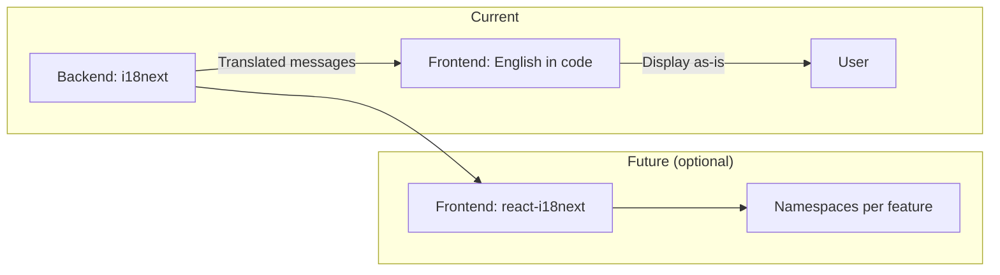

# Internationalization (i18n) — Core Frontend

Current status and how the frontend relates to backend translations.

---

## Current status

- **Frontend:** User-facing strings in the app are in **English** and live in the code (no client-side i18n yet).
- **Backend:** The API returns translated error and success messages (e.g. via i18next). The frontend displays those API messages as returned; no translation layer in the client.

---

## Future: client-side i18n

If you add client-side internationalization (e.g. react-i18next, namespace per feature):

- Define translation keys and namespaces consistently (e.g. `pages:notifications.title`).
- Keep backend message keys in sync where the API returns user-facing text.
- Document locale files location and how to add new keys (e.g. `src/locales/en/`, `src/locales/es/`).

Until then, the app remains English-only with backend-provided messages used as-is.
