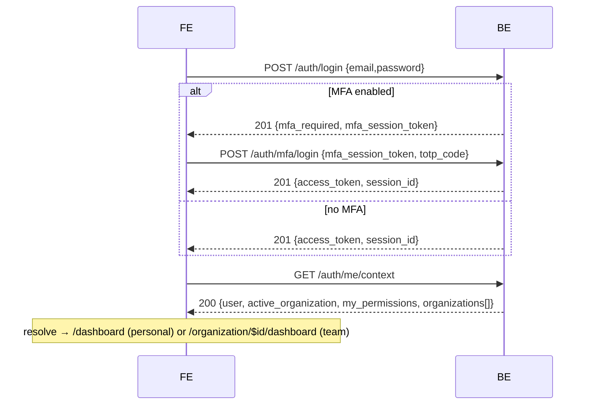

# 10 — Dual-URL Tenancy, Routing Redesign & Auth-Flow Alignment

Status: **proposed** (design for review) · Supersedes parts of
`docs/reference/routing-and-tenancy.md` (URL-as-source-of-truth) and the
[[pages-url-mirror-design]] memory · Source of truth for the backend contract:
core-be `docs/reference/api/frontend-auth-flows.md` + the FE-reference pasted in
this session.

## 0. Why

Two things changed our model:

1. **Active org is a signed token claim, not the URL.** core-be reads the active
   organization from the JWT `org` claim; `X-Organization-Id` is dead in the
   authorization path. The single authoritative read is `GET /auth/me/context`.
   Our current FE treats the **URL** (`/organization/$organizationId`) as the
   source of truth — that must flip to **token/me-context-driven**, with the URL
   merely _reflecting_ the active org.
2. **Dual-URL by org type (product decision).** A user has exactly **one
   PERSONAL org** + **N TEAM orgs** (left switcher). When the active org is
   **PERSONAL**, the app lives at **root URLs** (`/dashboard`, …, no org
   segment). When it's a **TEAM**, URLs are **`/organization/org_*/…`**.

This reverses "URL is the single source of truth" and bends the route-island
"pages mirror the URL 1:1" rule (the same pages render in two URL spaces). It
also surfaced **three auth-flow corrections** (below) in code written before the
backend contract was pinned.

## 1. Org model (recap, authoritative)

- Every workspace is an org with immutable `type` ∈ `PERSONAL | TEAM`.
- Type drives `capabilities` (TEAM ⇒ all true; PERSONAL ⇒ all false):
  `can_invite_members`, `can_manage_members`, `can_manage_roles`,
  `can_transfer_ownership`, `can_delete`, `can_manage_billing`.
- **Gate team-only UI on `capabilities.*`** — never by probing a route
  (team-only routes return **422** on a personal org; the type never changes).
- `me/context.user` carries deployment flags + `personal_organization_id`:
  `capabilities: { personal_organizations, team_organizations }`,
  `personal_organization_id` (null when personal orgs are disabled).
- PERSONAL: `slug: null`, one per user, auto-provisioned at signup.

## 2. Token / active-org model

- `Authorization: Bearer <access_token>` (RS256, ~15-min TTL) on every guarded call.
- Active org = the token's `org` claim. **Switch** via `POST /auth/switch-to-organization { organization_id }` or `POST /auth/switch-to-personal` → **re-mints the token** and returns the **active-org delta inline** (no follow-up `/me/context`):

  ```ts
  // switch response `data`
  const data = { access_token, active_organization, my_permissions, global_role };
  ```

- `user` + `organizations[]` are **stable across a switch** — reuse from the
  initial `/me/context` and just flip `is_active` locally.
- httpOnly `session_id` cookie backs `POST /auth/refresh` (rotates the token,
  **preserves** the switched org). 401 → refresh; refresh 401 → login.

## 3. Routing redesign (dual-URL)

### 3.1 URL scheme

| Active org (token) | URL space                             | Examples                                   |
| ------------------ | ------------------------------------- | ------------------------------------------ |
| **PERSONAL**       | **root**                              | `/dashboard`, `/#settings/account/profile` |
| **TEAM**           | **`/organization/$organizationSlug`** | `/organization/acme-inc/dashboard`         |
| (unauth)           | auth-shell                            | `/login`, `/register`, `/callback`, …      |
| (no active org)    | —                                     | redirect `/onboarding`                     |

Active org is **always** `me/context.active_organization`. The URL reflects it;
for TEAM the **`$organizationSlug`** segment is the human-readable, shareable
"which team" target. The immutable `id` (needed by `switch-to-organization`) is
resolved from the slug locally via `me/context.organizations` (no extra fetch);
a deep link to an org not in that list falls back to
`GET /tenancy/organizations/by-slug/{slug}`. PERSONAL has `slug: null` and uses
root URLs, so it never needs a slug.

### 3.2 Route tree

```text
__root__  (RouteAnnouncer + global SettingsModal + version check)
├── auth-shell (pathless)         /login /register /forgot-password /reset-password /verify-email /mfa
├── /callback  /unauthorized  /onboarding  /accept-invite/$invitationId
├── /                              resolver (no UI) — see 3.3
├── _app (pathless layout)         PERSONAL space — mounts <AppShell> (active org = token's personal)
│   └── /dashboard                 personal dashboard  (+ future personal pages)
└── /organization/$organizationSlug  TEAM space — <AppShell> (org guard + switch-on-nav)
    ├── dashboard
    ├── suspended
    └── … (members/roles/billing are the hash SettingsModal, not routes)
```

Both spaces render the **same** `<AppShell>` (already in `shared/layouts/`) and
the **same** page components. The personal space (`_app`) and the team space
(`/organization/$organizationId`) are thin route markers that import the shared
components — see 3.4.

### 3.3 The `/` resolver

```ts
// reads me/context once (cached via the useMeContext query / a loader fetch)
export async function resolveRoot() {
  const ctx = await fetchMeContext();
  if (!ctx.activeOrganization) return redirect({ to: '/onboarding' });
  return ctx.activeOrganization.type === 'PERSONAL'
    ? redirect({ to: '/dashboard' })
    : redirect({
        to: '/organization/$organizationSlug/dashboard',
        params: { organizationSlug: ctx.activeOrganization.slug },
      });
}
```

### 3.4 Shared pages / dual-mount (route-island reconciliation)

Tension: route-island says _pages mirror the URL 1:1_, but the dashboard now
lives at two URLs. **Resolution:**

- The **page component is shared** and lives once. `DashboardPage` (today in the
  team island) is promoted to a shared app surface (e.g.
  `shared/components/app/` or kept in the team island and imported by the
  personal marker). `<AppShell>` is already shared.
- **Route markers exist at both URL locations** (`_app/dashboard.route.tsx` and
  `organization/$organizationSlug/dashboard/dashboard.route.tsx`), each rendering
  the shared component. This keeps URL-mirrored markers while sharing UI.
- **Decision to confirm during build:** promote `DashboardPage` to
  `shared/` vs. import it from the team island into the personal marker.
  Recommendation: **promote to `shared/`** (neither space "owns" it).

### 3.5 Guards

Per-space guard chains (TanStack `beforeLoad`), all RBAC sourced from `me/context`:

- **auth-shell:** `redirectIfAuthenticated()`.
- **`_app` (personal):** `requireAuth()` → ensure `me/context.activeOrganization.type === 'PERSONAL'` (else redirect to the team URL — keeps URL ⇄ active-org consistent) → `requirePermission` from `manifest`.
- **`/organization/$organizationSlug` (team):** `requireAuth()` → **switch-on-nav** (3.6) → `requireActiveOrganization` (status) → `requirePermission`.

### 3.6 Switch-on-navigation

```ts
// entering /organization/$slug/* :
const ctx = await fetchMeContext();
const target = ctx.organizations.find((o) => o.slug === slug);
if (!target) throw notFound(); // unknown / non-member slug (or try by-slug)
if (ctx.activeOrganization?.id !== target.id) {
  await switchToOrganization(target.id); // switch by immutable id → re-mint + inline delta
}
```

Lets a deep link / refresh into `/organization/acme-inc/...` re-point the token
to that team (if a member), or 404 otherwise.

## 4. Org switcher (left rail, in `<AppShell>`)

- Source: `me/context.organizations` (personal + teams), `is_active` flag.
- **Personal** → `switchToPersonal()` → store token + delta → `navigate('/dashboard')`.
- **Team** → `switchToOrganization(id)` (immutable id from the org) → store token + delta (`active_organization`, `my_permissions`) → `navigate('/organization/$slug/dashboard')`. Flip `is_active` locally; no extra `/me/context`.
- Group as **Personal** (top) + **Teams** + a "Create team" action
  (`POST /tenancy/organizations` + switch). Apply `impeccable` /
  `high-end-visual-design` for the switcher + dashboard polish.

## 5. Auth-flow alignment (corrections + canonical post-auth call)

Every first-factor flow returns `{ access_token, session_id }` **or** the MFA
alternative `{ mfa_required: true, mfa_session_token }` — **branch on the body,
not the 201 status** — and ends with the single `GET /auth/me/context`.

**Corrections to ship (built before the contract was pinned):**

1. **Magic-link is code-entry, not a link.** `send { email }` → a **6-digit code**
   by email; `verify { email, code }` → token. Replace the `/callback?token`
   exchange (Task #1) with a **code-entry step** after "send" (reuse the OTP
   input pattern). The emailed flow auto-signs-up unknown emails.
2. **OAuth start returns `{ url }`.** `GET /auth/oauth/:provider` → `{ url }`;
   the FE redirects the browser to `url` (don't `window.location` the start route
   directly). Return path: provider → BE `/auth/oauth/:provider/callback` →
   session cookie → FE `/callback` → `POST /auth/refresh` (Flow F) → `me/context`.
3. **`mfa/login` field is `totp_code` / `recovery_code`,** not `code`.



Flows A–H (signup / login(+MFA) / magic-link / OAuth / passkey / silent-resume /
forgot-reset / invited-teammate) are each 2–3 calls ending in `me/context`; the
invited-teammate flow adds `accept` + `switch-to-organization`.

## 6. API mock + live parity (every endpoint)

One env var — **`config.useMockApi`** (`VITE_USE_MOCK_API`; default **live** in
prod/staging/test, opt-in mock in dev). **Every** API fn implements both branches
and returns the **same domain shape**:

```ts
export async function listMembers(): Promise<Member[]> {
  if (config.useMockApi) return mockResponse(MOCK_MEMBERS); // domain shape == live-mapped shape
  const res = await apiClient.get<unknown>(`${API}/tenancy/organization/memberships`);
  return membershipListWire.parse(res.data).map(toMember); // wire(snake) → domain
}
```

- The **mock data mirrors the mapped wire** so the full flow is exercisable
  offline; flipping `useMockApi=false` makes every screen work against core-be.
- Gap today: the `organization-api.ts` fns (members, invitations, roles,
  api-keys, billing, webhooks, notification-prefs, sessions) are **mock-only** —
  each needs a live branch + a `*Wire` schema + `to*` mapper (me-context style).
- Reconciliations needed: member `role` is a **`{ id, name }` object** (not the
  FE `OrgRole` enum); **no list-invitations endpoint** (invite = add-member-by-
  email → pending membership); members embed a `user` object (snake_case).

## 7. Doc / convention / memory ripple

- `CLAUDE.md` + `docs/reference/routing-and-tenancy.md`: "URL is the single
  source of truth for org context" → **"active org = token claim (`me/context`);
  the URL reflects it — personal at root, team under `/organization/$orgId`."**
- `agent-os/rules/file-structure.mdc` + `route-island` skill: add the
  **dual-mount** note (shared app page mounted in both URL spaces).
- Memory: update [[pages-url-mirror-design]] and [[core-fe-be-integration-plan]].

## 8. Phased implementation plan

1. **Auth-flow corrections** — magic-link code-entry; OAuth `{url}` redirect;
   `mfa/login` `totp_code`; `/callback` → refresh for OAuth; `me/context` as the
   canonical post-auth call. (Tests + integration.)
2. **me/context as the org source** — `useMeContext` everywhere; switch endpoints
   apply the inline delta to the query cache; org store derives from it.
3. **Dual-URL routing** — `_app` personal space + resolver + shared dashboard
   dual-mount; team space keeps `/organization/$orgId` + switch-on-nav.
4. **Org switcher** rebuild (personal + teams + create-team), capability-aware.
5. **API mock+live parity** — live branches + `*Wire`/`to*` for every org-api fn.
6. **Settings panels** on the new foundation (Members → Roles → Billing →
   Integrations → Account).
7. **Responsive Pass 3 + premium polish + e2e capstone** (impeccable /
   high-end-visual-design / motion-framer).

## 9. Risks / open questions

- **Dual-mount vs. extract-to-shared** for `DashboardPage` (3.4) — confirm at build.
- **OAuth return**: confirm FE lands on `/callback` with a cookie → `/auth/refresh`
  (vs. a token in the URL) against `frontend-auth-flows.md`.
- **Personal-space URL for settings/admin**: settings stays the global hash modal
  (`#settings/...`) in both spaces — unchanged.
- **Slugs in team URLs are mutable** (org rename ⇒ URL changes); ids are not. Map
  slug↔id from `me/context.organizations`; `switch-to-organization` + every write
  uses the immutable id; optionally 301 an old slug → new after a rename.
- **e2e**: the mock layer must mirror the wire so the 320px + flow e2e run offline;
  integration specs cover the live contracts.
