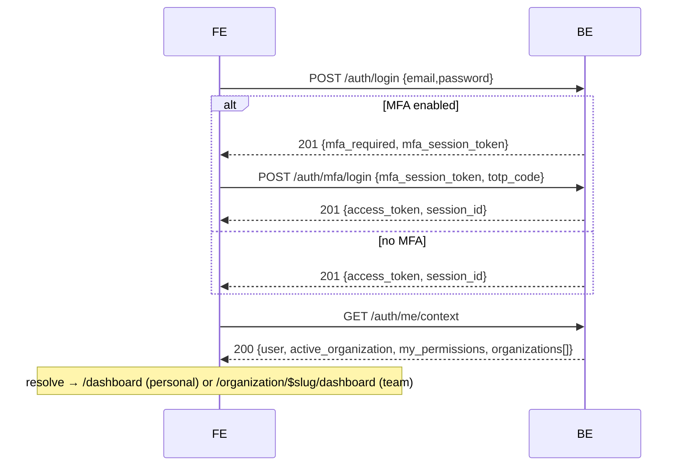

# 11 — Tenancy, Routing & Auth Redesign — Design + Implementation Plan

Status: **awaiting item-wise green-light** · Backend contract: core-be
`docs/reference/api/frontend-auth-flows.md` + the FE-reference pasted this
session · Supersedes parts of `docs/reference/routing-and-tenancy.md`
(URL-as-source-of-truth) and the [[pages-url-mirror-design]] memory.

> **Part I** is the design — **25 numbered decisions** (`D-01`…`D-25`, indexed
> below, each traced to the items that build it). **Part II** is the commit-sized
> plan — **48 build items** (`FE-01`…`FE-48`), each with a stable ID.

---

## Part I — Design

### Design decisions index (D-01…D-24)

Every normative decision below carries a stable `D-` ID, the section that
specifies it, and the Part II item(s) that build it. **24 decisions → 42 items.**

| ID       | Decision                                                                                                                   | Spec     | Built by                   |
| -------- | -------------------------------------------------------------------------------------------------------------------------- | -------- | -------------------------- |
| **D-01** | Active org = JWT `org` claim; `me/context` is authoritative; URL only reflects it                                          | §0, §2   | FE-05, FE-07, FE-08, FE-11 |
| **D-02** | Dual-URL by type: PERSONAL → root, TEAM → `/organization/$slug`                                                            | §0, §3.1 | FE-19, FE-21, FE-22        |
| **D-03** | One PERSONAL + N TEAM orgs; left switcher                                                                                  | §1, §4   | FE-24                      |
| **D-04** | Gate team-only UI on `capabilities.*` — never probe (422)                                                                  | §1       | FE-15, FE-34…FE-37         |
| **D-05** | Switch re-mints token + applies the inline delta (no extra `me/context`)                                                   | §2       | FE-06                      |
| **D-06** | `user` + `organizations[]` stable across a switch (flip `is_active` locally)                                               | §2       | FE-06, FE-07               |
| **D-07** | 401 → refresh; refresh-401 → login; refresh preserves the switched org                                                     | §2       | FE-10                      |
| **D-08** | Three shared layouts: Auth / Public / Protected                                                                            | §3.2     | FE-16, FE-17, FE-18        |
| **D-09** | Slug in team URL; immutable id resolved locally; `by-slug` fallback                                                        | §3.1     | FE-22                      |
| **D-10** | `/` resolver → onboarding \| personal `/dashboard` \| team-slug                                                            | §3.3     | FE-19                      |
| **D-11** | Dual-mount: one shared `DashboardPage`, route markers at both URLs                                                         | §3.4     | FE-20, FE-21, FE-22        |
| **D-12** | Security gateway: sequential gates, first failure short-circuits                                                           | §3.7     | FE-09                      |
| **D-13** | Six layered access gates **L1–L6**                                                                                         | §3.7     | FE-10…FE-15                |
| **D-14** | Defense-in-depth; the server is the boundary, FE gates are UX                                                              | §3.7     | FE-10…FE-15                |
| **D-15** | `core/security/` access layer (folder structure)                                                                           | §3.7     | FE-09…FE-15                |
| **D-16** | Switcher: personal/team navigation + create-team                                                                           | §4       | FE-24                      |
| **D-17** | Branch on the body (not the 201); every flow ends at `me/context`                                                          | §5       | FE-05                      |
| **D-18** | Magic-link is code-entry (`{email, code}`), not a link                                                                     | §5       | FE-01                      |
| **D-19** | OAuth start returns `{url}`; return via `/callback` → refresh                                                              | §5       | FE-02, FE-03               |
| **D-20** | `mfa/login` uses `totp_code` / `recovery_code`                                                                             | §5       | FE-04                      |
| **D-21** | One env var; every API has mock + live, identical domain shape                                                             | §6       | FE-25…FE-33                |
| **D-22** | Mock data mirrors the mapped wire (offline parity)                                                                         | §6       | FE-25…FE-33                |
| **D-23** | Reconciliations: role object, no list-invitations, embedded `user`                                                         | §6       | FE-25                      |
| **D-24** | Doc / convention / memory ripple                                                                                           | §7       | FE-42                      |
| **D-25** | Cross-cutting UX layer: one `notify` module + error→message map + shared mutation wrapper + confirm/empty/error primitives | §8       | FE-43…FE-48                |

## 0. Why

Two things changed our model:

1. **Active org is a signed token claim, not the URL.** core-be reads the active
   organization from the JWT `org` claim; `X-Organization-Id` is dead in the
   authorization path. The single authoritative read is `GET /auth/me/context`.
   Our current FE treats the **URL** (`/organization/$organizationId`) as the
   source of truth — that must flip to **token/me-context-driven**, with the URL
   merely _reflecting_ the active org.
2. **Dual-URL by org type (product decision).** A user has exactly **one
   PERSONAL org** + **N TEAM orgs** (left switcher). When the active org is
   **PERSONAL**, the app lives at **root URLs** (`/dashboard`, …, no org
   segment). When it's a **TEAM**, URLs are **`/organization/$slug/…`**.

This reverses "URL is the single source of truth" and bends the route-island
"pages mirror the URL 1:1" rule (the same pages render in two URL spaces). It
also surfaced **three auth-flow corrections** (§5) in code written before the
backend contract was pinned.

## 1. Org model (authoritative)

- Every workspace is an org with immutable `type` ∈ `PERSONAL | TEAM`.
- Type drives `capabilities` (TEAM ⇒ all true; PERSONAL ⇒ all false):
  `can_invite_members`, `can_manage_members`, `can_manage_roles`,
  `can_transfer_ownership`, `can_delete`, `can_manage_billing`.
- **Gate team-only UI on `capabilities.*`** — never by probing a route
  (team-only routes return **422** on a personal org; the type never changes).
- `me/context.user` carries deployment flags + `personal_organization_id`:
  `capabilities: { personal_organizations, team_organizations }`,
  `personal_organization_id` (null when personal orgs are disabled).
- PERSONAL: `slug: null`, one per user, auto-provisioned at signup.

## 2. Token / active-org model

- `Authorization: Bearer <access_token>` (RS256, ~15-min TTL) on every guarded call.
- Active org = the token's `org` claim. **Switch** via
  `POST /auth/switch-to-organization { organization_id }` or
  `POST /auth/switch-to-personal` → **re-mints the token** and returns the
  **active-org delta inline** (no follow-up `/me/context`):

  ```ts
  // switch response `data`
  const data = { access_token, active_organization, my_permissions, global_role };
  ```

- `user` + `organizations[]` are **stable across a switch** — reuse from the
  initial `/me/context` and just flip `is_active` locally.
- httpOnly `session_id` cookie backs `POST /auth/refresh` (rotates the token,
  **preserves** the switched org). 401 → refresh; refresh 401 → login.

## 3. Routing redesign (dual-URL)

### 3.1 URL scheme

| Active org (token) | URL space                             | Examples                                   |
| ------------------ | ------------------------------------- | ------------------------------------------ |
| **PERSONAL**       | **root**                              | `/dashboard`, `/#settings/account/profile` |
| **TEAM**           | **`/organization/$organizationSlug`** | `/organization/acme-inc/dashboard`         |
| (unauth)           | auth-shell                            | `/login`, `/register`, `/callback`, …      |
| (no active org)    | —                                     | redirect `/onboarding`                     |

Active org is **always** `me/context.active_organization`. The URL reflects it;
for TEAM the **`$organizationSlug`** segment is the human-readable, shareable
target. The immutable `id` (needed by `switch-to-organization`) is resolved from
the slug locally via `me/context.organizations` (no extra fetch); a deep link to
an org not in that list falls back to `GET /tenancy/organizations/by-slug/{slug}`.
PERSONAL has `slug: null` and uses root URLs, so it never needs a slug.

### 3.2 Route tree + three layouts

`shared/layouts/`: **AuthLayout** (auth forms), **PublicLayout** (minimal
centered chrome), **ProtectedLayout** (authenticated app shell — sidebar with the
single **Dashboard** tab + org switcher + header + `<Outlet/>`).

```text
__root__  (RouteAnnouncer + global SettingsModal + version check)
├── AuthLayout (pathless)        /login /register /forgot-password /reset-password /verify-email /mfa
├── PublicLayout                 /callback /unauthorized /onboarding /accept-invite/$id /* (404)
├── /                            resolver (no UI) — see 3.3
└── ProtectedLayout (gateway-gated; renders the AppShell: Dashboard tab + switcher + header)
    ├── _app (pathless)          PERSONAL space (root URLs) — active org = token's personal
    │   └── /dashboard           the one Dashboard page (1 tab · 1 page)
    └── /organization/$organizationSlug   TEAM space (org gate + switch-on-nav)
        ├── dashboard
        ├── suspended
        └── … (members/roles/billing are the hash SettingsModal, not routes)
```

**ProtectedLayout** wraps **both** the personal (`_app`, root) and team
(`/organization/$organizationSlug`) spaces — thin route markers that render the
**same** shared `DashboardPage` (one tab, one page) in its `<Outlet/>`. Today's
`AppShell` becomes `ProtectedLayout`; `PublicLayout` is new. See 3.4.

### 3.3 The `/` resolver

```ts
export async function resolveRoot() {
  const ctx = await fetchMeContext();
  if (!ctx.activeOrganization) return redirect({ to: '/onboarding' });
  return ctx.activeOrganization.type === 'PERSONAL'
    ? redirect({ to: '/dashboard' })
    : redirect({
        to: '/organization/$organizationSlug/dashboard',
        params: { organizationSlug: ctx.activeOrganization.slug },
      });
}
```

### 3.4 Shared pages / dual-mount (route-island reconciliation)

Route-island says _pages mirror the URL 1:1_, but the dashboard now lives at two
URLs. **Resolution:** the **page component is shared** (promote `DashboardPage`
to `shared/`); **route markers exist at both URL locations** (`_app/…` +
`organization/$organizationSlug/dashboard/…`), each rendering the shared
component in `ProtectedLayout`'s `<Outlet/>`. Recommendation: **promote to
`shared/`** (neither space "owns" it) — see OD-1.

### 3.5 Guards (run via the gateway, 3.7)

- **AuthLayout:** `redirectIfAuthenticated`.
- **`_app` (personal):** session → context → ensure active org is PERSONAL (else
  redirect to its team URL) → permission.
- **`/organization/$organizationSlug` (team):** session → context →
  switch-on-nav (3.6) → org-status → permission.

### 3.6 Switch-on-navigation

```ts
// entering /organization/$slug/* :
const ctx = await fetchMeContext();
const target = ctx.organizations.find((o) => o.slug === slug);
if (!target) throw notFound(); // unknown / non-member slug (or try by-slug)
if (ctx.activeOrganization?.id !== target.id) {
  await switchToOrganization(target.id); // switch by immutable id → re-mint + inline delta
}
```

Lets a deep link / refresh into `/organization/acme-inc/...` re-point the token
to that team (if a member), or 404 otherwise.

### 3.7 Security gateway (layered access — defense in depth)

Access is a **pipeline of gates passed one by one**. A single `gateway(...gates)`
composer (`core/security/`) runs them **sequentially** in a route/layout
`beforeLoad`; the **first failure short-circuits** (redirect / 404 /
unauthorized). One composable, testable chain — the "common gateway, secured
layer entry one by one."

| Layer | Gate                | Checks                                                | Fail →                       |
| ----- | ------------------- | ----------------------------------------------------- | ---------------------------- |
| L1    | `requireSession`    | valid token, else silent `refresh` (Flow F)           | `/login`                     |
| L2    | `hydrateContext`    | load `me/context` into the cache (single source)      | error boundary               |
| L3    | `resolveActiveOrg`  | personal vs team (slug→id), membership, switch-on-nav | `/onboarding` · 404 · switch |
| L4    | `requireOrgStatus`  | active vs suspended/archived                          | `…/$slug/suspended`          |
| L5    | `requirePermission` | RBAC `manifest.permission` ∈ `my_permissions`         | `/unauthorized`              |
| L6    | `requireCapability` | org-type capability (team-only)                       | hidden · `/unauthorized`     |

Beneath the gates: transport (HTTPS + CSP headers), the session runtime
(in-memory token, single-flight refresh, cross-tab logout — `shared/auth`), and
**UI gating** (hide/disable on permissions + capabilities). The server re-checks
everything — the FE gates are UX + defense-in-depth, never the boundary.

```ts
// core/security/gateway.ts
export type Gate = (ctx: GateContext) => Promise<void> | void; // throw redirect/notFound to halt
export const gateway =
  (...gates: Gate[]) =>
  async (ctx: GateContext) => {
    for (const gate of gates) await gate(ctx); // sequential; first throw halts
  };
```

Per-layout gateways (the layout's `beforeLoad`):

- **AuthLayout:** `gateway(redirectIfAuthenticated)`.
- **PublicLayout:** open; `/onboarding` + `/accept-invite` add `gateway(requireSession)`.
- **ProtectedLayout:** `gateway(requireSession, hydrateContext, resolveActiveOrg, requireOrgStatus, requirePermission)` (+ `requireCapability` per route via `manifest`).

```text
src/core/security/          # the access layer (framework-agnostic)
├── gateway.ts              # gateway(...gates) composer
├── gate.types.ts           # Gate, GateContext
├── gates/                  # one file + colocated test per gate
│   ├── require-session.ts        hydrate-context.ts        resolve-active-org.ts
│   └── require-org-status.ts     require-permission.ts     require-capability.ts
└── index.ts
```

Feeds: `shared/auth` → L1; `shared/tenancy` (me/context, switch) → L2/L3;
`core/rbac` (policies) → L5/L6. The three `shared/layouts/` own presentation
only; `core/security` owns access.

## 4. Org switcher (left rail, in ProtectedLayout)

- Source: `me/context.organizations` (personal + teams), `is_active` flag.
- **Personal** → `switchToPersonal()` → store token + delta → `navigate('/dashboard')`.
- **Team** → `switchToOrganization(id)` → store token + delta →
  `navigate('/organization/$slug/dashboard')`; flip `is_active` locally (no extra `/me/context`).
- Group **Personal** (top) + **Teams** + a "Create team" action
  (`POST /tenancy/organizations` + switch). Apply `impeccable` /
  `high-end-visual-design` for switcher + dashboard polish.

## 5. Auth-flow alignment (corrections + canonical post-auth call)

Every first-factor flow returns `{ access_token, session_id }` **or** the MFA
alternative `{ mfa_required: true, mfa_session_token }` — **branch on the body,
not the 201 status** — and ends with the single `GET /auth/me/context`.

**Corrections to ship** (built before the contract was pinned):

1. **Magic-link is code-entry, not a link.** `send { email }` → a **6-digit code**
   by email; `verify { email, code }` → token. Replace the `/callback?token`
   exchange with a **code-entry step** after "send". Auto-signs-up unknown emails.
2. **OAuth start returns `{ url }`.** `GET /auth/oauth/:provider` → `{ url }`; FE
   redirects to `url`. Return: provider → BE `/auth/oauth/:provider/callback` →
   session cookie → FE `/callback` → `POST /auth/refresh` (Flow F) → `me/context`.
3. **`mfa/login` field is `totp_code` / `recovery_code`,** not `code`.



Flows A–H (signup / login(+MFA) / magic-link / OAuth / passkey / silent-resume /
forgot-reset / invited-teammate) are each 2–3 calls ending in `me/context`; the
invited-teammate flow adds `accept` + `switch-to-organization`.

## 6. API mock + live parity (every endpoint)

One env var — **`config.useMockApi`** (`VITE_USE_MOCK_API`; default **live** in
prod/staging/test, opt-in mock in dev). **Every** API fn implements both branches
and returns the **same domain shape**:

```ts
export async function listMembers(): Promise<Member[]> {
  if (config.useMockApi) return mockResponse(MOCK_MEMBERS); // domain shape == live-mapped shape
  const res = await apiClient.get<unknown>(`${API}/tenancy/organization/memberships`);
  return membershipListWire.parse(res.data).map(toMember); // wire(snake) → domain
}
```

- The **mock data mirrors the mapped wire** so the full flow runs offline;
  flipping `useMockApi=false` makes every screen work against core-be.
- Gap today: `organization-api.ts` fns (members, invitations, roles, api-keys,
  billing, webhooks, notification-prefs, sessions) are **mock-only** — each needs
  a live branch + `*Wire` schema + `to*` mapper (me-context style).
- Reconciliations: member `role` is a **`{ id, name }` object** (not the FE
  `OrgRole` enum); **no list-invitations endpoint** (invite = add-member-by-email
  → pending membership); members embed a `user` object (snake_case).

## 7. Doc / convention / memory ripple

- `CLAUDE.md` + `docs/reference/routing-and-tenancy.md`: "URL is the single source
  of truth for org context" → **"active org = token claim (`me/context`); the URL
  reflects it — personal at root, team under `/organization/$slug`."**
- `agent-os/rules/file-structure.mdc` + `route-island` skill: add the
  **dual-mount** note + the `core/security` access layer.
- Memory: update [[pages-url-mirror-design]] and [[core-fe-be-integration-plan]].

## 8. Cross-cutting UX layer (notify / errors / mutations)

Today a global `<Toaster>` is mounted once (`routeTree.tsx`), but **13 call sites
import `toast` from `sonner` directly**, each writing its own success/error
strings + error extraction. The data-heavy Phase 6–7 work multiplies that drift.
Centralize it — this is to UX what §3.7 is to access:

- **`shared/notify`** — the single toast surface (`notify.success/error/info`,
  stable de-dupe ids, promise/loading toasts). The **only** module importing `sonner`.
- **`mapApiError`** — `ApiError` (`reason` / `code` / `status`) → one user-facing
  string; feeds both `notify` and inline form errors (one wording everywhere).
- **`useAppMutation`** — a thin TanStack wrapper: idempotency-key on writes +
  cache invalidation + optimistic update + success/error `notify`, so every
  Phase 6–7 mutation behaves identically (the 5 existing hooks refactor onto it).
- **`ConfirmDialog`** + state primitives (`Skeleton` / `EmptyState` / route
  `ErrorBoundary`) — shared destructive-action + loading/empty/error UX.
- Global QueryCache `onError` routes failed loads through `notify` once.

---

## Part II — Implementation plan (item-wise)

**48 build items** (`FE-01`…`FE-48`) across 9 phases — plus Phase 0 (already
shipped). Each is commit-sized with a stable ID; review by ID — I build only
green-lit items, in dependency order, each its own tested commit. Legend: ⬜ to
build · ✅ shipped. **Counts:** P1 5 · P2 3 · P3 10 · P4 5 · P5 1 · PF 6 · P6 9 · P7 5 · P8 4.

### Phase 0 — Already shipped

- ✅ Email-verify banner (`b2cf639`) · ✅ Live RBAC from `me/context` (`85ce454`).
- ⚠️ Magic-link `/callback?token` (`327a87c`) — **superseded by FE-01**.

### Phase 1 — Auth-flow alignment (5)

- ⬜ **FE-01** Magic-link code-entry — `send {email}`→6-digit code, `verify {email, code}`; drop `/callback?token`. _Files:_ auth-api, constants, PasswordlessOptions, CallbackPage.
- ⬜ **FE-02** OAuth start `{url}` — fetch `GET /auth/oauth/:provider` → `window.location.assign(url)`. _Files:_ auth-api, PasswordlessOptions.
- ⬜ **FE-03** OAuth return — `/callback` → `/auth/refresh` → `me/context` (OD-2). _Files:_ CallbackPage.
- ⬜ **FE-04** `mfa/login` → `totp_code` (+ recovery-code toggle). _Files:_ auth-api, auth-contracts, MfaForm.
- ⬜ **FE-05** `me/context` canonical post-auth (all flows → resolver). _Files:_ login/register forms, MfaForm, resolver.

### Phase 2 — me/context as org source (3)

- ⬜ **FE-06** Switch service — re-mint + apply inline delta to the `useMeContext` cache. _Files:_ shared/tenancy/switch.ts.
- ⬜ **FE-07** Org store derives from context (id/slug/type/status/caps/perms). _Files:_ useOrganizationStore, guards.
- ⬜ **FE-08** Retire URL-as-source in guards. _Files:_ organization-context, guards.

### Phase 3 — Security gateway & shared layouts (10)

- ⬜ **FE-09** Gateway composer + `gate.types` (sequential, short-circuit). _Files:_ core/security/gateway.ts, gate.types.ts.
- ⬜ **FE-10** Gate **L1** `requireSession` (token/refresh). _Files:_ core/security/gates/require-session.ts (+test).
- ⬜ **FE-11** Gate **L2** `hydrateContext` (load `me/context`).
- ⬜ **FE-12** Gate **L3** `resolveActiveOrg` (personal/team slug→id, membership, switch-on-nav).
- ⬜ **FE-13** Gate **L4** `requireOrgStatus` (suspended/archived).
- ⬜ **FE-14** Gate **L5** `requirePermission` (RBAC).
- ⬜ **FE-15** Gate **L6** `requireCapability` (org-type).
- ⬜ **FE-16** `ProtectedLayout` (from today's `AppShell`) wired to its gateway. _Files:_ shared/layouts/ProtectedLayout.
- ⬜ **FE-17** `PublicLayout` (new, minimal centered chrome). _Files:_ shared/layouts/PublicLayout.
- ⬜ **FE-18** `AuthLayout` — wire the `redirectIfAuthenticated` gateway.

### Phase 4 — Dual-URL routing (5)

- ⬜ **FE-19** Root resolver (`/` → personal | team-slug | onboarding). _Files:_ organization-resolver, routeTree.
- ⬜ **FE-20** Promote `DashboardPage` → shared (OD-1) — 1 tab · 1 page.
- ⬜ **FE-21** Personal `_app` space (root `/dashboard`) under `ProtectedLayout`.
- ⬜ **FE-22** Team `$organizationSlug` space + switch-on-nav (uses **FE-12**); rename `$organizationId`→`$organizationSlug` (OD-3).
- ⬜ **FE-23** routeTree wiring + update e2e specs / mock fixtures / routes-and-ui for the new URLs.

### Phase 5 — Org switcher (1)

- ⬜ **FE-24** Switcher rebuild — Personal + Teams + Create-team; uses **FE-06**; capability-aware. _Files:_ OrganizationSwitcher.

### Phase F — Cross-cutting UX foundations (6) — land before Phases 6–7

_IDs appended (`FE-43`…`FE-48`) so earlier IDs stay stable; by dependency this phase precedes Phases 6–7. Builds D-25._

- ⬜ **FE-43** `shared/notify` toast module (the only importer of `sonner`); migrate the 13 direct call sites. _Files:_ shared/notify (+13 call sites).
- ⬜ **FE-44** `mapApiError` — `ApiError` → one user string; used by notify + form errors. _Files:_ shared/errors.
- ⬜ **FE-45** `useAppMutation` — idempotency-key + invalidate + optimistic + notify; refactor useMembers/useRoles/useApiKeys/useSubscription/useInvitations onto it. _Files:_ shared/hooks/useAppMutation (+5 hooks).
- ⬜ **FE-46** Global query-error surfacing — QueryCache `onError` → notify (failed loads toast once). _Files:_ app query-client.
- ⬜ **FE-47** `ConfirmDialog` — shared destructive-action confirm (remove member/role/key, delete org). _Files:_ shared/components/ConfirmDialog.
- ⬜ **FE-48** State primitives — `Skeleton` / `EmptyState` + per-route `ErrorBoundary` for dashboard + panels. _Files:_ shared/components/{EmptyState,ErrorBoundary}.

### Phase 6 — API mock+live parity (9) — per domain: `*Wire` + `to*` mapper + both branches + integration spec

- ⬜ **FE-25** Memberships (role `{id,name}`; invite = add-by-email; embed `user`).
- ⬜ **FE-26** Roles (+ permissions catalog).
- ⬜ **FE-27** Billing (plans + subscriptions + mutations).
- ⬜ **FE-28** API keys (+ rotate).
- ⬜ **FE-29** Webhooks + notification-policies.
- ⬜ **FE-30** Notification preferences.
- ⬜ **FE-31** Sessions (list + revoke).
- ⬜ **FE-32** MFA enroll + passkeys.
- ⬜ **FE-33** Org general / settings / logo.

### Phase 7 — Settings panels (5) — consume Phase 6

- ⬜ **FE-34** Members panel (table + invite-by-email + role change + remove; cap-gated).
- ⬜ **FE-35** Roles panel (list + create custom + permissions).
- ⬜ **FE-36** Billing panel (personal: plans/upgrade; team: subscription mgmt).
- ⬜ **FE-37** Integrations panel (API keys + webhooks).
- ⬜ **FE-38** Account panels (Security MFA/passkeys, Sessions, Notifications, General).

### Phase 8 — Responsive + polish + capstone (4)

- ⬜ **FE-39** Responsive Pass 3 (picker / onboarding / CommandPalette ≤320px / accept-invite).
- ⬜ **FE-40** Premium polish (high-end-visual-design / impeccable / motion-framer).
- ⬜ **FE-41** e2e capstone (all entry flows) + onboarding job-title persist.
- ⬜ **FE-42** Docs / memory ripple (Part I §7).

### Sequencing & dependencies

Critical path **FE-01 → FE-23** (auth → me/context → gateway+layouts → routing).
**Phase F (FE-43…FE-48)** is cross-cutting — land it before Phases 6–7 so panels
share one notify/mutation/error layer (FE-43/44 can land even earlier).
**Phase 6 (FE-25…FE-33)** runs parallel to Phases 3–4 (pure data layer).
**Phase 7** depends on Phase 6 + Phase F. **Phase 8** is last. Cross-deps: FE-22
needs FE-12; FE-24 needs FE-06; FE-20 needs OD-1; FE-34…FE-37 use FE-45/FE-47.

### Open decisions

- **OD-1** (blocks **FE-20**): `DashboardPage` → promote to `shared/` (rec) vs. import from team island.
- **OD-2** (blocks **FE-03**): OAuth return = cookie → `/auth/refresh` (rec) vs. token in URL.
- **OD-3** (blocks **FE-22**): team rename/slug change → resolve via `by-slug`, no redirect v1 (rec) vs. 301 old→new.

### Risks

- Dual-mount vs. extract-to-shared for `DashboardPage` (OD-1).
- OAuth return mechanics (OD-2).
- Settings stays the global hash modal (`#settings/...`) in both spaces — unchanged.
- Slugs in team URLs are mutable; ids aren't — map via `me/context`; writes use the id.
- The mock layer must mirror the wire so 320px + flow e2e run offline.
