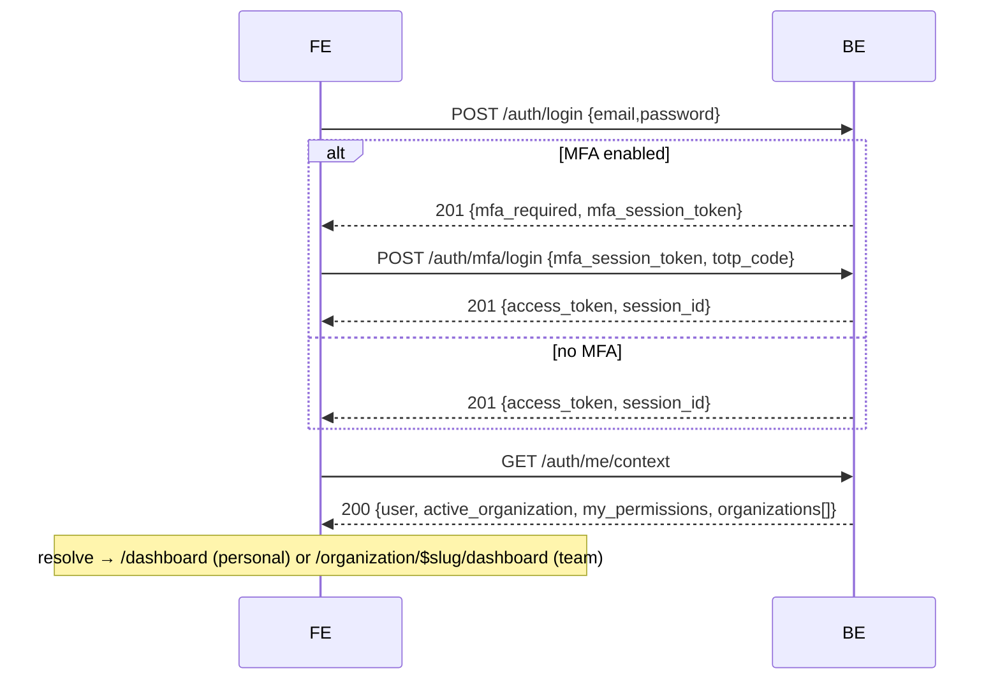

# 11 — Tenancy, Routing & Auth Redesign — Design + Implementation Plan

Status: **awaiting item-wise green-light** · Backend contract: core-be
`docs/reference/api/frontend-auth-flows.md` + the FE-reference pasted this
session · Supersedes parts of `docs/reference/routing-and-tenancy.md`
(URL-as-source-of-truth) and the [[pages-url-mirror-design]] memory.

> **Part I** is the design (what / why / how). **Part II** is the commit-sized,
> item-wise plan. Nothing is built until each item is green-lit.

---

# Part I — Design

## 0. Why

Two things changed our model:

1. **Active org is a signed token claim, not the URL.** core-be reads the active
   organization from the JWT `org` claim; `X-Organization-Id` is dead in the
   authorization path. The single authoritative read is `GET /auth/me/context`.
   Our current FE treats the **URL** (`/organization/$organizationId`) as the
   source of truth — that must flip to **token/me-context-driven**, with the URL
   merely _reflecting_ the active org.
2. **Dual-URL by org type (product decision).** A user has exactly **one
   PERSONAL org** + **N TEAM orgs** (left switcher). When the active org is
   **PERSONAL**, the app lives at **root URLs** (`/dashboard`, …, no org
   segment). When it's a **TEAM**, URLs are **`/organization/$slug/…`**.

This reverses "URL is the single source of truth" and bends the route-island
"pages mirror the URL 1:1" rule (the same pages render in two URL spaces). It
also surfaced **three auth-flow corrections** (§5) in code written before the
backend contract was pinned.

## 1. Org model (authoritative)

- Every workspace is an org with immutable `type` ∈ `PERSONAL | TEAM`.
- Type drives `capabilities` (TEAM ⇒ all true; PERSONAL ⇒ all false):
  `can_invite_members`, `can_manage_members`, `can_manage_roles`,
  `can_transfer_ownership`, `can_delete`, `can_manage_billing`.
- **Gate team-only UI on `capabilities.*`** — never by probing a route
  (team-only routes return **422** on a personal org; the type never changes).
- `me/context.user` carries deployment flags + `personal_organization_id`:
  `capabilities: { personal_organizations, team_organizations }`,
  `personal_organization_id` (null when personal orgs are disabled).
- PERSONAL: `slug: null`, one per user, auto-provisioned at signup.

## 2. Token / active-org model

- `Authorization: Bearer <access_token>` (RS256, ~15-min TTL) on every guarded call.
- Active org = the token's `org` claim. **Switch** via
  `POST /auth/switch-to-organization { organization_id }` or
  `POST /auth/switch-to-personal` → **re-mints the token** and returns the
  **active-org delta inline** (no follow-up `/me/context`):

  ```ts
  // switch response `data`
  const data = { access_token, active_organization, my_permissions, global_role };
  ```

- `user` + `organizations[]` are **stable across a switch** — reuse from the
  initial `/me/context` and just flip `is_active` locally.
- httpOnly `session_id` cookie backs `POST /auth/refresh` (rotates the token,
  **preserves** the switched org). 401 → refresh; refresh 401 → login.

## 3. Routing redesign (dual-URL)

### 3.1 URL scheme

| Active org (token) | URL space                             | Examples                                   |
| ------------------ | ------------------------------------- | ------------------------------------------ |
| **PERSONAL**       | **root**                              | `/dashboard`, `/#settings/account/profile` |
| **TEAM**           | **`/organization/$organizationSlug`** | `/organization/acme-inc/dashboard`         |
| (unauth)           | auth-shell                            | `/login`, `/register`, `/callback`, …      |
| (no active org)    | —                                     | redirect `/onboarding`                     |

Active org is **always** `me/context.active_organization`. The URL reflects it;
for TEAM the **`$organizationSlug`** segment is the human-readable, shareable
target. The immutable `id` (needed by `switch-to-organization`) is resolved from
the slug locally via `me/context.organizations` (no extra fetch); a deep link to
an org not in that list falls back to `GET /tenancy/organizations/by-slug/{slug}`.
PERSONAL has `slug: null` and uses root URLs, so it never needs a slug.

### 3.2 Route tree + three layouts

`shared/layouts/`: **AuthLayout** (auth forms), **PublicLayout** (minimal
centered chrome), **ProtectedLayout** (authenticated app shell — sidebar with the
single **Dashboard** tab + org switcher + header + `<Outlet/>`).

```text
__root__  (RouteAnnouncer + global SettingsModal + version check)
├── AuthLayout (pathless)        /login /register /forgot-password /reset-password /verify-email /mfa
├── PublicLayout                 /callback /unauthorized /onboarding /accept-invite/$id /* (404)
├── /                            resolver (no UI) — see 3.3
└── ProtectedLayout (gateway-gated; renders the AppShell: Dashboard tab + switcher + header)
    ├── _app (pathless)          PERSONAL space (root URLs) — active org = token's personal
    │   └── /dashboard           the one Dashboard page (1 tab · 1 page)
    └── /organization/$organizationSlug   TEAM space (org gate + switch-on-nav)
        ├── dashboard
        ├── suspended
        └── … (members/roles/billing are the hash SettingsModal, not routes)
```

**ProtectedLayout** wraps **both** the personal (`_app`, root) and team
(`/organization/$organizationSlug`) spaces — thin route markers that render the
**same** shared `DashboardPage` (one tab, one page) in its `<Outlet/>`. Today's
`AppShell` becomes `ProtectedLayout`; `PublicLayout` is new. See 3.4.

### 3.3 The `/` resolver

```ts
export async function resolveRoot() {
  const ctx = await fetchMeContext();
  if (!ctx.activeOrganization) return redirect({ to: '/onboarding' });
  return ctx.activeOrganization.type === 'PERSONAL'
    ? redirect({ to: '/dashboard' })
    : redirect({
        to: '/organization/$organizationSlug/dashboard',
        params: { organizationSlug: ctx.activeOrganization.slug },
      });
}
```

### 3.4 Shared pages / dual-mount (route-island reconciliation)

Route-island says _pages mirror the URL 1:1_, but the dashboard now lives at two
URLs. **Resolution:** the **page component is shared** (promote `DashboardPage`
to `shared/`); **route markers exist at both URL locations** (`_app/…` +
`organization/$organizationSlug/dashboard/…`), each rendering the shared
component in `ProtectedLayout`'s `<Outlet/>`. Recommendation: **promote to
`shared/`** (neither space "owns" it) — see OD-1.

### 3.5 Guards (run via the gateway, 3.7)

- **AuthLayout:** `redirectIfAuthenticated`.
- **`_app` (personal):** session → context → ensure active org is PERSONAL (else
  redirect to its team URL) → permission.
- **`/organization/$organizationSlug` (team):** session → context →
  switch-on-nav (3.6) → org-status → permission.

### 3.6 Switch-on-navigation

```ts
// entering /organization/$slug/* :
const ctx = await fetchMeContext();
const target = ctx.organizations.find((o) => o.slug === slug);
if (!target) throw notFound(); // unknown / non-member slug (or try by-slug)
if (ctx.activeOrganization?.id !== target.id) {
  await switchToOrganization(target.id); // switch by immutable id → re-mint + inline delta
}
```

Lets a deep link / refresh into `/organization/acme-inc/...` re-point the token
to that team (if a member), or 404 otherwise.

### 3.7 Security gateway (layered access — defense in depth)

Access is a **pipeline of gates passed one by one**. A single `gateway(...gates)`
composer (`core/security/`) runs them **sequentially** in a route/layout
`beforeLoad`; the **first failure short-circuits** (redirect / 404 /
unauthorized). One composable, testable chain — the "common gateway, secured
layer entry one by one."

| Layer | Gate                | Checks                                                | Fail →                       |
| ----- | ------------------- | ----------------------------------------------------- | ---------------------------- |
| L1    | `requireSession`    | valid token, else silent `refresh` (Flow F)           | `/login`                     |
| L2    | `hydrateContext`    | load `me/context` into the cache (single source)      | error boundary               |
| L3    | `resolveActiveOrg`  | personal vs team (slug→id), membership, switch-on-nav | `/onboarding` · 404 · switch |
| L4    | `requireOrgStatus`  | active vs suspended/archived                          | `…/$slug/suspended`          |
| L5    | `requirePermission` | RBAC `manifest.permission` ∈ `my_permissions`         | `/unauthorized`              |
| L6    | `requireCapability` | org-type capability (team-only)                       | hidden · `/unauthorized`     |

Beneath the gates: transport (HTTPS + CSP headers), the session runtime
(in-memory token, single-flight refresh, cross-tab logout — `shared/auth`), and
**UI gating** (hide/disable on permissions + capabilities). The server re-checks
everything — the FE gates are UX + defense-in-depth, never the boundary.

```ts
// core/security/gateway.ts
export type Gate = (ctx: GateContext) => Promise<void> | void; // throw redirect/notFound to halt
export const gateway =
  (...gates: Gate[]) =>
  async (ctx: GateContext) => {
    for (const gate of gates) await gate(ctx); // sequential; first throw halts
  };
```

Per-layout gateways (the layout's `beforeLoad`):

- **AuthLayout:** `gateway(redirectIfAuthenticated)`.
- **PublicLayout:** open; `/onboarding` + `/accept-invite` add `gateway(requireSession)`.
- **ProtectedLayout:** `gateway(requireSession, hydrateContext, resolveActiveOrg, requireOrgStatus, requirePermission)` (+ `requireCapability` per route via `manifest`).

```text
src/core/security/          # the access layer (framework-agnostic)
├── gateway.ts              # gateway(...gates) composer
├── gate.types.ts           # Gate, GateContext
├── gates/                  # one file + colocated test per gate
│   ├── require-session.ts        hydrate-context.ts        resolve-active-org.ts
│   └── require-org-status.ts     require-permission.ts     require-capability.ts
└── index.ts
```

Feeds: `shared/auth` → L1; `shared/tenancy` (me/context, switch) → L2/L3;
`core/rbac` (policies) → L5/L6. The three `shared/layouts/` own presentation
only; `core/security` owns access.

## 4. Org switcher (left rail, in ProtectedLayout)

- Source: `me/context.organizations` (personal + teams), `is_active` flag.
- **Personal** → `switchToPersonal()` → store token + delta → `navigate('/dashboard')`.
- **Team** → `switchToOrganization(id)` (immutable id from the org) → store token
  - delta → `navigate('/organization/$slug/dashboard')`. Flip `is_active` locally;
    no extra `/me/context`.
- Group **Personal** (top) + **Teams** + a "Create team" action
  (`POST /tenancy/organizations` + switch). Apply `impeccable` /
  `high-end-visual-design` for switcher + dashboard polish.

## 5. Auth-flow alignment (corrections + canonical post-auth call)

Every first-factor flow returns `{ access_token, session_id }` **or** the MFA
alternative `{ mfa_required: true, mfa_session_token }` — **branch on the body,
not the 201 status** — and ends with the single `GET /auth/me/context`.

**Corrections to ship** (built before the contract was pinned):

1. **Magic-link is code-entry, not a link.** `send { email }` → a **6-digit code**
   by email; `verify { email, code }` → token. Replace the `/callback?token`
   exchange with a **code-entry step** after "send". Auto-signs-up unknown emails.
2. **OAuth start returns `{ url }`.** `GET /auth/oauth/:provider` → `{ url }`; FE
   redirects to `url`. Return: provider → BE `/auth/oauth/:provider/callback` →
   session cookie → FE `/callback` → `POST /auth/refresh` (Flow F) → `me/context`.
3. **`mfa/login` field is `totp_code` / `recovery_code`,** not `code`.



Flows A–H (signup / login(+MFA) / magic-link / OAuth / passkey / silent-resume /
forgot-reset / invited-teammate) are each 2–3 calls ending in `me/context`; the
invited-teammate flow adds `accept` + `switch-to-organization`.

## 6. API mock + live parity (every endpoint)

One env var — **`config.useMockApi`** (`VITE_USE_MOCK_API`; default **live** in
prod/staging/test, opt-in mock in dev). **Every** API fn implements both branches
and returns the **same domain shape**:

```ts
export async function listMembers(): Promise<Member[]> {
  if (config.useMockApi) return mockResponse(MOCK_MEMBERS); // domain shape == live-mapped shape
  const res = await apiClient.get<unknown>(`${API}/tenancy/organization/memberships`);
  return membershipListWire.parse(res.data).map(toMember); // wire(snake) → domain
}
```

- The **mock data mirrors the mapped wire** so the full flow runs offline;
  flipping `useMockApi=false` makes every screen work against core-be.
- Gap today: `organization-api.ts` fns (members, invitations, roles, api-keys,
  billing, webhooks, notification-prefs, sessions) are **mock-only** — each needs
  a live branch + `*Wire` schema + `to*` mapper (me-context style).
- Reconciliations: member `role` is a **`{ id, name }` object** (not the FE
  `OrgRole` enum); **no list-invitations endpoint** (invite = add-member-by-email
  → pending membership); members embed a `user` object (snake_case).

## 7. Doc / convention / memory ripple

- `CLAUDE.md` + `docs/reference/routing-and-tenancy.md`: "URL is the single source
  of truth for org context" → **"active org = token claim (`me/context`); the URL
  reflects it — personal at root, team under `/organization/$slug`."**
- `agent-os/rules/file-structure.mdc` + `route-island` skill: add the
  **dual-mount** note + the `core/security` access layer.
- Memory: update [[pages-url-mirror-design]] and [[core-fe-be-integration-plan]].

---

# Part II — Implementation plan (item-wise)

Each item is **commit-sized**: one concern, with files + an acceptance check.
Review per item; I build only green-lit items, in order, each its own tested
commit. Legend: ⬜ proposed · ✅ shipped this session.

## Phase 0 — Already shipped (one to revise)

- ✅ **0.1 Email-verify banner** (`b2cf639`). ✅ **0.2 Live RBAC** (`85ce454`).
- ⚠️ **0.3 Magic-link via `/callback?token`** (`327a87c`) — **replaced by 1.1**
  (real flow is code-entry). Flagged so we don't double-count.

## Phase 1 — Auth-flow alignment

- ⬜ **1.1 Magic-link = code-entry.** `send {email}` → 6-digit code; `verify
{email, code}`. Replace the `/callback?token` branch with a code-entry step.
  _Files:_ `auth-api.ts`, `constants.ts`, `PasswordlessOptions.tsx`,
  `CallbackPage.tsx`. _Accept:_ send→code→verify (mock); integration send 201.
- ⬜ **1.2 OAuth start `{url}`.** Fetch `GET /auth/oauth/:provider` → redirect.
  _Files:_ `auth-api.ts`, `PasswordlessOptions.tsx`.
- ⬜ **1.3 OAuth return.** `/callback` → `/auth/refresh` → `me/context` (OD-2).
  _Files:_ `CallbackPage.tsx`.
- ⬜ **1.4 `mfa/login` → `totp_code`** (+ recovery-code toggle). _Files:_
  `auth-api.ts`, `auth-contracts.ts`, `MfaForm.tsx`.
- ⬜ **1.5 `me/context` canonical post-auth** across all flows. _Files:_ login/
  register forms, `MfaForm`, resolver.

## Phase 2 — me/context as the org source

- ⬜ **2.1 Switch service** (`switchToOrganization`/`switchToPersonal` → re-mint +
  apply inline delta to the `useMeContext` cache). _Files:_ `shared/tenancy/switch.ts`.
- ⬜ **2.2 Org store derives from context** (id/slug/type/status/caps/perms).
- ⬜ **2.3 Retire URL-as-source** in guards (URL validates + triggers switch-on-nav).

## Phase 3 — Security gateway & shared layouts

- ⬜ **3.1 Gateway composer.** `core/security/gateway.ts` (`gateway(...gates)`,
  sequential, short-circuit) + `gate.types.ts`. _Accept:_ unit: order + halt.
- ⬜ **3.2 The gates (L1–L6).** `core/security/gates/`: `require-session`,
  `hydrate-context`, `resolve-active-org`, `require-org-status`,
  `require-permission`, `require-capability` — refactor today's ad-hoc guards
  into these; colocated tests. _Accept:_ gate units + migrated guard tests green.
- ⬜ **3.3 Shared layouts.** `shared/layouts/{ProtectedLayout, PublicLayout,
AuthLayout}`, each wiring its per-layout gateway; `ProtectedLayout` = today's
  `AppShell`, wraps both spaces. _Accept:_ layouts route their groups; validator green.

## Phase 4 — Dual-URL routing

- ⬜ **4.1 Root resolver** (`/` → onboarding | `/dashboard` | `/organization/$slug/dashboard`).
- ⬜ **4.2 Promote `DashboardPage` → shared** (OD-1) — one tab, one page.
- ⬜ **4.3 Personal `_app` space** (root `/dashboard`) under `ProtectedLayout`.
- ⬜ **4.4 Team `$organizationSlug` space** under `ProtectedLayout` + switch-on-nav
  (uses the L3 gate); rename `$organizationId` → `$organizationSlug` (OD-3).
- ⬜ **4.5 Update e2e + docs** for the new URLs (specs, mock fixtures, routes-and-ui).

## Phase 5 — Org switcher

- ⬜ **5.1 Switcher rebuild** (Personal + Teams + Create-team; uses 2.1; navigates
  to the right URL space; capability-aware).

## Phase 6 — API mock + live parity (per domain: `*Wire` + `to*` + both branches)

_Accept (each):_ live + mock both return the domain shape; integration spec hits
the real endpoint.

- ⬜ **6.1 Memberships** (role `{id,name}`; invite = add-by-email; embed `user`).
- ⬜ **6.2 Roles** (+ permissions catalog). ⬜ **6.3 Billing** (plans + subscriptions).
- ⬜ **6.4 API keys** (+ rotate). ⬜ **6.5 Webhooks/policies**. ⬜ **6.6 Notification prefs**.
- ⬜ **6.7 Sessions** (`/auth/me/sessions`). ⬜ **6.8 MFA enroll + passkeys**.
- ⬜ **6.9 Org general/settings/logo**.

## Phase 7 — Settings panels (consume Phase 6)

- ⬜ **7.1 Members** · ⬜ **7.2 Roles** · ⬜ **7.3 Billing** · ⬜ **7.4 Integrations**
  (API keys + webhooks) · ⬜ **7.5 Account** (Security/Sessions/Notifications/General).

## Phase 8 — Responsive Pass 3 + polish + capstone

- ⬜ **8.1 Responsive Pass 3** (picker, onboarding, CommandPalette ≤320px,
  accept-invite; extend `responsive.e2e`).
- ⬜ **8.2 Premium polish** (high-end-visual-design / impeccable / motion-framer).
- ⬜ **8.3 e2e capstone** (all entry flows) + onboarding job-title persist.
- ⬜ **8.4 Docs/memory ripple** (§7).

## Sequencing & dependencies

`1 → 2 → 3 → 4` is the critical path (gateway + layouts before routing). **Phase
6** runs parallel to 3–4 (pure data layer). **Phase 7** depends on 6. **Phase 8**
is last. ~33 commit-sized items.

## Open decisions (need your call before the dependent item)

- **OD-1 (blocks 4.2):** `DashboardPage` → promote to `shared/` (rec) vs. import
  from the team island.
- **OD-2 (blocks 1.3):** confirm OAuth return = cookie → `/auth/refresh` (rec) vs.
  token in URL — against core-be `frontend-auth-flows.md`.
- **OD-3 (blocks 4.4):** team rename (slug change) → resolve via `by-slug`, no
  redirect for v1 (rec) vs. 301 old→new.

## Risks

- Dual-mount vs. extract-to-shared for `DashboardPage` (OD-1).
- OAuth return mechanics (OD-2).
- Settings stays the global hash modal (`#settings/...`) in both spaces — unchanged.
- Slugs in team URLs are mutable; ids aren't — map via `me/context`; writes use the id.
- The mock layer must mirror the wire so 320px + flow e2e run offline.
