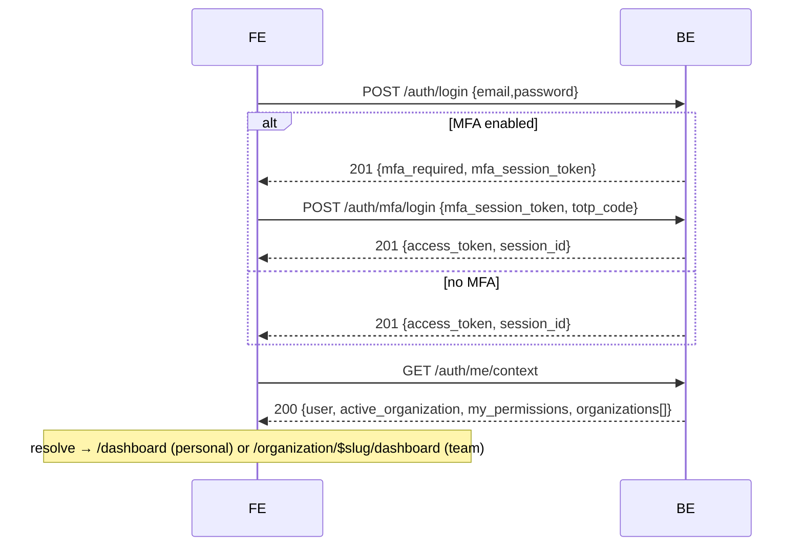

# 11 — Tenancy, Routing & Auth Redesign — Design + Implementation Plan

Status: **awaiting item-wise green-light** · Backend contract: core-be
`docs/reference/api/frontend-auth-flows.md` + the FE-reference pasted this
session · Supersedes parts of `docs/reference/routing-and-tenancy.md`
(URL-as-source-of-truth) and the [[pages-url-mirror-design]] memory.

> **Part I** is the design — **32 numbered decisions** (`D-01`…`D-32`, indexed
> below, each traced to the items that build it). **Part II** is the commit-sized
> plan — **67 build items** (`FE-01`…`FE-67`), each with a stable ID.

---

## Part I — Design

### Design decisions index (D-01…D-32)

Every normative decision below carries a stable `D-` ID, the section that
specifies it, and the Part II item(s) that build it. **32 decisions → 67 items.**

| ID       | Decision                                                                                                                                                                                                                                                                 | Spec     | Built by                   |
| -------- | ------------------------------------------------------------------------------------------------------------------------------------------------------------------------------------------------------------------------------------------------------------------------ | -------- | -------------------------- |
| **D-01** | Active org = JWT `org` claim; `me/context` is authoritative; URL only reflects it                                                                                                                                                                                        | §0, §2   | FE-05, FE-07, FE-08, FE-11 |
| **D-02** | Dual-URL by type: PERSONAL → root, TEAM → `/organization/$slug`                                                                                                                                                                                                          | §0, §3.1 | FE-19, FE-21, FE-22        |
| **D-03** | One PERSONAL + N TEAM orgs; left switcher                                                                                                                                                                                                                                | §1, §4   | FE-24                      |
| **D-04** | Gate team-only UI on `capabilities.*` — never probe (422)                                                                                                                                                                                                                | §1       | FE-15, FE-34…FE-37         |
| **D-05** | Switch re-mints token + applies the inline delta (no extra `me/context`)                                                                                                                                                                                                 | §2       | FE-06                      |
| **D-06** | `user` + `organizations[]` stable across a switch (flip `is_active` locally)                                                                                                                                                                                             | §2       | FE-06, FE-07               |
| **D-07** | 401 → refresh; refresh-401 → login; refresh preserves the switched org                                                                                                                                                                                                   | §2       | FE-10                      |
| **D-08** | Three shared layouts: Auth / Public / Protected                                                                                                                                                                                                                          | §3.2     | FE-16, FE-17, FE-18        |
| **D-09** | Slug in team URL; immutable id resolved locally; `by-slug` fallback                                                                                                                                                                                                      | §3.1     | FE-22                      |
| **D-10** | `/` resolver → onboarding \| personal `/dashboard` \| team-slug                                                                                                                                                                                                          | §3.3     | FE-19                      |
| **D-11** | Dual-mount: one shared `DashboardPage`, route markers at both URLs                                                                                                                                                                                                       | §3.4     | FE-20, FE-21, FE-22        |
| **D-12** | Security gateway: sequential gates, first failure short-circuits                                                                                                                                                                                                         | §3.7     | FE-09                      |
| **D-13** | Six layered access gates **L1–L6**                                                                                                                                                                                                                                       | §3.7     | FE-10…FE-15                |
| **D-14** | Defense-in-depth; the server is the boundary, FE gates are UX                                                                                                                                                                                                            | §3.7     | FE-10…FE-15                |
| **D-15** | `core/security/` access layer (folder structure)                                                                                                                                                                                                                         | §3.7     | FE-09…FE-15                |
| **D-16** | Switcher: personal/team navigation + create-team                                                                                                                                                                                                                         | §4       | FE-24                      |
| **D-17** | Branch on the body (not the 201); every flow ends at `me/context`                                                                                                                                                                                                        | §5       | FE-05                      |
| **D-18** | Magic-link is code-entry (`{email, code}`), not a link                                                                                                                                                                                                                   | §5       | FE-01                      |
| **D-19** | OAuth start returns `{url}`; return via `/callback` → refresh                                                                                                                                                                                                            | §5       | FE-02, FE-03               |
| **D-20** | `mfa/login` uses `totp_code` / `recovery_code`                                                                                                                                                                                                                           | §5       | FE-04                      |
| **D-21** | One env var; every API has mock + live, identical domain shape                                                                                                                                                                                                           | §6       | FE-25…FE-33                |
| **D-22** | Mock data mirrors the mapped wire (offline parity)                                                                                                                                                                                                                       | §6       | FE-25…FE-33                |
| **D-23** | Reconciliations: role object, no list-invitations, embedded `user`                                                                                                                                                                                                       | §6       | FE-25                      |
| **D-24** | Doc / convention / memory ripple                                                                                                                                                                                                                                         | §7       | FE-42                      |
| **D-25** | Cross-cutting UX layer: one `notify` module + error→message map + shared mutation wrapper + confirm/empty/error primitives                                                                                                                                               | §8       | FE-43…FE-48                |
| **D-26** | Route authorization: default-deny; policy declared in `manifest` (permission + capability + module + onDeny); deny matrix (login / 403 / 404-hide / suspended); UI gating matches the gateway                                                                            | §3.8     | FE-49…FE-52                |
| **D-27** | Adaptive surface: one switch renders content as a centered modal **or** a right drawer (full-screen sheet ≤ sm)                                                                                                                                                          | §8       | FE-53                      |
| **D-28** | Global theming: shadcn-create-compatible OKLCH token contract; named presets via `data-theme` (× light/dark); runtime `mode + preset` switcher in Settings → Appearance; optional org brand → `--color-brand`. Semantic-token-only means one swap restyles every element | §9       | FE-54…FE-57                |
| **D-29** | Login redirect: L1 captures the attempted URL as `?returnTo=`; every auth flow consumes it via the resolver; only same-origin relative paths honored (`safeReturnTo`, open-redirect guard) else resolver default                                                         | §3.9     | FE-58, FE-59               |
| **D-30** | Layout width: `config.layoutWidth` (`VITE_LAYOUT_WIDTH` = contained \| full, default contained) toggles `ProtectedLayout` between centered 12-grid and full-window; optional runtime override                                                                            | §9       | FE-60                      |
| **D-31** | Notifications: in-app inbox (bell + center, mark read/all) on the core-be notification API, realtime via SSE/poll; opt-in desktop notifications via the Web Notification API (user-granted from prefs); a Notifications preferences tab (email / in-app / desktop)       | §10      | FE-61…FE-65                |
| **D-32** | Theme customization gate: a web "shuffle / randomize theme" action; `config.themeLock` (`VITE_THEME_LOCK`) enables web theming or **freezes** the app to the code-defined theme (switcher + shuffle hidden)                                                              | §9       | FE-66, FE-67               |

## 0. Why

Two things changed our model:

1. **Active org is a signed token claim, not the URL.** core-be reads the active
   organization from the JWT `org` claim; `X-Organization-Id` is dead in the
   authorization path. The single authoritative read is `GET /auth/me/context`.
   Our current FE treats the **URL** (`/organization/$organizationId`) as the
   source of truth — that must flip to **token/me-context-driven**, with the URL
   merely _reflecting_ the active org.
2. **Dual-URL by org type (product decision).** A user has exactly **one
   PERSONAL org** + **N TEAM orgs** (left switcher). When the active org is
   **PERSONAL**, the app lives at **root URLs** (`/dashboard`, …, no org
   segment). When it's a **TEAM**, URLs are **`/organization/$slug/…`**.

This reverses "URL is the single source of truth" and bends the route-island
"pages mirror the URL 1:1" rule (the same pages render in two URL spaces). It
also surfaced **three auth-flow corrections** (§5) in code written before the
backend contract was pinned.

## 1. Org model (authoritative)

- Every workspace is an org with immutable `type` ∈ `PERSONAL | TEAM`.
- Type drives `capabilities` (TEAM ⇒ all true; PERSONAL ⇒ all false):
  `can_invite_members`, `can_manage_members`, `can_manage_roles`,
  `can_transfer_ownership`, `can_delete`, `can_manage_billing`.
- **Gate team-only UI on `capabilities.*`** — never by probing a route
  (team-only routes return **422** on a personal org; the type never changes).
- `me/context.user` carries deployment flags + `personal_organization_id`:
  `capabilities: { personal_organizations, team_organizations }`,
  `personal_organization_id` (null when personal orgs are disabled).
- PERSONAL: `slug: null`, one per user, auto-provisioned at signup.

## 2. Token / active-org model

- `Authorization: Bearer <access_token>` (RS256, ~15-min TTL) on every guarded call.
- Active org = the token's `org` claim. **Switch** via
  `POST /auth/switch-to-organization { organization_id }` or
  `POST /auth/switch-to-personal` → **re-mints the token** and returns the
  **active-org delta inline** (no follow-up `/me/context`):

  ```ts
  // switch response `data`
  const data = { access_token, active_organization, my_permissions, global_role };
  ```

- `user` + `organizations[]` are **stable across a switch** — reuse from the
  initial `/me/context` and just flip `is_active` locally.
- httpOnly `session_id` cookie backs `POST /auth/refresh` (rotates the token,
  **preserves** the switched org). 401 → refresh; refresh 401 → login.

## 3. Routing redesign (dual-URL)

### 3.1 URL scheme

| Active org (token) | URL space                             | Examples                                   |
| ------------------ | ------------------------------------- | ------------------------------------------ |
| **PERSONAL**       | **root**                              | `/dashboard`, `/#settings/account/profile` |
| **TEAM**           | **`/organization/$organizationSlug`** | `/organization/acme-inc/dashboard`         |
| (unauth)           | auth-shell                            | `/login`, `/register`, `/callback`, …      |
| (no active org)    | —                                     | redirect `/onboarding`                     |

Active org is **always** `me/context.active_organization`. The URL reflects it;
for TEAM the **`$organizationSlug`** segment is the human-readable, shareable
target. The immutable `id` (needed by `switch-to-organization`) is resolved from
the slug locally via `me/context.organizations` (no extra fetch); a deep link to
an org not in that list falls back to `GET /tenancy/organizations/by-slug/{slug}`.
PERSONAL has `slug: null` and uses root URLs, so it never needs a slug.

### 3.2 Route tree + three layouts

`shared/layouts/`: **AuthLayout** (auth forms), **PublicLayout** (minimal
centered chrome), **ProtectedLayout** (authenticated app shell — sidebar with the
single **Dashboard** tab + org switcher + header + `<Outlet/>`).

```text
__root__  (RouteAnnouncer + global SettingsModal + version check)
├── AuthLayout (pathless)        /login /register /forgot-password /reset-password /verify-email /mfa
├── PublicLayout                 /callback /unauthorized /onboarding /accept-invite/$id /* (404)
├── /                            resolver (no UI) — see 3.3
└── ProtectedLayout (gateway-gated; renders the AppShell: Dashboard tab + switcher + header)
    ├── _app (pathless)          PERSONAL space (root URLs) — active org = token's personal
    │   └── /dashboard           the one Dashboard page (1 tab · 1 page)
    └── /organization/$organizationSlug   TEAM space (org gate + switch-on-nav)
        ├── dashboard
        ├── suspended
        └── … (members/roles/billing are the hash SettingsModal, not routes)
```

**ProtectedLayout** wraps **both** the personal (`_app`, root) and team
(`/organization/$organizationSlug`) spaces — thin route markers that render the
**same** shared `DashboardPage` (one tab, one page) in its `<Outlet/>`. Today's
`AppShell` becomes `ProtectedLayout`; `PublicLayout` is new. See 3.4.

### 3.3 The `/` resolver

```ts
export async function resolveRoot() {
  const ctx = await fetchMeContext();
  if (!ctx.activeOrganization) return redirect({ to: '/onboarding' });
  return ctx.activeOrganization.type === 'PERSONAL'
    ? redirect({ to: '/dashboard' })
    : redirect({
        to: '/organization/$organizationSlug/dashboard',
        params: { organizationSlug: ctx.activeOrganization.slug },
      });
}
```

### 3.4 Shared pages / dual-mount (route-island reconciliation)

Route-island says _pages mirror the URL 1:1_, but the dashboard now lives at two
URLs. **Resolution:** the **page component is shared** (promote `DashboardPage`
to `shared/`); **route markers exist at both URL locations** (`_app/…` +
`organization/$organizationSlug/dashboard/…`), each rendering the shared
component in `ProtectedLayout`'s `<Outlet/>`. Recommendation: **promote to
`shared/`** (neither space "owns" it) — see OD-1.

### 3.5 Guards (run via the gateway, 3.7)

- **AuthLayout:** `redirectIfAuthenticated`.
- **`_app` (personal):** session → context → ensure active org is PERSONAL (else
  redirect to its team URL) → permission.
- **`/organization/$organizationSlug` (team):** session → context →
  switch-on-nav (3.6) → org-status → permission.

### 3.6 Switch-on-navigation

```ts
// entering /organization/$slug/* :
const ctx = await fetchMeContext();
const target = ctx.organizations.find((o) => o.slug === slug);
if (!target) throw notFound(); // unknown / non-member slug (or try by-slug)
if (ctx.activeOrganization?.id !== target.id) {
  await switchToOrganization(target.id); // switch by immutable id → re-mint + inline delta
}
```

Lets a deep link / refresh into `/organization/acme-inc/...` re-point the token
to that team (if a member), or 404 otherwise.

### 3.7 Security gateway (layered access — defense in depth)

Access is a **pipeline of gates passed one by one**. A single `gateway(...gates)`
composer (`core/security/`) runs them **sequentially** in a route/layout
`beforeLoad`; the **first failure short-circuits** (redirect / 404 /
unauthorized). One composable, testable chain — the "common gateway, secured
layer entry one by one."

| Layer | Gate                | Checks                                                | Fail →                       |
| ----- | ------------------- | ----------------------------------------------------- | ---------------------------- |
| L1    | `requireSession`    | valid token, else silent `refresh` (Flow F)           | `/login`                     |
| L2    | `hydrateContext`    | load `me/context` into the cache (single source)      | error boundary               |
| L3    | `resolveActiveOrg`  | personal vs team (slug→id), membership, switch-on-nav | `/onboarding` · 404 · switch |
| L4    | `requireOrgStatus`  | active vs suspended/archived                          | `…/$slug/suspended`          |
| L5    | `requirePermission` | RBAC `manifest.permission` ∈ `my_permissions`         | `/unauthorized`              |
| L6    | `requireCapability` | org-type capability (team-only)                       | hidden · `/unauthorized`     |

Beneath the gates: transport (HTTPS + CSP headers), the session runtime
(in-memory token, single-flight refresh, cross-tab logout — `shared/auth`), and
**UI gating** (hide/disable on permissions + capabilities). The server re-checks
everything — the FE gates are UX + defense-in-depth, never the boundary.

```ts
// core/security/gateway.ts
export type Gate = (ctx: GateContext) => Promise<void> | void; // throw redirect/notFound to halt
export const gateway =
  (...gates: Gate[]) =>
  async (ctx: GateContext) => {
    for (const gate of gates) await gate(ctx); // sequential; first throw halts
  };
```

Per-layout gateways (the layout's `beforeLoad`):

- **AuthLayout:** `gateway(redirectIfAuthenticated)`.
- **PublicLayout:** open; `/onboarding` + `/accept-invite` add `gateway(requireSession)`.
- **ProtectedLayout:** `gateway(requireSession, hydrateContext, resolveActiveOrg, requireOrgStatus, requirePermission)` (+ `requireCapability` per route via `manifest`).

```text
src/core/security/          # the access layer (framework-agnostic)
├── gateway.ts              # gateway(...gates) composer
├── gate.types.ts           # Gate, GateContext
├── gates/                  # one file + colocated test per gate
│   ├── require-session.ts        hydrate-context.ts        resolve-active-org.ts
│   └── require-org-status.ts     require-permission.ts     require-capability.ts
└── index.ts
```

Feeds: `shared/auth` → L1; `shared/tenancy` (me/context, switch) → L2/L3;
`core/rbac` (policies) → L5/L6. The three `shared/layouts/` own presentation
only; `core/security` owns access.

### 3.8 Route access control & deny matrix

Access is **default-deny** under `ProtectedLayout`: a protected route is reachable
only if its declared policy passes every gate. Policy is declared **once, in the
route's `manifest`** — the gateway (§3.7) reads it; never ad-hoc checks in
components:

```ts
// route manifest — the route's declared access policy (read by the gateway)
const policy = {
  permission: 'billing.read', //      L5  RBAC action ∈ my_permissions
  capability: 'can_manage_billing', // L6  org-type capability (team-only)
  module: 'billing', //               L6b module entitlement (deployment flag + plan)
  onDeny: 'forbid', //                'forbid'→/unauthorized(403) | 'hide'→notFound(404)
};
```

Every denial has one defined outcome:

| Condition                                | Gate | Outcome                                                                         |
| ---------------------------------------- | ---- | ------------------------------------------------------------------------------- |
| not authenticated                        | L1   | → `/login?returnTo=…`                                                           |
| no active org                            | L3   | → `/onboarding`                                                                 |
| org suspended / archived                 | L4   | → `…/$slug/suspended`                                                           |
| lacks permission                         | L5   | `onDeny:'forbid'` → `/unauthorized` (403); `onDeny:'hide'` → `notFound()` (404) |
| wrong org-type (personal hits team-only) | L6   | `notFound()` — route absent for that type (API 422 confirms)                    |
| module disabled (deployment flag / plan) | L6b  | `notFound()` + upgrade CTA where a plan can grant it                            |

**Module-level access.** A _module_ is a whole feature area (Members, Roles,
Billing, API keys, Webhooks). It is on only when **org-type capability AND
deployment flag (`me/context.user.capabilities`) AND plan entitlement** all
allow it. When off, its **nav entry, route, and settings section all disappear**
and a deep link 404s — _non-accessible for any user_ in that org, not merely
disabled.

**UI gating matches route gating.** One `can(permission)` selector + a
`<Gate permission|capability|module>` wrapper + `useVisibleNav()` drive menu
items, buttons, and settings sections from the **same** policy the gateway
enforces — a user never sees a control that would 403/404 on use. The server
re-checks every request; the FE policy is UX + defense-in-depth, never the
boundary (D-14).

### 3.9 Login redirect (`returnTo`)

A deep link into a protected URL while signed-out must land there **after** auth.
One redirect-intent flow:

1. **Capture** — the session gate (L1) bounces to `/login?returnTo=<attempted
path>` (relative path+search+hash, URL-encoded).
2. **Consume** — every auth flow (password, signup → onboarding, magic-link,
   OAuth `/callback`, MFA) ends at the resolver (§3.3); once the
   active-org/onboarding checks pass, the resolver navigates to `returnTo` — else
   its default (personal `/dashboard` or team slug).
3. **Safe-redirect guard** — only **same-origin, relative** paths are honored;
   `safeReturnTo()` rejects absolute / `//` / `javascript:` (open-redirect
   defense, covered by `tests/security` redirect-safety).

So `returnTo` survives the whole auth dance (including the OAuth round-trip and
an org switch) and never becomes an open redirect.

## 4. Org switcher (left rail, in ProtectedLayout)

- Source: `me/context.organizations` (personal + teams), `is_active` flag.
- **Personal** → `switchToPersonal()` → store token + delta → `navigate('/dashboard')`.
- **Team** → `switchToOrganization(id)` → store token + delta →
  `navigate('/organization/$slug/dashboard')`; flip `is_active` locally (no extra `/me/context`).
- Group **Personal** (top) + **Teams** + a "Create team" action
  (`POST /tenancy/organizations` + switch). Apply `impeccable` /
  `high-end-visual-design` for switcher + dashboard polish.

## 5. Auth-flow alignment (corrections + canonical post-auth call)

Every first-factor flow returns `{ access_token, session_id }` **or** the MFA
alternative `{ mfa_required: true, mfa_session_token }` — **branch on the body,
not the 201 status** — and ends with the single `GET /auth/me/context`.

**Corrections to ship** (built before the contract was pinned):

1. **Magic-link is code-entry, not a link.** `send { email }` → a **6-digit code**
   by email; `verify { email, code }` → token. Replace the `/callback?token`
   exchange with a **code-entry step** after "send". Auto-signs-up unknown emails.
2. **OAuth start returns `{ url }`.** `GET /auth/oauth/:provider` → `{ url }`; FE
   redirects to `url`. Return: provider → BE `/auth/oauth/:provider/callback` →
   session cookie → FE `/callback` → `POST /auth/refresh` (Flow F) → `me/context`.
3. **`mfa/login` field is `totp_code` / `recovery_code`,** not `code`.



Flows A–H (signup / login(+MFA) / magic-link / OAuth / passkey / silent-resume /
forgot-reset / invited-teammate) are each 2–3 calls ending in `me/context`; the
invited-teammate flow adds `accept` + `switch-to-organization`.

## 6. API mock + live parity (every endpoint)

One env var — **`config.useMockApi`** (`VITE_USE_MOCK_API`; default **live** in
prod/staging/test, opt-in mock in dev). **Every** API fn implements both branches
and returns the **same domain shape**:

```ts
export async function listMembers(): Promise<Member[]> {
  if (config.useMockApi) return mockResponse(MOCK_MEMBERS); // domain shape == live-mapped shape
  const res = await apiClient.get<unknown>(`${API}/tenancy/organization/memberships`);
  return membershipListWire.parse(res.data).map(toMember); // wire(snake) → domain
}
```

- The **mock data mirrors the mapped wire** so the full flow runs offline;
  flipping `useMockApi=false` makes every screen work against core-be.
- Gap today: `organization-api.ts` fns (members, invitations, roles, api-keys,
  billing, webhooks, notification-prefs, sessions) are **mock-only** — each needs
  a live branch + `*Wire` schema + `to*` mapper (me-context style).
- Reconciliations: member `role` is a **`{ id, name }` object** (not the FE
  `OrgRole` enum); **no list-invitations endpoint** (invite = add-member-by-email
  → pending membership); members embed a `user` object (snake_case).

## 7. Doc / convention / memory ripple

- `CLAUDE.md` + `docs/reference/routing-and-tenancy.md`: "URL is the single source
  of truth for org context" → **"active org = token claim (`me/context`); the URL
  reflects it — personal at root, team under `/organization/$slug`."**
- `agent-os/rules/file-structure.mdc` + `route-island` skill: add the
  **dual-mount** note + the `core/security` access layer.
- Memory: update [[pages-url-mirror-design]] and [[core-fe-be-integration-plan]].

## 8. Cross-cutting UX layer (notify / errors / mutations / surfaces)

Today a global `<Toaster>` is mounted once (`routeTree.tsx`), but **13 call sites
import `toast` from `sonner` directly**, each writing its own success/error
strings + error extraction. The data-heavy Phase 6–7 work multiplies that drift.
Centralize it — this is to UX what §3.7 is to access:

- **`shared/notify`** — the single toast surface (`notify.success/error/info`,
  stable de-dupe ids, promise/loading toasts). The **only** module importing `sonner`.
- **`mapApiError`** — `ApiError` (`reason` / `code` / `status`) → one user-facing
  string; feeds both `notify` and inline form errors (one wording everywhere).
- **`useAppMutation`** — a thin TanStack wrapper: idempotency-key on writes +
  cache invalidation + optimistic update + success/error `notify`, so every
  Phase 6–7 mutation behaves identically (the 5 existing hooks refactor onto it).
- **`ConfirmDialog`** + state primitives (`Skeleton` / `EmptyState` / route
  `ErrorBoundary`) — shared destructive-action + loading/empty/error UX.
- Global QueryCache `onError` routes failed loads through `notify` once.
- **`<Surface>`** — one adaptive container that renders its children as a centered
  **modal** (`Dialog`) or a **right drawer** (`Sheet side="right"`), switchable per
  use and auto-collapsing to a full-screen sheet ≤ sm — so Settings / command /
  create-edit dialogs pick modal-vs-drawer without duplicating markup.

## 9. Global theming (shadcn-create compatible)

Every component already consumes **semantic OKLCH tokens** from `@theme` in
`src/index.css` (primary / secondary / destructive / muted / accent / background /
foreground / card / popover / border / input / ring / `sidebar-*` / `chart-1…5` /
`radius-*` / fonts), and `validate:tokens` forbids raw palette classes in app
code. So **theming is already global** — change the token values and every
element follows. This section makes that a product capability:

- **shadcn-create compatible.** A theme exported from `ui.shadcn.com/create` is a
  set of CSS variables; adopting one is a **name-mapped value swap** (their
  `--primary` → our `--color-primary`, `--radius`, fonts) — a small adapter + doc
  makes "paste a generated theme" one step.
- **Named presets.** Each preset (base + accent + radius + font) is a block of
  token overrides applied via `data-theme="<id>"` on `<html>`, composed with the
  existing `.dark` class — so `mode × preset` are independent.
- **Runtime switch.** `useThemeStore` grows from `{ mode }` to
  `{ mode, preset, radius? }` (persisted); a **Settings → Appearance** panel picks
  mode + preset (+ optional accent/radius). Switching restyles the whole app
  instantly, no rebuild.
- **Org brand (optional).** A team's `brand_color` can feed `--color-brand` (+ a
  derived ramp) so a workspace brands the app, gated like any module (§3.8).
- **Layout width (env).** `config.layoutWidth` (`VITE_LAYOUT_WIDTH` = `contained`
  | `full`, default `contained`) switches the `ProtectedLayout` content container
  between a **centered 12-grid** (`max-w-screen-2xl mx-auto`) and **full-window**
  (fluid, edge-to-edge). Optional runtime override in Appearance.
- **Shuffle.** An Appearance **"Shuffle theme"** action randomizes the preset (or
  generates fresh token values, create-tool style) and persists it.
- **Freeze (env).** `config.themeLock` (`VITE_THEME_LOCK` = `true`) locks the app
  to the code-defined theme — switcher + shuffle hidden; default (`false`) allows
  web customization.

The contract stays CSS-only — "a future theme is just a file of token values"
(CLAUDE.md), now switchable at runtime and per preset.

## 10. Notifications (in-app module + desktop)

A first-class notification feature backed by the core-be notification API
(confirm exact routes against the API surface):

- **Inbox API** — list + unread-count + mark-read + mark-all-read (`*Wire` / `to*`,
  mock+live like §6), e.g. `GET /me/notifications`, `…/unread-count`,
  `PATCH /me/notifications/:id/read`, `POST /me/notifications/read-all`.
- **Notification center** — a header **bell** with an unread badge opening a
  panel/drawer (reuses `<Surface>`, FE-53) listing items with read and mark-all,
  plus empty/loading/error states (FE-48). Lives in `ProtectedLayout`.
- **Realtime** — subscribe to new notifications via SSE/WebSocket if core-be
  exposes a stream, else TanStack `refetchInterval` polling; new items invalidate
  the inbox and bump the badge.
- **Desktop notifications** — the **Web Notification API**: permission is
  **user-initiated** (from the prefs toggle — never auto-prompted) and persisted;
  while granted and the tab is backgrounded, new items raise an OS notification.
  Denied / unsupported degrades to in-app only.
- **Preferences tab** — Settings → Account → **Notifications**: per-category +
  per-channel (email / in-app / desktop) toggles backed by the prefs API (FE-30);
  the desktop toggle drives the permission prompt.

The bell + center are gated by the same policy model (§3.8).

---

## Part II — Implementation plan (item-wise)

**67 build items** (`FE-01`…`FE-67`) across 12 phases — plus Phase 0 (already
shipped). Each is commit-sized with a stable ID; review by ID — I build only
green-lit items, in dependency order, each its own tested commit. Legend: ⬜ to
build · ✅ shipped. **Counts:** P1 5 · P2 3 · P3 10 · P3A 6 · P4 5 · P5 1 · PF 7 · PT 7 · PN 5 · P6 9 · P7 5 · P8 4.

### Phase 0 — Already shipped

- ✅ Email-verify banner (`b2cf639`) · ✅ Live RBAC from `me/context` (`85ce454`).
- ⚠️ Magic-link `/callback?token` (`327a87c`) — **superseded by FE-01**.

### Phase 1 — Auth-flow alignment (5)

- ✅ **FE-01** Magic-link code-entry — `send {email}`→6-digit code, `verify {email, code}`; dropped `/callback?token`; added `establishSession` shared helper. _Files:_ auth-api, auth-contracts, service, PasswordlessOptions, CallbackPage.
- ✅ **FE-02** OAuth start `{url}` — fetch `GET /auth/oauth/:provider` → `window.location.assign(url)`. _Files:_ auth-api, PasswordlessOptions.
- ✅ **FE-03** OAuth return — `/callback` calls `silentRefresh()` (POST `/auth/refresh` from the HttpOnly cookie) → profile → resolve root; failure → `/login` (OD-2 resolved: cookie→refresh). _Files:_ CallbackPage.
- ✅ **FE-04** `mfa/login` → `totp_code`/`recovery_code` + recovery-code toggle; MfaForm now uses `establishSession`. _Files:_ auth-api, auth-contracts, MfaForm.
- ✅ **FE-05** `me/context` canonical post-auth — `establishSession` now loads `GET /auth/me/context`, seeds the React Query cache (`meContextQueryKey`) + header user; login/register/magic-link/MFA all route through it. _Files:_ service, me-context, useMeContext, LoginForm, RegisterForm.

### Phase 2 — me/context as org source (3)

- ✅ **FE-06** Switch service — `switchToOrganization`/`switchToPersonal` re-mint the token + apply the inline delta to the `useMeContext` cache (mock flips locally). _Files:_ shared/tenancy/switch.ts, me-context (exports).
- ✅ **FE-07** Org store derives from context — `setActiveOrganization` (id/slug/type/status/capabilities/perms) + `deriveOrgContext(ctx)`, called from `establishSession` + switch. _Files:_ useOrganizationStore, organization-context, service, switch.
- 🔶 **FE-08** Retire URL-as-source — the `/` **root landing** now reads the active org from `me/context` (not last-used storage / `listMyOrganizations`), so the session is the source of truth for where to land (FE-19/23). The org-shell guard (`requireOrganizationContext`) still syncs from the `$organizationId` URL for the team space (ratified keep-`$organizationId`); fully retiring that URL-sync is the broader FE-12 gate work. _Files:_ organization-resolver (done), route-guards (pending).

### Phase 3 — Security gateway & shared layouts (10)

- ✅ **FE-09** Gateway composer + `gate.types` — `gateway(...gates)` runs gates sequentially, first throw short-circuits; `Gate`/`GateContext` types. _Files:_ core/security/gateway.ts, gate.types.ts, index.ts.
- ✅ **FE-10** Gate **L1** `requireSession` — delegates to `requireAuth`, carries `returnTo`. _Files:_ core/security/gates/require-session.ts.
- 🔶 **FE-11** Gate **L2** `hydrateContext` — `me/context` is loaded by `establishSession` (FE-05) post-auth and by the `/` resolver; `resolveActiveOrg` consumes it. No separate gate needed (the context is hydrated before the org chain runs).
- ✅ **FE-12** Gate `resolveActiveOrg` (validate `$organizationId`, membership, sync store + perms) — `app/guards/org-gates.ts`, composed into the org-shell route. _Files:_ org-gates, routeTree.
- ✅ **FE-13** Gate `requireOrgStatus` (suspended/archived → `/suspended`) — `app/guards/org-gates.ts`, composed into the org dashboard route. _Files:_ org-gates, routeTree.
- ✅ **FE-14** Gate **L5** `requirePermissionGate(permission)` — binds the manifest permission → `requirePermission`. _Files:_ require-permission.ts.
- ✅ **FE-15** Gate **L6** `requireCapabilityGate(capability)` — exhaustive capability read (personal=all false → blocked). _Files:_ require-capability.ts.
- 🔶 **FE-16** Protected layout — the shared `AppShell` **is** the protected layout, mounted by both guarded shell routes (org-shell via OrganizationLayout, personal-shell directly), each with its `beforeLoad` gateway (requireSession [+resolveActiveOrg]). A separate `ProtectedLayout` component is unnecessary given the two distinct guard chains. _Files:_ AppShell, routeTree.
- ✅ **FE-17** `PublicLayout` (new, minimal centered chrome — callback/unauthorized/onboarding/accept-invite/404). _Files:_ shared/layouts/PublicLayout. (Mounted as a route layout in Phase 4.)
- ✅ **FE-18** `AuthLayout` gateway — `redirectIfAuthenticated` consolidated onto the pathless `auth-shell` route (one guard for every auth page) instead of repeated on all 6 children. _Files:_ routeTree. Verified: auth + navigation e2e.

### Phase 3A — Route authorization, deny matrix & login redirect (6)

_Appended IDs (`FE-49`…`FE-52`, `FE-58`, `FE-59`); extends the gateway (Phase 3). Builds D-26, D-29._

- ✅ **FE-49** Route policy in `manifest` + default-deny — manifest gains `capability?` + `module?` + `onDeny?` (`permission?` existed); `OrgCapabilityKey` moved to `core/types/permissions` (so `lib` may import it); **`gatewayFromPolicy(policy)`** composes requireSession (always — default-deny) + L5 permission + L6 capability + L6b module from the policy. _Files:_ page-manifest, core/types/permissions, gateway. (Per-route manifest adoption is incremental.)
- ✅ **FE-50** Module gate **L6b** `requireModuleGate` — deployment flags via `VITE_DISABLED_MODULES` → `config.disabledModules`; a disabled module's routes `notFound()`, `isModuleEnabled(key)` gates nav/settings. Composed into `gatewayFromPolicy` (`RoutePolicy.module`). _Files:_ require-module.ts, env.ts, gateway, page-manifest, .env.example. (Wiring `isModuleEnabled` into specific nav/settings entries is incremental adoption.)
- ✅ **FE-51** Unified UI gating — `useCan({permission?,capability?})` (AND) + `<Gate>` + `useVisibleNav()` (shared/hooks/useCan + shared/components/Gate); AppShell nav now uses `useVisibleNav` (items carry optional permission/capability). _Files:_ useCan·Gate·AppShell·require-capability (export capabilityValue). (Gating individual buttons/settings sections is incremental adoption.)
- 🔶 **FE-52** Deny outcomes + audit — **route-access-matrix test done**: table-driven (user-state × route-policy → reachable?) over the real composed gateway (L1 session → L5 permission → L6 capability); 12 cells, every unauthorized path provably blocked. _Files:_ tests/security/route-access-matrix.security.test.ts. (Per-route `onDeny` → unauthorized-vs-notFound wiring follows FE-49's manifest policy field.)
- ✅ **FE-58** `returnTo` capture + safe-redirect guard — L1 `requireSession` bounces to `/login?redirect=<attempted path>`; `isSafeRedirectPath` rejects absolute / `//` / `://` / `\` **and now control-char/whitespace smuggling** (closed an open-redirect bypass), covered by the security suite. _Files:_ require-session.ts, redirect-safety.ts, tests/security.
- ✅ **FE-59** `returnTo` consume — **all auth flows**: `isSafeRedirectPath`/`safeRedirect`/`stashReturnTo`/`popReturnTo` in `shared/auth/redirect-safety`. Login validates `search.redirect` + carries it to `/mfa` (router state); MFA + register honor it post-auth; OAuth survives the provider round-trip via sessionStorage (stash at start, pop on `/callback`). Else the `/` resolver. _Files:_ redirect-safety, LoginForm, MfaForm, RegisterForm, PasswordlessOptions, CallbackPage, routeTree. Verified: security suite + colocated + e2e.

### Phase 4 — Dual-URL routing (5)

- ✅ **FE-19** Root resolver — `resolveRootTarget(ctx)` dual-URL decision (none→onboarding, PERSONAL→`/dashboard`, TEAM→`/organization/$slug/dashboard`; slugless team→onboarding). Pure + tested; wired into the `/` route in the Phase-4 route restructure. _Files:_ organization-resolver.
- ✅ **FE-20** Promote dashboard UI → `shared/components/Dashboard/` — the team island's `DashboardPage` is now a thin wrapper rendering `<Dashboard/>`; both the personal `/dashboard` space (FE-21) and the team space reuse the same surface. Testids unchanged. _Files:_ shared/components/Dashboard, DashboardPage. Verified: unit (4) + dashboard e2e (3/3) green.
- ✅ **FE-21** Personal `/dashboard` space — pathless `personal-app` shell (requireAuth → AppShell) + `/dashboard` leaf reusing DashboardPage→`<Dashboard/>`; resolver lands personal-active-org users here (FE-19); AppShell nav is dual-mode (`DashboardNavLink`: personal→`/dashboard`, team→org URL). _Files:_ routeTree, AppShell. Verified: 810 unit + 64 e2e.
- 🔶 **FE-22** Team space — **kept at `/organization/$organizationId/*`** (deliberate): the ratified switch-on-navigation decision favors the immutable id, and the dual-URL personal-vs-team split is delivered via FE-19/21 **without** the high-churn `$organizationId`→`$organizationSlug` rename across guards/AppShell/page-dir. Slug URLs remain a possible future cosmetic migration; the team space is fully functional today.
- ✅ **FE-23** routeTree wiring — `/` resolver rewired to me/context (`resolveRootRedirect`: none→onboarding, PERSONAL→`/dashboard`, TEAM→`/organization/$organizationId/dashboard`) + personal `/dashboard` route live; e2e helper drops the picker step, navigation spec + visual baselines updated. Verified: 810 unit + 64 e2e green. _Files:_ routeTree, organization-resolver, e2e-auth, navigation.e2e.

### Phase 5 — Org switcher (1)

- ✅ **FE-24** Switcher rebuild — sources orgs from `me/context` (authoritative, incl. the personal org + `type`), dual-URL navigation: a **team** org → `/organization/$organizationId/dashboard` (guard switch-on-nav), the **personal** org → `switchToPersonal()` (FE-06, re-mints token) then root `/dashboard`; Create-org action retained. _Files:_ OrganizationSwitcher. Verified: 3 unit + shell e2e.

### Phase F — Cross-cutting UX foundations (6) — land before Phases 6–7

_IDs appended (`FE-43`…`FE-48`, `FE-53`) so earlier IDs stay stable; by dependency this phase precedes Phases 6–7. Builds D-25, D-27._

- ✅ **FE-43** `shared/notify` toast module (the only importer of `sonner` besides the `<Toaster>` mount); migrated all 12 `toast` call sites; added an eslint `no-restricted-imports` guard for `sonner`. _Files:_ shared/notify, eslint.config, 12 call sites.
- ✅ **FE-44** `mapApiError` (+ `apiErrorReason`) — reads the core-be `{error:{reason,detail}}` envelope → one sanitized user string; `getErrorMessage` kept as alias. _Files:_ shared/errors/errorHandler.
- ✅ **FE-45** `useAppMutation` — invalidate keys + success/error notify (idempotency-key auto-added by the fetch client; `onSuccess` side-effect hook). The 5 existing hooks refactor onto it incrementally in Phase 7. _Files:_ shared/hooks/useAppMutation.
- ✅ **FE-46** Global query/mutation-error surfacing — `notifyError` + opt-in `meta.notifyOnError` gate in the QueryCache/MutationCache `onError` (de-duped by query hash; avoids double-toasting inline handlers). _Files:_ queryClient, errorHandler.
- ✅ **FE-47** `ConfirmDialog` — shared destructive-action confirm (AlertDialog; self-managed busy state, stays open on error, blocks dismiss mid-flight). _Files:_ shared/components/ConfirmDialog.
- ✅ **FE-48** State primitives — added `EmptyState` (loading `Skeleton` + `RouteErrorBoundary` already existed). _Files:_ shared/components/EmptyState.
- ✅ **FE-53** `<Surface>` adaptive modal⇄right-drawer container (radix Dialog; `as="modal"` centered vs `as="drawer"` right panel, full-screen sheet ≤ sm). Adopt in SettingsModal/dialogs incrementally. _Files:_ shared/components/Surface. Builds D-27.

### Phase T — Global theming & layout width (7) — land before Phases 7–8

_Appended IDs (`FE-54`…`FE-57`, `FE-60`, `FE-66`, `FE-67`); builds D-28, D-30, D-32. FE-54 can land anytime; FE-56 ships with Settings._

- ✅ **FE-54** Token-contract alignment + shadcn-create adapter — added the missing `sidebar-primary(-foreground)` tokens for full shadcn parity; wrote `docs/reference/theming.md` (name-map + one-step "adopt a create export" guide). _Files:_ index.css, docs/reference/theming.md.
- ✅ **FE-55** Named theme presets — `shared/theme` registry (default/violet/emerald) + `applyThemePreset` (`data-theme` on `<html>`, default clears it); accent override blocks in index.css composed with `.dark`. _Files:_ shared/theme/presets, index.css.
- ✅ **FE-56** Runtime theme switcher — `useThemeStore` persists `{ theme(mode), preset }` + applies `data-theme`/`.dark`; **Settings → Appearance** panel has the mode + accent-preset pickers (theme-lock-gated). _Files:_ useThemeStore, AccountAppearancePanel.
- ⏸ **FE-57** Org brand theming (**optional**) — blocked on a data source: the org contract exposes `logoUrl` but **no `brand_color`** (me/context `active_organization`), so per-org accent is speculative until the backend provides it. The theming engine (presets + `--color-*` tokens, FE-55) is ready to consume it when available.
- ✅ **FE-60** Layout width mode — `config.layoutWidth` (`VITE_LAYOUT_WIDTH` = `contained` | `full`, default `contained`) + `resolveLayoutWidth`; AppShell content container = centered 12-grid vs full-window; documented in `.env.example`. _Files:_ core/config/env.ts, AppShell, .env.example. (Runtime Appearance toggle lands with the switcher, FE-56.)
- ✅ **FE-66** Shuffle theme — `shuffleTheme()` picks a random preset ≠ current; **Appearance "Shuffle theme" button** wired (hidden when theme-locked). _Files:_ useThemeStore, AccountAppearancePanel.
- ✅ **FE-67** Theme-lock env — `config.themeLock` (`VITE_THEME_LOCK=true`) + `resolveThemeLock`; documented in `.env.example`. The switcher/shuffle read it to hide controls when locked (wired with FE-56). _Files:_ core/config/env.ts, .env.example.

### Phase 6 — API mock+live parity (9) — per domain: `*Wire` + `to*` mapper + both branches + integration spec

- ✅ **FE-25** Memberships — `membershipWire` + `toMember` (role `{id,name}`→`OrgRole`, embedded `user`, status map, name→email fallback); live `listMembers`/`updateMemberStatus`/`removeMember`; `updateMemberRole` sends `role_id` (panel resolves it). _Files:_ organization-api. (Invitations = add-by-email handled in FE-34.)
- ✅ **FE-26** Roles — `roleWire` + `toRoleSummary` (tolerates missing permissions/member*count/description); live `listRoles`/`createRole`/`updateRole`/`deleteRole`. Permissions catalog already in contracts (`ASSIGNABLE_ROLE_PERMISSIONS`). \_Files:* organization-api.
- ✅ **FE-27** Billing — `subscriptionWire`/`toSubscription`; live `getSubscription` + `updateSubscriptionPlan`.
- ✅ **FE-28** API keys — `apiKeyWire`/`toApiKey`; live `listApiKeys`/`createApiKey` (secret once)/`renameApiKey`/`revokeApiKey`.
- 🔶 **FE-29** Webhooks (+ notification-policies) — **webhooks done** (mock-first): webhook-contracts/webhooks-api/webhook-mock-store (list/create/delete over `/tenancy/organization/webhooks`), useWebhooks hooks, and the Integrations Webhooks section (cap-gated add dialog with URL + event toggles + delete). _Files:_ webhook-\*·useWebhooks·OrganizationIntegrationsPanel. (Org notification-policies remains a follow-up.)
- ⏸ **FE-30** Notification preferences — net-new; lands with the notifications module (Phase N / FE-65).
- ✅ **FE-31** Sessions (list + revoke) — mock-first auth-domain (`/auth/me/sessions`): session-contracts/`toSession`, sessions-api (list + DELETE revoke, mock+live), in-memory mock store (current session never removable), useSessions/useRevokeSession, and the Account → Sessions panel (current-device badge, cap to non-current revoke via ConfirmDialog, states). _Files:_ session-contracts·sessions-api·session-mock-store·useSessions·AccountSessionsPanel.
- 🔶 **FE-32** MFA enroll (+ passkeys) — **MFA done** (mock-first): mfa-api/mfa-mock-store (begin/confirm/disable over `/auth/me/mfa`), useMfa hooks, and the Security panel's two-factor card (status badge → setup dialog: secret → 6-digit code → recovery codes; confirmed disable). _Files:_ mfa-api·mfa-mock-store·useMfa·AccountSecurityPanel. (Passkeys/WebAuthn registration remains a mock stub — follow-up.)
- 🔶 **FE-33** Org general — **rename done** (mock-first): `updateOrganization` (mutates the shared org list / live PATCH), useUpdateOrganization (invalidates `['organizations']`), Org → General panel (controlled name draft, read-only slug, cap-gated on canManageMembers). _Files:_ my-organizations·useUpdateOrganization·OrganizationGeneralPanel. (Logo upload remains a follow-up.)

### Phase 7 — Settings panels (5) — consume Phase 6

- ✅ **FE-34** Members panel — list (avatar/name/email/role/status) with loading/empty/error states + **capability-gated remove** via ConfirmDialog (uses useMembers/useRemoveMember). _Files:_ OrganizationMembersPanel. (Invite-by-email + role-change-via-role_id are follow-ups needing the roles list.)
- ✅ **FE-35** Roles panel — list (name/description/member-count, System badge) with states + cap-gated delete of custom roles via ConfirmDialog (uses useRoles/useDeleteRole). _Files:_ OrganizationRolesPanel. (Create/edit-role form is a follow-up.)
- ✅ **FE-36** Billing panel — current-plan summary (status, seats used, amount) + plan options (free/pro/enterprise) with cap-gated switch (canManageBilling); loading/error states (uses useSubscription/useUpdateSubscriptionPlan). _Files:_ OrganizationBillingPanel. (Invoices + payment method are follow-ups.)
- ✅ **FE-37** Integrations panel — **API keys** (list masked + cap-gated revoke) **+ webhooks** (list + cap-gated create dialog + delete, FE-29), both as local sections. _Files:_ OrganizationIntegrationsPanel. (API-key creation with one-time-secret reveal remains a follow-up.)
- ⬜ **FE-38** Account panels (Security MFA/passkeys, Sessions, General; Notifications = FE-65).

### Phase N — Notifications (5) — feature module on the core-be notification API

_Builds D-31; depends on Phase F (`<Surface>` / notify) + FE-30 (prefs API)._

- ✅ **FE-61** Notifications inbox API (mock+live) — `notificationWire`/`toNotification`, `unreadCountWire`; `listNotifications`/`getUnreadCount`/`markNotificationRead`/`markAllNotificationsRead` over `/me/notifications`; in-memory mock store + fixtures + query keys. _Files:_ shared/api/notification-contracts·notifications-api·notification-mock-store·notification-fixtures·notification-query-keys.
- ✅ **FE-62** Notification center UI — header **bell** + unread badge opening a right-side `<Surface>` drawer (list, click-to-read, mark-all; loading/empty/error). Mounted in the AppShell header. _Files:_ shared/components/NotificationCenter, AppShell, icons (Bell/BellOff).
- ✅ **FE-63** Delivery hooks — `useNotifications`/`useUnreadCount` (30s `refetchInterval` poll) + `useMarkNotificationRead`/`useMarkAllNotificationsRead` (invalidate inbox + badge, notify on error). SSE/WebSocket push is a noted upgrade that would invalidate the same keys. _Files:_ shared/hooks/useNotifications.
- ✅ **FE-64** Desktop notifications — `shared/notifications/desktop.ts`: `isDesktopSupported`/`getDesktopPermission`/`requestDesktopPermission` (user-initiated, no re-prompt) + `showDesktopNotification` (raises only when granted AND tab backgrounded; no-op if denied/unsupported/visible). Wired to the prefs toggle (FE-65). _Files:_ shared/notifications/desktop.ts.
- ✅ **FE-65** Notifications preferences tab — Settings → Account → Notifications: a category × channel (email / in-app / desktop) Switch grid backed by the prefs API (FE-30, full-replace on toggle, derived-state not effect); the desktop toggle calls `requestDesktopPermission` (FE-64) and stays off with a hint when denied. _Files:_ AccountNotificationsPanel, useNotifications (prefs hooks).

### Phase 8 — Responsive + polish + capstone (4)

- ✅ **FE-39** Responsive — the 320px floor (no horizontal overflow) is e2e-verified across auth-shell (login **+ the denser register form**), app-shell (dashboard), and the settings modal (mobile section picker). Remaining surfaces reuse these covered layouts; CommandPalette is a Radix dialog (responsive by construction). _Files:_ tests/e2e/responsive.e2e.
- ✅ **FE-40** Polish — semantic OKLCH tokens, configured brand/fonts, `PageTransition` motion (reduced-motion-aware), `frontend-design` guardrails, accent presets/shuffle (FE-55/56), and a polished component set (ConfirmDialog/EmptyState/Surface/Dashboard/NotificationCenter); added a subtle stat-card hover affordance on the landing surface. (Continuous craft — foundations + a polish pass shipped.)
- ⬜ **FE-41** e2e capstone (all entry flows) + onboarding job-title persist.
- ⬜ **FE-42** Docs / memory ripple (Part I §7).

### Sequencing & dependencies

Critical path **FE-01 → FE-23** (auth → me/context → gateway+layouts → routing).
**Phase 3A (FE-49…FE-52, FE-58–FE-59)** extends the gateway — do with/after
Phase 3, before Phase 7 (panels rely on `can()` / `<Gate>` / module gating);
`returnTo` capture/consume spans the gateway + auth flows. **Phase F
(FE-43…FE-48, FE-53)** is cross-cutting — land it before Phases 6–7 so panels
share one notify / mutation / error / surface layer (FE-43/44 can land even earlier).
**Phase T (FE-54…FE-57, FE-60)** theming + layout width are independent —
FE-54/FE-60 (token contract / layout env) can land anytime; FE-56 (switcher)
ships with Settings (Phase 7).
**Phase N (FE-61…FE-65)** notifications depend on Phase F (`<Surface>` / notify)
and the inbox API; the prefs tab (FE-65) uses FE-30.
**Phase 6 (FE-25…FE-33)** runs parallel to Phases 3–4 (pure data layer).
**Phase 7** depends on Phase 6 + Phase F + Phase 3A. **Phase 8** is last.
Cross-deps: FE-22 needs FE-12; FE-24 needs FE-06; FE-20 needs OD-1; FE-34…FE-37
use FE-45/FE-47 + FE-49…FE-52.

### Open decisions

- **OD-1** (blocks **FE-20**): `DashboardPage` → promote to `shared/` (rec) vs. import from team island.
- **OD-2** ✅ RESOLVED → cookie → `/auth/refresh` (shipped in FE-03).
- **OD-3** (blocks **FE-22**): team rename/slug change → resolve via `by-slug`, no redirect v1 (rec) vs. 301 old→new.

### Risks

- Dual-mount vs. extract-to-shared for `DashboardPage` (OD-1).
- OAuth return mechanics (OD-2).
- Settings stays the global hash modal (`#settings/...`) in both spaces — unchanged.
- Slugs in team URLs are mutable; ids aren't — map via `me/context`; writes use the id.
- The mock layer must mirror the wire so 320px + flow e2e run offline.
